# Golems: Documento de Diseño y Especificación Técnica


## 1. De qué trata el juego

Golems es una experiencia multijugador para Decentraland donde cada visitante entra a un mundo de chatarra, máquinas de vapor y magia residual con una misión clara: recorrer un mapa enorme, usar un radar de calor para encontrar piezas ocultas y ensamblar criaturas mecánicas únicas. La fantasía y el steampunk se cruzan en cada decisión de diseño, porque aquí no se mina mineral, se rebuscan transistores, ollas, antenas y televisores viejos entre los escombros.

El corazón del juego es el golem. Cada golem nace de una receta concreta y, gracias a un sistema de hash determinista, ninguna combinación produce exactamente el mismo resultado dos veces por accidente, aunque sí se puede reproducir a voluntad si memorizas la receta. Un jugador puede forjar y llevar consigo hasta tres golems que lo siguen por el mundo. Los que no viajan contigo no se quedan de brazos cruzados: los envías a misiones de recolección automatizadas que siguen trabajando mientras tú haces otra cosa.

Alrededor de esa idea central orbitan el combate en tiempo real basado en estadísticas, los personajes no jugadores que patrullan la escena con sus propios golems hostiles, la progresión por niveles y un torneo competitivo estilo escalera que se juega tanto en formato uno contra uno como en formato dos contra dos en una colosal arena de torneo de 72 metros.

La intención es que una persona recién llegada entienda qué hacer en los primeros dos minutos gracias al acompañamiento del NPC tutorial **Silas el Sobreviviente**, y que quien lleva semanas jugando siga encontrando razones para volver, ya sea por una pieza legendaria que no aparece, por un golem que quiere forjar con una receta secreta o por un rival que le está ganando en la tabla.


## 2. El bucle principal de juego

El recorrido típico de una sesión se puede resumir en un flujo circular que se retroalimenta:

1. **Distrito de la Forja (Spawn & Base)**: El jugador aparece en la parcela `[0,0]` `(15.8m, 5.9m)`, interactúa opcionalmente con Silas el Sobreviviente, consulta su Escondite y Bóveda personal `(Z: 17.7m, X: 3.8m-8.0m)` y recibe el Radar de Calor.
2. **Exploración del Mapa (25x25 / 400m × 400m)**: Sale a explorar guiado por las pulsaciones térmicas del radar y el Minimapa 2D superpuesto en el HUD.
3. **Recolección de Chatarra**: Al acercarse a menos de 4m, la pieza emerge visualmente del suelo y se recolecta mediante un toque táctil.
4. **Forja Determinista**: En el Wreckage Lab de la Forja, combina de 5 a 12 componentes para generar golems con atributos y nombres derivados algorítmicamente.
5. **Acompañamiento y Combate**: Asigna hasta 3 golems activos que lo siguen en formación Multi-Trail FIFO LERP y luchan en tiempo real contra NPCs o jugadores en la Gran Arena de 72m.
6. **Misiones de Reserva Automatizadas**: Asigna a los golems en reserva misiones de recolección fuera de línea que generan botín persistente.

Cada jugador decide si se especializa en coleccionar piezas raras, en forjar golems con combinaciones poco comunes, en subir de nivel combatiendo o en trepar en la escalera competitiva.


## 3. El mundo y el mapa (Grid 25x25 - 400m × 400m)

La experiencia se despliega en un Decentraland World de veinticinco por veinticinco parcelas (desde `0,0` hasta `24,24`), lo que equivale a un terreno de cuatrocientos por cuatrocientos metros. Son ciento sesenta mil metros cuadrados de superficie útil, y el terreno usa la configuración de paisaje natural propia de los Worlds (`landscapeTerrain: true`), con colinas suaves y desniveles que dan variedad sin complicar la navegación en móvil.

### 3.1 Distribución Espacial de Zonas y las 4 Esquinas Simétricas (140m × 140m c/u)

| Zona | Ubicación (Coords Metros) | Dimensión | Nivel de Riesgo | Materiales Principales | Descripción |
| :--- | :--- | :--- | :--- | :--- | :--- |
| **Distrito de la Forja** | Esquina Suroeste `(0,0)` a `(140,140)` | 140m × 140m (19.600 m²) | 🟢 Zona Segura (No PK) | Ninguno (Taller/Forja) | Spawn `(16, 6)`, **Silas** en `(15.8, 5.9)`, Plaza Mayor `(70, 70)`, 10 Trading Posts, Wreckage Lab `[1,2]`, Trampolín de Vapor y **Escondite/Bóveda del Jugador** en `(Z: 17.7m, X: 3.8m-8.0m)`. |
| **Desierto de Chatarra** | Esquina Noroeste `(0,260)` a `(140,400)` | 140m × 140m (19.600 m²) | 🔴 Zona PK Libre | Legendarios (`ojo_dragon`, `corazon_primigenio`) | Páramo desolado de máxima dificultad, Cráter del Autómata Primigenio `(70, 330)`, Nido del Dragón y portal `(130, 270)`. |
| **Reserva de Minería** | Esquina Noreste `(260,260)` to `(400,400)` | 140m × 140m (19.600 m²) | 🟢 Zona Segura (No PK) | Épicos (`nucleo_mana`, `cerebro_automata`, `engranajes_bronce`) | Cantera protegida de éter `(340, 340)`, taller de relojería, pozo profundo, refugio de exploradores y portal `(270, 270)`. |
| **Calderas de la Fundición** | Esquina Sureste `(260,0)` a `(400,140)` | 140m × 140m (19.600 m²) | 🔴 Zona PK Libre | Épicos (`corazon_caldera`, `reactor_eter`) | Complejo volcánico y térmico, Gran Horno Central `(330, 70)`, Reactor de Éter y portal `(270, 130)`. |
| **Corredor y Gran Vía Sur**| Sector Sur `(140,0)` a `(260,140)` | ~16.800 m² | 🟢 Zona Segura (Tránsito) | Conexión e infraestructura | Puesto de Control Parcela 13,1 `(212, 24)`, Gran Cruce `(200, 70)` y Estación de Vapor `(170, 40)`. |
| **Los Chatarrales** | Sector Oeste `(0,140)` a `(140,260)` | ~16.800 m² | 🟢 Dificultad Baja | Comunes (Alambre, Tornillos, Ollas) | Campamento de Chatarreros `(70, 200)`, Depósito de Latón `(40, 170)` y calzada $X=70$. |
| **Fábrica Abandonada** | Anillo Medio `(140,140)` a `(260,260)` | ~20.000 m² | 🟡 Dificultad Media | Poco Comunes (Transistores, Manómetros) | Estructuras industriales derruidas con materiales de estadísticas avanzadas. |
| **Subestación Eléctrica** | Sector Norte `(140,280)` a `(260,400)` | ~14.400 m² | 🟠 Dificultad Alta | Raros (Bobinas Tesla, Baterías, Motores) | Complejo de alta tensión con componentes de afinidad galvánica y vapor. |
| **Torre de Radio** | Sector Este `(280,140)` a `(400,260)` | ~14.400 m² | 🟠 Dificultad Alta | Raros (Antenas de radio, Diodos LED) | Antiguas antenas de telecomunicación con materiales de afinidad luminosa. |
| **Gran Arena de Torneo** | Centro `(164,164)` a `(236,236)` | ~4.071 m² (Ø 72m) | 🏆 Competitivo | Torneo Escalera 1v1 y 2v2 | Colosal plataforma circular de torneo steampunk en `(200, 200)`. |

### 3.2 Hitos e Infraestructura Destacada del Distrito de la Forja

- **Campamento de Silas el Sobreviviente `(15.8m, 0.25m, 5.9m)`**: Punto de acogida en la parcela `[0,0]`. Silas ofrece un diálogo tutorial dinámico (React-ECS) y un **Tour Guiado a pie** de 11 waypoints con cinemáticas de cámara orbital (`silasTourSystem.ts`) para mostrar el refugio, la fábrica y los mercados.
- **Escondite y Bóveda del Jugador (User's Hideout & Vault) `(Z: 17.7m, X: 3.8m-8.0m)`**: Taller improvisado de supervivencia que incluye una plataforma escenográfica con **3 cofres cerrados** de alta resistencia que representan la custodia del tesoro e inventario del jugador.
- **Trampolín de Vapor Propulsor `(X: 5.2m, Z: 5.6m)`**: Dispositivo mecatrónico impulsado por vapor que eleva verticalmente al avatar al pisar su plataforma, permitiendo cruzar rápidamente los desniveles hacia la plaza principal.
- **10 Puestos de Mercado Steampunk y Wreckage Lab**: Infraestructura de comercio y la nave central de forja `[1,2]` equipada con yunque térmico y reactor de plasma.


## 4. El radar de calor, el minimapa 2D y la recolección

Los materiales no están visibles a simple vista. Están enterrados o camuflados, y se revelan cuando el jugador se acerca lo suficiente utilizando el **Radar de Calor** y el **Minimapa 2D en tiempo real**.

### 4.1 El Radar de Calor (React-ECS UI)
- **Ubicación en Pantalla**: Esquina superior derecha (`top: 80, right: 240`), posicionado inmediatamente a la izquierda del Minimapa HUD.
- **Gradiente Térmico**:
  - **Lejos (> 30m)**: Sensor inactivo con tonalidades frías (`#0D1F38`) y pulso apagado.
  - **Distancia Media (15m - 30m)**: Pulso rítmico suave en tonos amarillos (`#332E05`).
  - **Cercanía (< 15m)**: Pulso acelerado en tonos naranjas y rojos brillantes (`#401700`).
  - **Proximidad Inmediata (< 4m)**: Tono incandescente (`#380D00`) con identificación del material (`🔥 ¡OBJETO DETECTADO!`). La pieza emerge visualmente del suelo ($Y = -0.5\text{m} \rightarrow Y = 0.25\text{m}$) con efecto emisivo.
- **Recolección Táctil Mobile-First**: Hitbox amplia ($\ge 1.5\text{m}$) recolectable con un simple toque en pantalla táctil (`pointerEventsSystem.onPointerDown`).

### 4.2 Sistema de Minimapa 2D y Cartografía
El HUD incluye un widget de **Minimapa 2D** (`top: 80, right: 28`) en la interfaz React-ECS que proyecta la posición del avatar en tiempo real dentro del mapa de 25x25 parcelas (400m × 400m). Permite conmutar a vista desplegada a pantalla completa mediante toque táctil, mostrando íconos de recursos detectados, zonas de riesgo y la ubicación de la Gran Arena Central.

---

## 5. Los materiales y el Spawner de 150 Ítems Concurrentes

El catálogo completo se compone de **cuarenta y seis (46) tipos de materiales coleccionables**, distribuidos en 5 niveles de rareza, todos diseñados como piezas de chatarra, mecatrónica y utensilios de un mundo post-industrial.

### 5.1 Reglas del Spawner y Ciclo de Vida (150 Ítems Activos)
- **Poblado Fijo de 150 Ítems**: El mapa mantiene una densidad fija de **exactamente 150 materiales activos** repartidos proporcionalmente por las 8 zonas.
- **Aislamiento Estricto de Zonas PK**: Los materiales de zonas de peligro libre PK (**Desierto de Chatarra PK** y **Calderas de la Fundición PK**) **NUNCA** aparecen fuera de las coordenadas métricas de sus zonas.
- **Instancias Únicas (`isUniqueInstance: true`)**: Los materiales Épicos y Legendarios están restringidos a **máximo 1 sola instancia activa simultánea** en todo el mundo.
- **Timeout de Rotación (30 min)**: Todo ítem que permanezca 30 minutos sin ser descubierto/recolectado expira automáticamente y rota a una nueva ubicación aleatoria de su zona.

### 5.2 Desglose de Distribución de Ítems por Zona (150 Ítems)

| Zona de Aparición | Rango X (m) | Rango Z (m) | Tipo de Zona | Peso Proporcional | Ítems Activos Simultáneos | Categoría de Materiales Temáticos |
| :--- | :--- | :--- | :--- | :--- | :--- | :--- |
| **Los Chatarrales** | `4` a `136` | `144` a `256` | 🟢 Segura | 14.0% | **21 ítems** | Comunes (Alambre, Tornillos, Ollas) |
| **Fábrica Abandonada** | `144` a `256` | `144` a `256` | 🟡 Media | 14.0% | **21 ítems** | Poco Comunes (Transistores, Manómetros) |
| **Corredor y Gran Vía Sur**| `144` a `256` | `4` a `136` | 🟢 Segura | 10.0% | **15 ítems** | Transición Sur (Comunes / Poco Comunes) |
| **Subestación Eléctrica** | `144` a `256` | `264` a `396` | 🟠 Alta | 12.6% | **19 ítems** | Galvánicos y Eléctricos (Bobinas Tesla, Baterías) |
| **Torre de Radio** | `264` a `396` | `144` a `256` | 🟠 Alta | 12.6% | **19 ítems** | Luminosos y Transmisión (Antenas, Diodos LED) |
| **Reserva de Minería** | `264` a `396` | `264` a `396` | 🟢 Segura | 12.6% | **19 ítems** | Mecánicos y Bronce (Engranajes, Giróscopos) |
| **Calderas Fundición (PK)**| `264` a `396` | `4` a `136` | 🔴 **PK Libre** | 12.1% | **18 ítems** (PK Libre) | Épicos de Fundición y Térmicos (`reactor_eter`) |
| **Desierto Chatarra (PK)** | `4` a `136` | `264` a `396` | 🔴 **PK Libre** | 12.1% | **18 ítems** (PK Libre) | Legendarios y Reliquias Éter (`ojo_dragon`, etc.) |

---

### 5.3 Catálogo Completo de los 46 Materiales Coleccionables


| Icono | Material | Rareza | Peso | Reaparición | Zona | Aporte principal |
| :-: | :--- | :--- | :--- | :--- | :--- | :--- |
|  | Alambre de cobre | Común | 3.7% | 1 a 3 minutos | Los Chatarrales | Velocidad +2 |
|  | Tornillos y pernos | Común | 3.7% | 1 a 3 minutos | Los Chatarrales | Defensa +2 |
|  | Engranajes desgastados | Común | 3.7% | 1 a 3 minutos | Los Chatarrales | Velocidad +1, Defensa +1 |
|  | Tubos de cobre | Común | 3.7% | 1 a 3 minutos | Los Chatarrales | Vitalidad +10 |
|  | Sartenes | Común | 3.7% | 1 a 3 minutos | Los Chatarrales | Defensa +3 |
|  | Ollas de cocinar | Común | 3.7% | 1 a 3 minutos | Los Chatarrales | Defensa +2, Vitalidad +5 |
|  | Placas de latón | Común | 3.7% | 1 a 3 minutos | Los Chatarrales | Defensa +3 |
|  | Clavos oxidados | Común | 3.7% | 1 a 3 minutos | Los Chatarrales | Defensa +1 |
|  | Latas de conserva | Común | 3.4% | 1 a 3 minutos | Los Chatarrales | Vitalidad +8 |
|  | Cadenas de hierro | Común | 3.4% | 1 a 3 minutos | Los Chatarrales | Defensa +2 |
|  | Tuercas gigantes | Común | 3.4% | 1 a 3 minutos | Los Chatarrales | Defensa +2 |
|  | Tapas de alcantarilla | Común | 3.4% | 1 a 3 minutos | Los Chatarrales | Defensa +3 |
|  | Cables deshilachados | Común | 3.4% | 1 a 3 minutos | Los Chatarrales | Velocidad +2 |
|  | Residuos de carbón | Común | 3.4% | 1 a 3 minutos | Los Chatarrales | Vitalidad +6, Afinidad Vapor |
|  | Transistores | Poco común | 2.6% | 4 a 7 minutos | Fábrica Abandonada | Ataque +3 |
|  | Bombillas de filamento | Poco común | 2.6% | 4 a 7 minutos | Fábrica Abandonada | Vitalidad +12, Afinidad Luminosa |
|  | Resortes de reloj | Poco común | 2.6% | 4 a 7 minutos | Fábrica Abandonada | Velocidad +4 |
|  | Manómetros | Poco común | 2.6% | 4 a 7 minutos | Fábrica Abandonada | Vitalidad +15 |
|  | Válvulas de vapor | Poco común | 2.6% | 4 a 7 minutos | Fábrica Abandonada | Ataque +2, Afinidad Vapor |
|  | Lentes de televisor viejo | Poco común | 2.6% | 4 a 7 minutos | Fábrica Abandonada | Velocidad +3 |
|  | Fusibles fundidos | Poco común | 2.6% | 4 a 7 minutos | Fábrica Abandonada | Ataque +2, Afinidad Galvánica |
|  | Relojes de bolsillo rotos | Poco común | 2.45% | 4 a 7 minutos | Fábrica Abandonada | Velocidad +3 |
|  | Brújulas magnéticas | Poco común | 2.45% | 4 a 7 minutos | Fábrica Abandonada | Velocidad +3, Afinidad Mecánica |
|  | Tubos de vacío | Poco común | 2.45% | 4 a 7 minutos | Fábrica Abandonada | Ataque +3, Afinidad Luminosa |
|  | Palancas de interruptor | Poco común | 2.45% | 4 a 7 minutos | Fábrica Abandonada | Defensa +2 |
|  | Motor de vapor | Raro | 1.5% | 10 a 15 minutos | Subestación Eléctrica | Ataque +5, Afinidad Vapor |
|  | Bobinas de Tesla | Raro | 1.5% | 10 a 15 minutos | Subestación Eléctrica | Ataque +6, Afinidad Galvánica |
|  | Antenas de radio | Raro | 1.5% | 10 a 15 minutos | Torre de Radio | Velocidad +6 |
|  | Diodos LED | Raro | 1.5% | 10 a 15 minutos | Torre de Radio | Ataque +4, Afinidad Luminosa |
|  | Baterías alquímicas | Raro | 1.5% | 10 a 15 minutos | Subestación Eléctrica | Vitalidad +25, Afinidad Galvánica |
|  | Engranajes de bronce perfectos | Raro | 1.5% | 10 a 15 minutos | Reserva de Minería | Defensa +6, Afinidad Mecánica |
|  | Dínamo galvánica | Raro | 1.5% | 10 a 15 minutos | Subestación Eléctrica | Ataque +5, Afinidad Galvánica |
|  | Cristal de cuarzo resonante | Raro | 1.5% | 10 a 15 minutos | Torre de Radio | Velocidad +5, Afinidad Luminosa |
|  | Giróscopo de precisión | Raro | 1.5% | 10 a 15 minutos | Reserva de Minería | Defensa +5, Afinidad Mecánica |
|  | Condensador de alta presión | Raro | 1.5% | 10 a 15 minutos | Subestación Eléctrica | Vitalidad +20, Afinidad Vapor |
|  | Núcleo de maná condensado | Épico | 0.8% | 20 a 30 minutos | Reserva de Minería | Ataque +8, Afinidad Éter |
|  | Cerebro de autómata | Épico | 0.8% | 20 a 30 minutos | Reserva de Minería | Ataque +8, Afinidad Mecánica |
|  | Reactor de éter | Épico | 0.8% | 20 a 30 minutos | Calderas de la Fundición (PK) | Ataque +9, Afinidad Éter |
|  | Corazón de caldera | Épico | 0.8% | 20 a 30 minutos | Calderas de la Fundición (PK) | Defensa +8, Afinidad Vapor |
|  | Batería de plasma supercargada | Épico | 0.8% | 20 a 30 minutos | Subestación Eléctrica | Ataque +8, Afinidad Galvánica |
|  | Matriz óptica solar | Épico | 0.8% | 20 a 30 minutos | Torre de Radio | Velocidad +7, Afinidad Luminosa |
|  | Émbolo de titanio forjado | Épico | 0.8% | 20 a 30 minutos | Calderas de la Fundición (PK) | Defensa +7, Afinidad Vapor |
|  | Ojo de dragón mecánico | Legendario | 0.35% | 45 a 60 minutos | Desierto de Chatarra (PK) | Ataque +14, Afinidad Éter |
|  | Corazón de golem primigenio | Legendario | 0.35% | 45 a 60 minutos | Desierto de Chatarra (PK) | Todas las estadísticas |
|  | Singularidad etérica | Legendario | 0.35% | 45 a 60 minutos | Desierto de Chatarra (PK) | Ataque +12, Velocidad +6, Afinidad Éter |
|  | Relicario de engranajes astrales | Legendario | 0.35% | 45 a 60 minutos | Desierto de Chatarra (PK) | Defensa +10, Vitalidad +30, Afinidad Éter |

Los materiales épicos y legendarios respetan un límite de **una sola instancia activa a la vez** en todo el mapa.

## 6. La forja y la unicidad de cada golem (Hash Determinista)

1. **Selección**: Entre 5 y 12 materiales del inventario.
2. **Serialización Canónica**: Cadena ordenada alfabéticamente (ej. `antena:2|bobina:1|cobre:3`).
3. **Hash FNV-1a (32-bit)**:
   ```typescript
   function calcularHashReceta(recetaCanonica: string): number {
     let hash = 0x811c9dc5
     for (let i = 0; i < recetaCanonica.length; i++) {
       hash ^= recetaCanonica.charCodeAt(i)
       hash = Math.imul(hash, 0x01000193)
     }
     return hash >>> 0
   }
   ```
4. **Derivación Determinista**:
   - **Stats Base**: Suma ponderada de materiales.
   - **Variación de Perfil**: Ajuste pseudoaleatorio acotado ($\pm 5\%$).
   - **Tinte y Escala**: Matiz emisivo PBR y tamaño ($0.9\text{m}$ a $1.3\text{m}$).
   - **Nombre Procedural**: Generado por tabla de prefijos/sufijos (ej. *«Vaporocrom Titánico»*).


### 🤖 Catálogo Maestro de los 150 Golems y sus Recetas

El sistema cuenta con **150 modelos de golems únicos** derivados de recetas deterministas de 5 a 12 componentes. A continuación se presenta la tabla completa con su render 3D, afinidad, atributos base y receta canónica:

| # | Render | Golem | Afinidad | Tier | Altura | ATK | DEF | HP | SPD | Componentes de la Receta |
| :-: | :-: | :--- | :-: | :-: | :-: | :-: | :-: | :-: | :-: | :--- |
| #001 |  | **Baluarte Eléctrico** | ⚡ Galvánico | Tier 1 | 1.09m | 16 | 24 | 117 | 4 | 2x Palancas de interruptor, 2x Tuercas gigantes, 2x Cadenas de hierro, 2x Manómetros, 2x Tornillos y pernos |
| #002 | 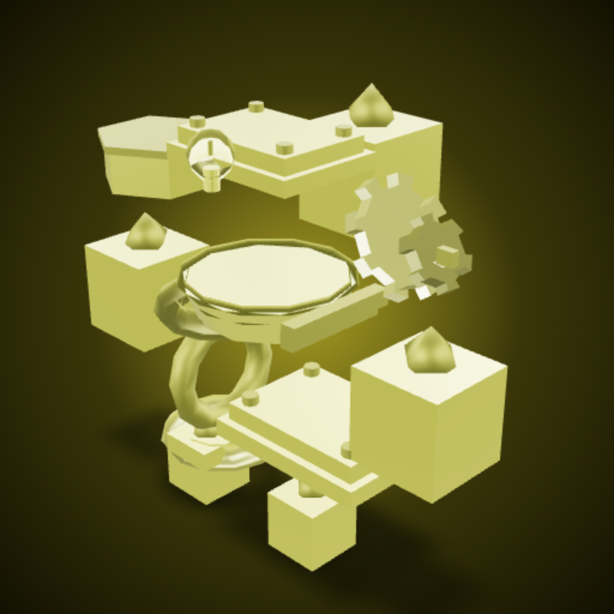 | **Cazador Filamento** | ☀️ Luminoso | Tier 1 | 1.03m | 16 | 23 | 109 | 6 | 1x Placas de latón, 1x Cadenas de hierro, 1x Tuercas gigantes, 2x Bombillas de filamento, 2x Engranajes desgastados, 2x Sartenes |
| #003 | 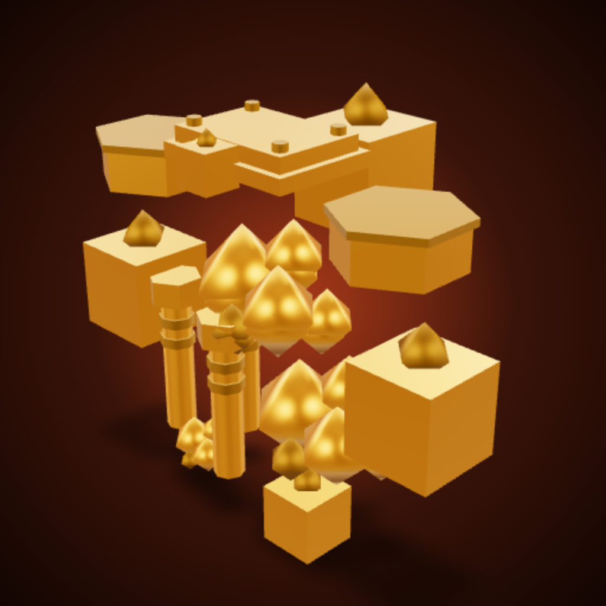 | **Artillero Calderero** | ♨️ Vapor | Tier 1 | 0.95m | 16 | 16 | 88 | 4 | 1x Residuos de carbón, 1x Tornillos y pernos, 2x Tuercas gigantes, 1x Placas de latón |
| #004 |  | **Espectro Mecánico** | ⚙️ Mecánico | Tier 1 | 1.10m | 16 | 23 | 87 | 7 | 2x Sartenes, 2x Tapas de alcantarilla, 1x Palancas de interruptor, 1x Engranajes desgastados, 1x Alambre de cobre |
| #005 | 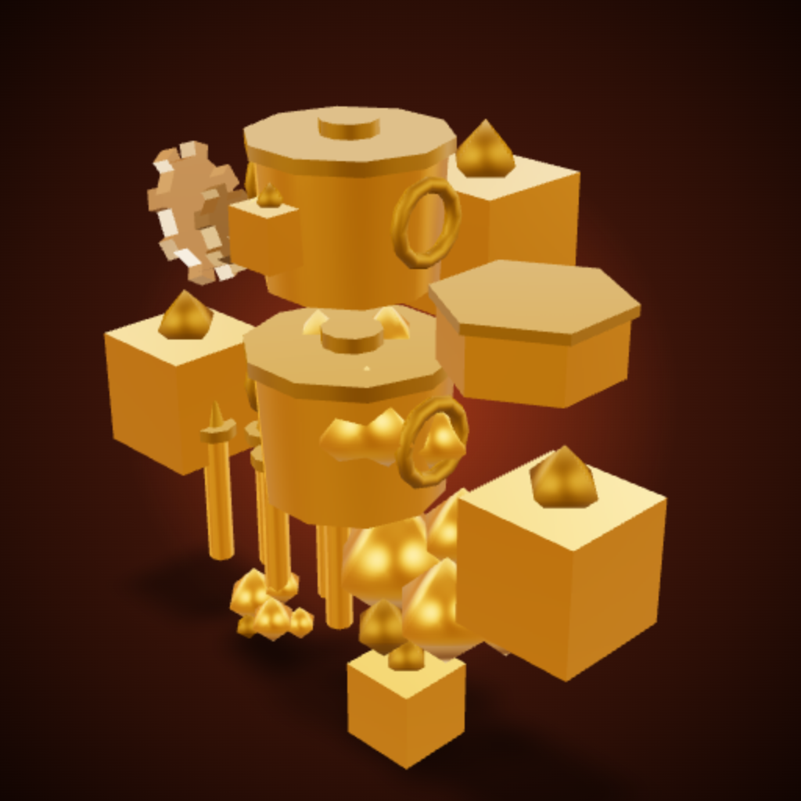 | **Coloso Presurizado** | ♨️ Vapor | Tier 1 | 0.97m | 15 | 15 | 97 | 5 | 1x Residuos de carbón, 2x Ollas de cocinar, 1x Engranajes desgastados, 1x Tuercas gigantes, 1x Clavos oxidados |
| #006 | 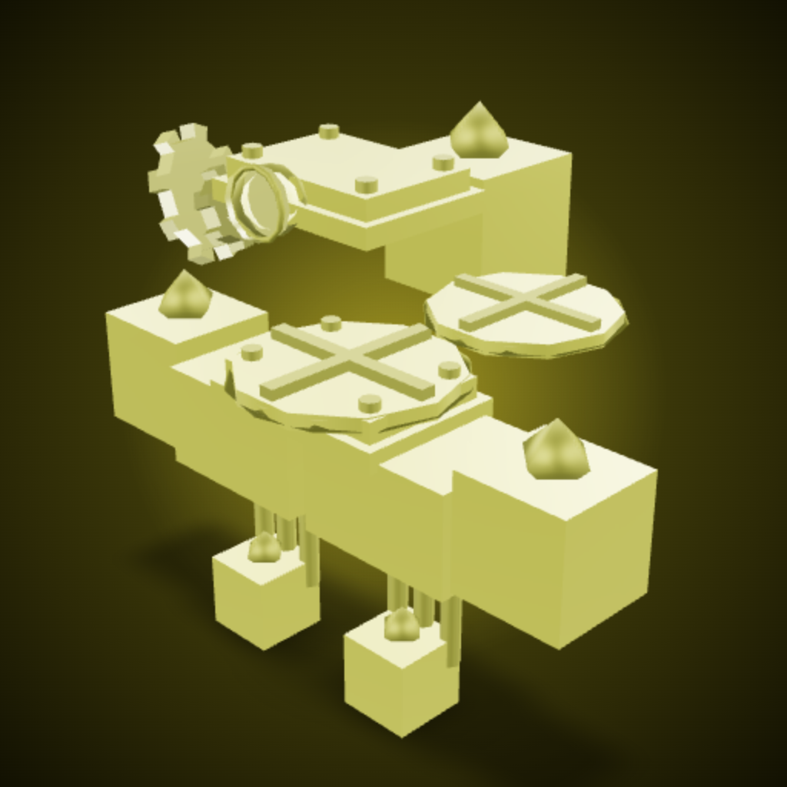 | **Destructor Brillante** | ☀️ Luminoso | Tier 1 | 1.01m | 24 | 20 | 82 | 11 | 1x Transistores, 2x Placas de latón, 1x Engranajes desgastados, 2x Lentes de televisor viejo, 2x Tubos de vacío, 2x Tapas de alcantarilla |
| #007 | 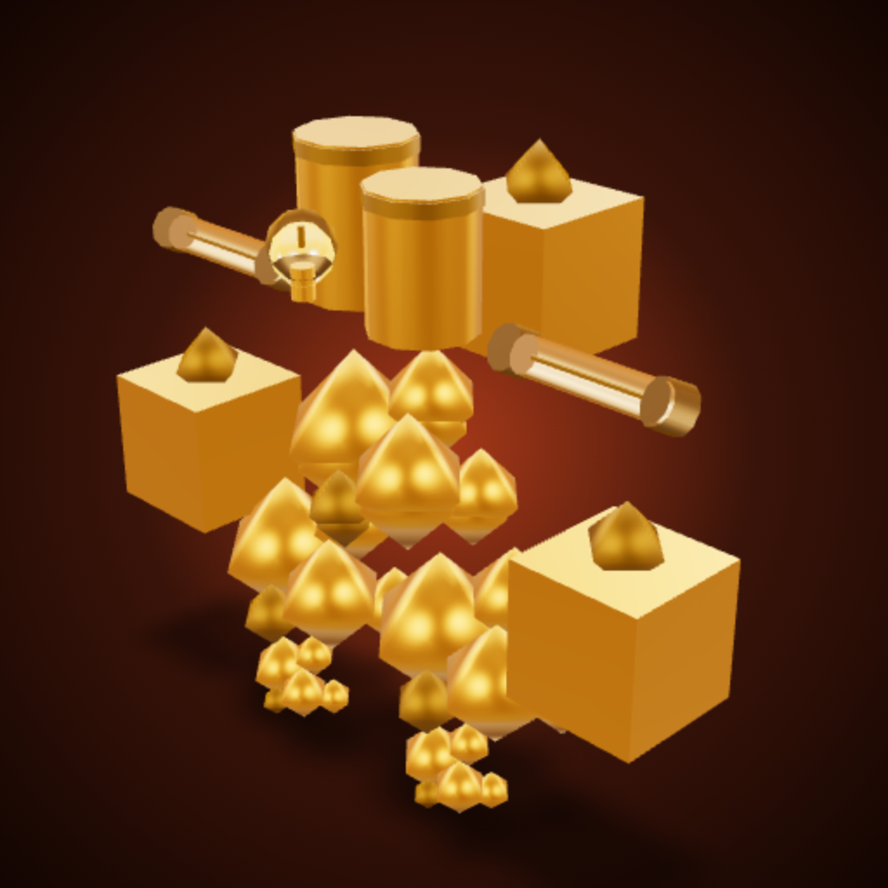 | **Servidor Ígneo** | ♨️ Vapor | Tier 1 | 0.91m | 19 | 8 | 124 | 7 | 2x Residuos de carbón, 2x Bombillas de filamento, 1x Lentes de televisor viejo, 2x Fusibles fundidos, 1x Latas de conserva |
| #008 |  | **Forjador Centellante** | ☀️ Luminoso | Tier 1 | 1.12m | 18 | 16 | 86 | 4 | 1x Clavos oxidados, 1x Tuercas gigantes, 1x Ollas de cocinar, 1x Tubos de vacío, 2x Cadenas de hierro |
| #009 | 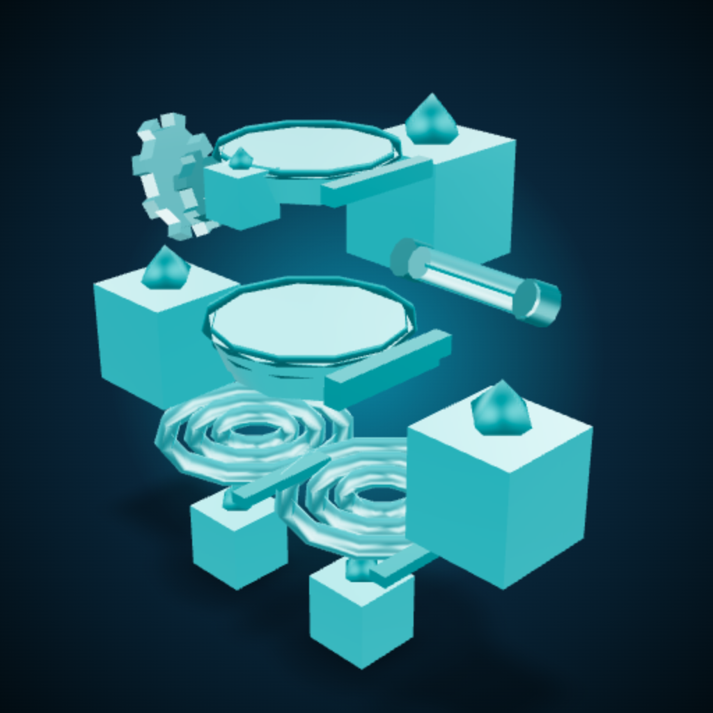 | **Ejecutor Rayante** | ⚡ Galvánico | Tier 1 | 1.05m | 18 | 15 | 107 | 13 | 2x Sartenes, 1x Fusibles fundidos, 2x Resortes de reloj, 1x Engranajes desgastados, 2x Tubos de cobre |
| #010 |  | **Rastreador Engranado** | ⚙️ Mecánico | Tier 1 | 0.92m | 15 | 14 | 109 | 13 | 2x Engranajes desgastados, 2x Brújulas magnéticas, 1x Cadenas de hierro, 2x Manómetros, 1x Alambre de cobre, 1x Sartenes |
| #011 |  | **Titán Eléctrico** | ⚡ Galvánico | Tier 1 | 1.19m | 19 | 14 | 89 | 4 | 1x Tapas de alcantarilla, 1x Tuercas gigantes, 1x Fusibles fundidos |
| #012 |  | **Caminante Térmico** | ♨️ Vapor | Tier 1 | 1.24m | 24 | 8 | 124 | 4 | 2x Válvulas de vapor, 2x Tubos de cobre, 1x Manómetros, 1x Transistores |
| #013 | 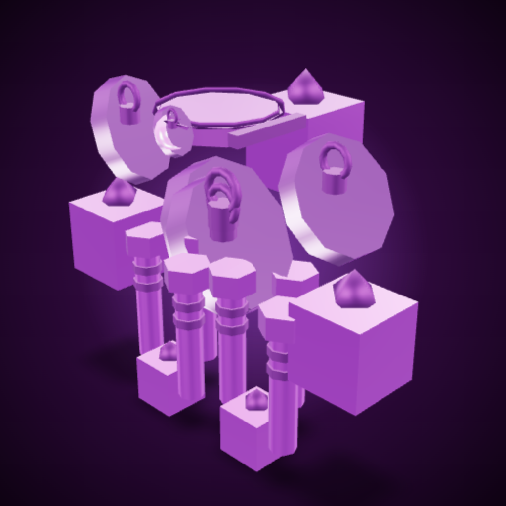 | **Gólem Astral** | 🔮 Éter | Tier 1 | 0.94m | 15 | 16 | 82 | 9 | 1x Relojes de bolsillo rotos, 2x Tornillos y pernos, 1x Cables deshilachados, 2x Clavos oxidados, 1x Sartenes |
| #014 | 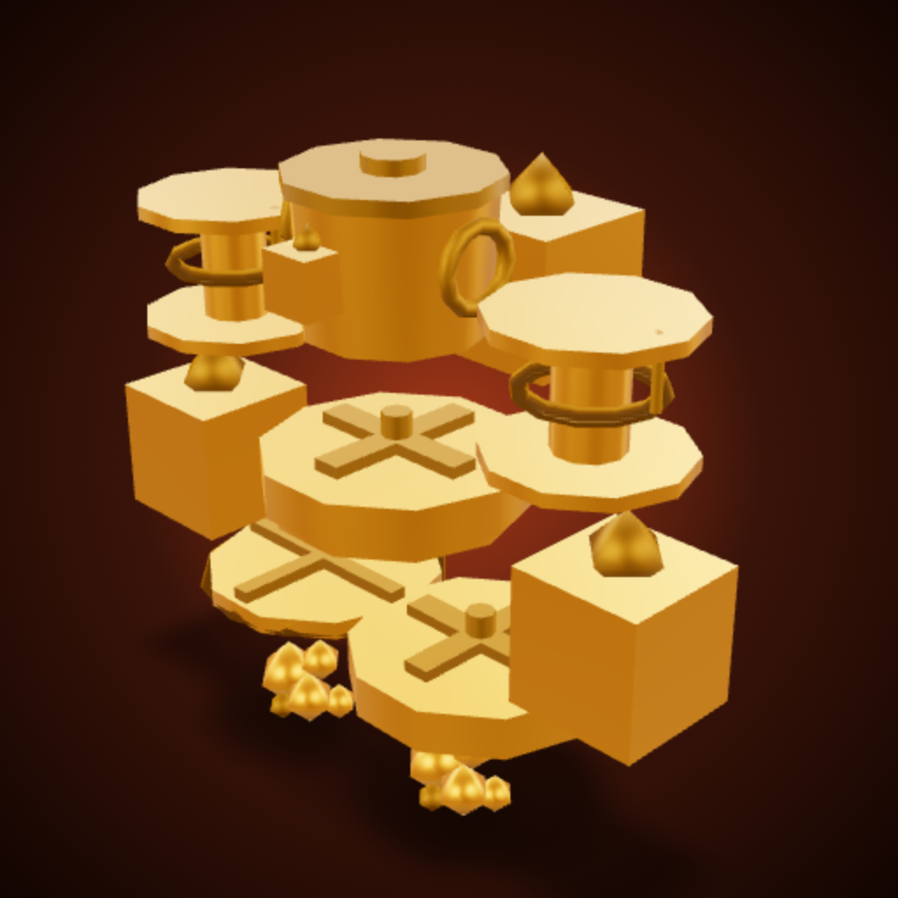 | **Centinela Neumático** | ♨️ Vapor | Tier 1 | 0.91m | 16 | 15 | 109 | 14 | 2x Brújulas magnéticas, 1x Tapas de alcantarilla, 2x Ollas de cocinar, 2x Alambre de cobre, 2x Residuos de carbón |
| #015 | 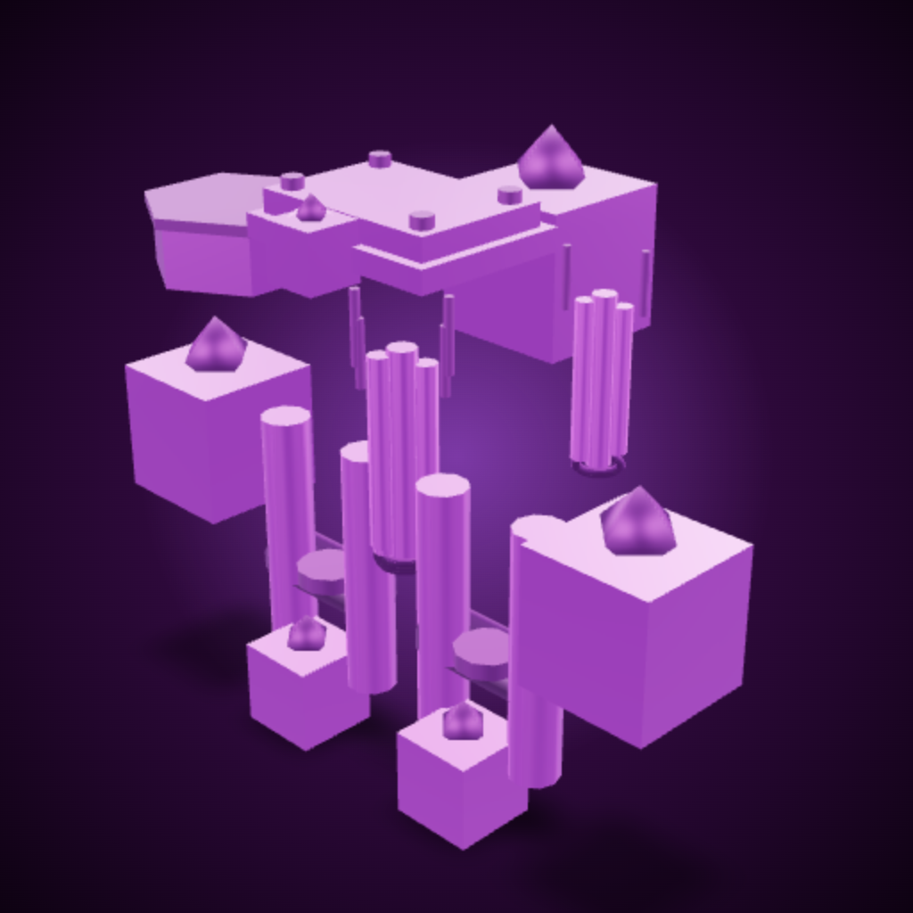 | **Defensor Singular** | 🔮 Éter | Tier 1 | 1.09m | 16 | 13 | 106 | 8 | 2x Cables deshilachados, 1x Tuercas gigantes, 1x Placas de latón, 2x Tubos de cobre |
| #016 |  | **Ensamblaje Brillante** | ☀️ Luminoso | Tier 1 | 1.25m | 16 | 9 | 133 | 4 | 1x Clavos oxidados, 1x Bombillas de filamento, 2x Tubos de cobre, 2x Latas de conserva |
| #017 | 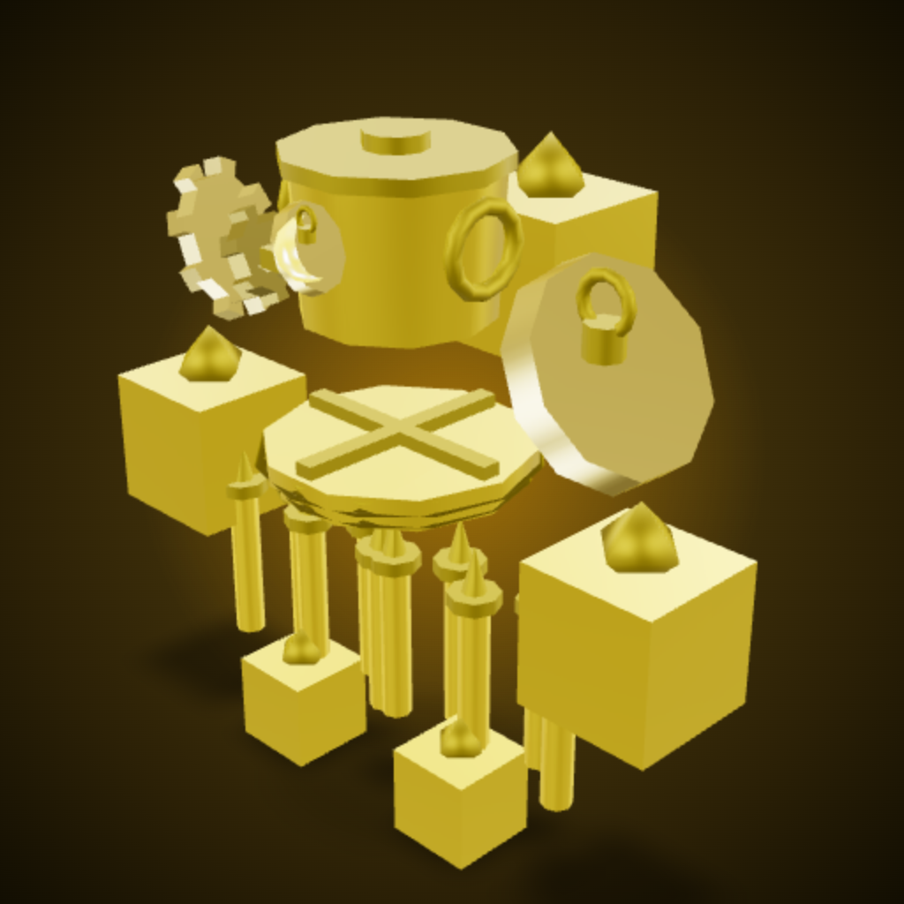 | **Guardián Articulado** | ⚙️ Mecánico | Tier 1 | 1.07m | 16 | 21 | 95 | 11 | 2x Relojes de bolsillo rotos, 2x Ollas de cocinar, 1x Engranajes desgastados, 2x Clavos oxidados, 2x Tapas de alcantarilla |
| #018 |  | **Cruzado Baterión** | ⚡ Galvánico | Tier 1 | 1.05m | 17 | 29 | 120 | 4 | 2x Manómetros, 2x Sartenes, 1x Tuercas gigantes, 2x Palancas de interruptor, 2x Placas de latón, 1x Cadenas de hierro |
| #019 | 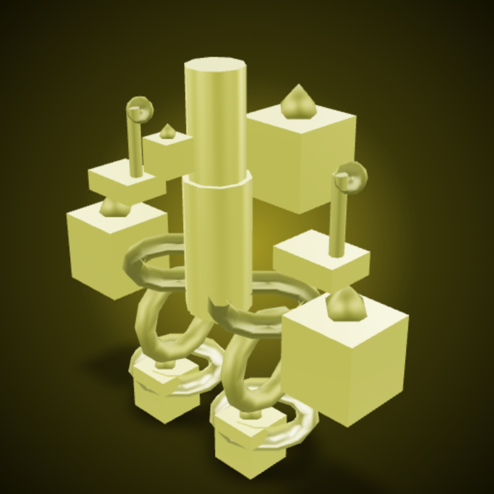 | **Poblador Espejado** | ☀️ Luminoso | Tier 1 | 1.05m | 19 | 20 | 84 | 6 | 1x Tubos de vacío, 2x Cadenas de hierro, 1x Cables deshilachados, 2x Tornillos y pernos, 2x Palancas de interruptor |
| #020 |  | **Fundidor Etéreo** | 🔮 Éter | Tier 1 | 0.98m | 16 | 14 | 102 | 12 | 2x Resortes de reloj, 2x Tubos de cobre, 2x Tuercas gigantes, 1x Tornillos y pernos |
| #021 |  | **Vigía Humeante** | ♨️ Vapor | Tier 1 | 1.08m | 16 | 24 | 105 | 4 | 2x Palancas de interruptor, 2x Tornillos y pernos, 1x Tubos de cobre, 1x Tuercas gigantes, 2x Residuos de carbón, 2x Sartenes |
| #022 | 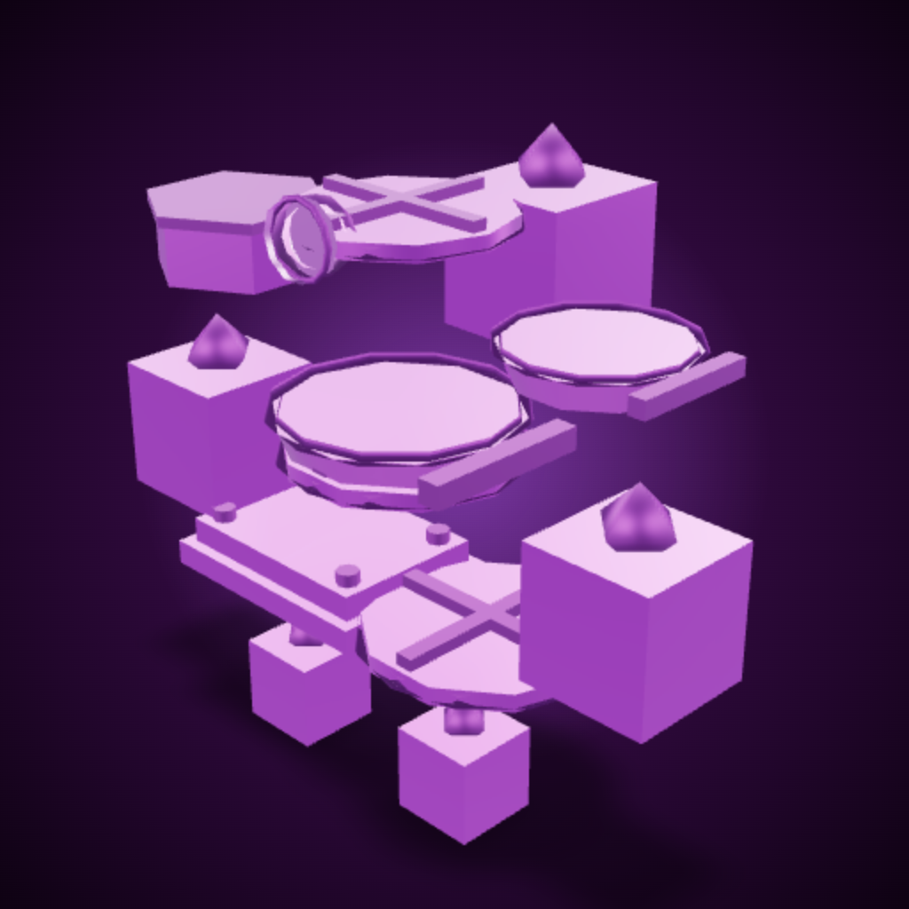 | **Leviatán Relicario** | 🔮 Éter | Tier 1 | 1.01m | 16 | 25 | 83 | 14 | 2x Tapas de alcantarilla, 2x Sartenes, 1x Tuercas gigantes, 2x Lentes de televisor viejo, 2x Cables deshilachados, 1x Placas de latón |
| #023 |  | **Vanguardia Calderero** | ♨️ Vapor | Tier 1 | 1.22m | 20 | 17 | 96 | 6 | 1x Sartenes, 2x Fusibles fundidos, 2x Residuos de carbón, 1x Alambre de cobre, 2x Tapas de alcantarilla |
| #024 |  | **Autómata Neumático** | ♨️ Vapor | Tier 1 | 1.27m | 15 | 12 | 101 | 12 | 1x Resortes de reloj, 2x Alambre de cobre, 1x Tuercas gigantes, 1x Cadenas de hierro, 2x Tubos de cobre |
| #025 | 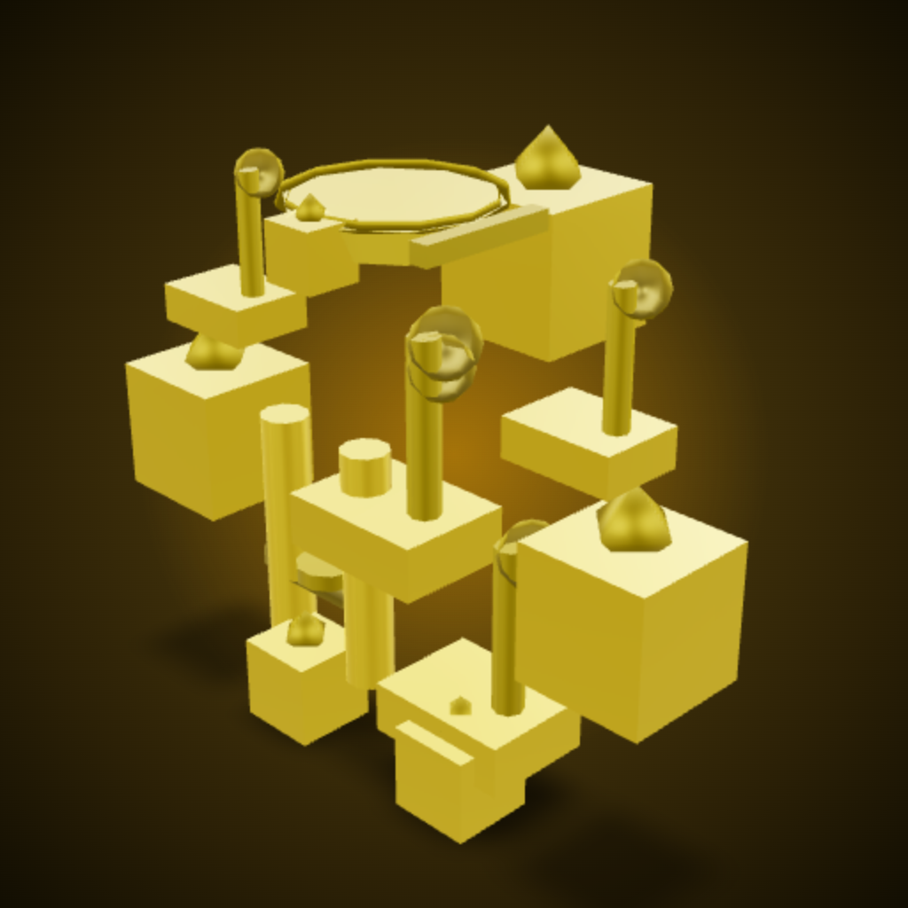 | **Protector Rotor** | ⚙️ Mecánico | Tier 1 | 0.98m | 16 | 13 | 95 | 8 | 1x Palancas de interruptor, 1x Tubos de cobre, 2x Cables deshilachados, 1x Sartenes |
| #026 |  | **Portador Engrane** | ⚙️ Mecánico | Tier 1 | 1.05m | 17 | 22 | 88 | 8 | 2x Cables deshilachados, 2x Cadenas de hierro, 1x Tornillos y pernos, 1x Clavos oxidados, 2x Placas de latón |
| #027 | 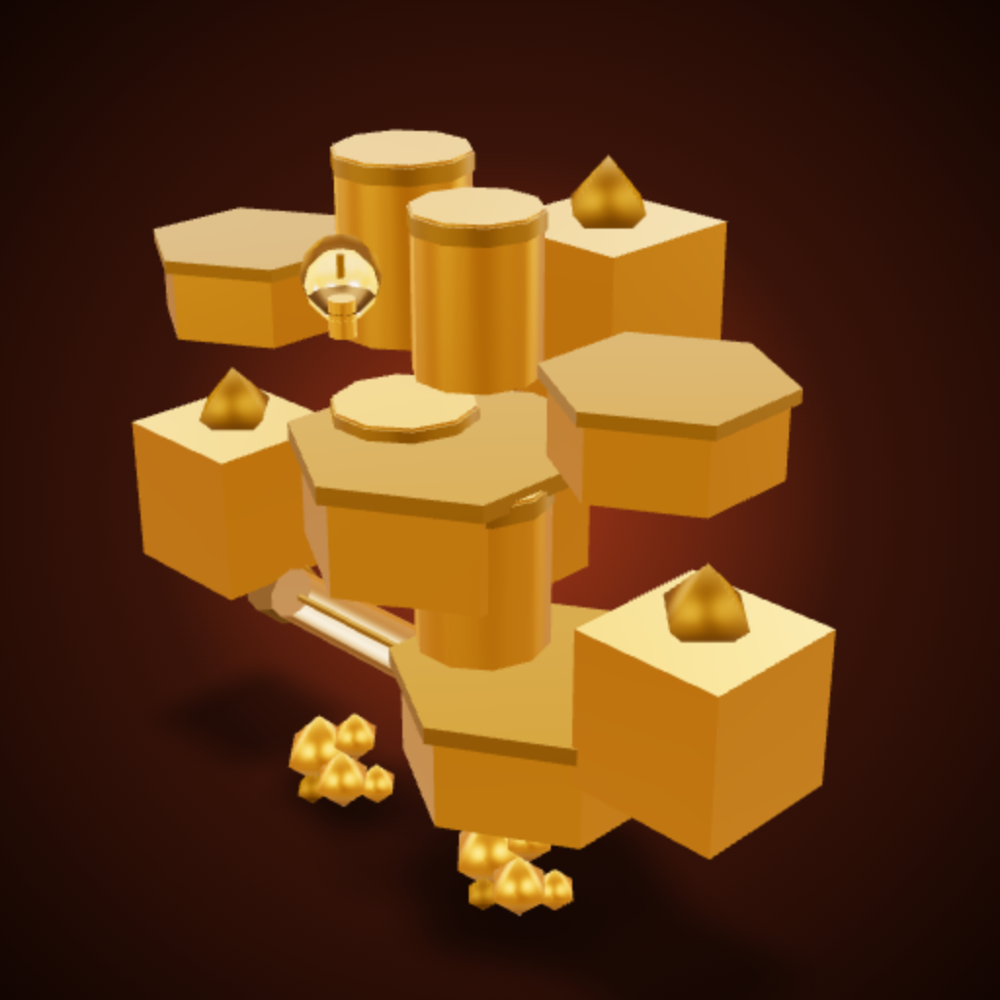 | **Monolito Ígneo** | ♨️ Vapor | Tier 1 | 1.05m | 19 | 12 | 129 | 6 | 2x Tuercas gigantes, 1x Cables deshilachados, 1x Fusibles fundidos, 1x Bombillas de filamento, 2x Residuos de carbón, 2x Latas de conserva |
| #028 |  | **Chatarrero Pistón** | ♨️ Vapor | Tier 1 | 0.99m | 18 | 10 | 104 | 12 | 2x Residuos de carbón, 1x Válvulas de vapor, 1x Ollas de cocinar, 2x Resortes de reloj |
| #029 | 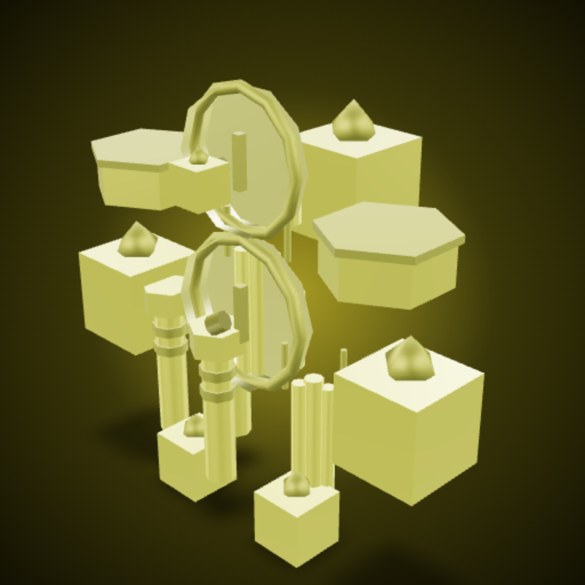 | **Excavador Espejado** | ☀️ Luminoso | Tier 1 | 1.00m | 16 | 14 | 116 | 8 | 2x Cables deshilachados, 2x Tuercas gigantes, 2x Manómetros, 1x Tornillos y pernos |
| #030 | 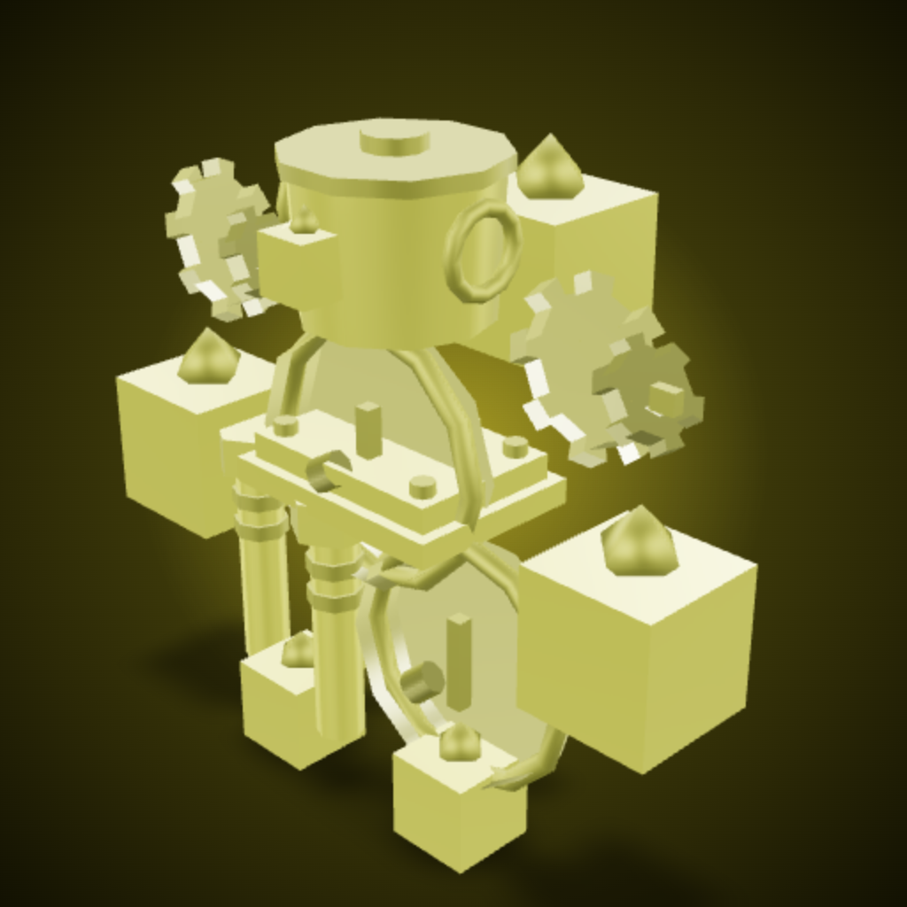 | **Patrullero Luminoso** | ☀️ Luminoso | Tier 1 | 1.07m | 17 | 18 | 125 | 6 | 2x Engranajes desgastados, 1x Placas de latón, 2x Manómetros, 1x Tornillos y pernos, 1x Ollas de cocinar |
| #031 |  | **Basilisco Humeante** | ♨️ Vapor | Tier 1 | 1.12m | 19 | 13 | 106 | 10 | 1x Manómetros, 2x Válvulas de vapor, 1x Bombillas de filamento, 2x Tapas de alcantarilla, 2x Relojes de bolsillo rotos |
| #032 | 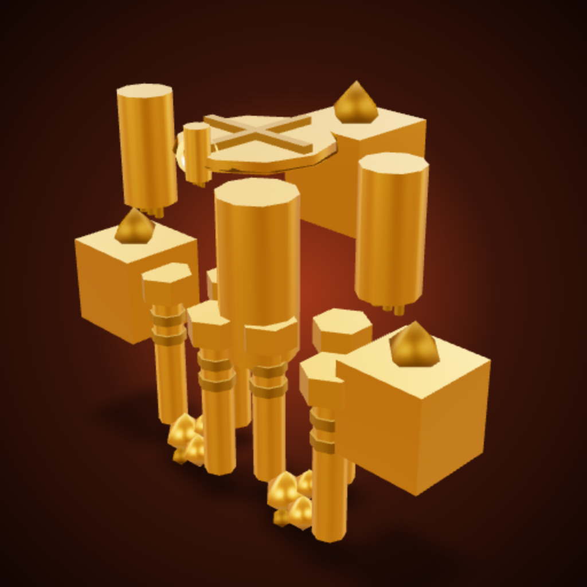 | **Guardia Térmico** | ♨️ Vapor | Tier 1 | 0.92m | 20 | 16 | 101 | 6 | 1x Tubos de vacío, 1x Cables deshilachados, 2x Tornillos y pernos, 2x Residuos de carbón, 1x Tapas de alcantarilla |
| #033 |  | **Baluarte Calderero** | ♨️ Vapor | Tier 1 | 0.90m | 16 | 12 | 97 | 10 | 1x Cables deshilachados, 1x Ollas de cocinar, 1x Palancas de interruptor, 1x Residuos de carbón, 1x Resortes de reloj |
| #034 |  | **Cazador Diódico** | ☀️ Luminoso | Tier 1 | 0.93m | 16 | 26 | 92 | 6 | 2x Sartenes, 2x Engranajes desgastados, 2x Tornillos y pernos, 1x Placas de latón, 2x Cadenas de hierro, 1x Tubos de cobre |
| #035 | 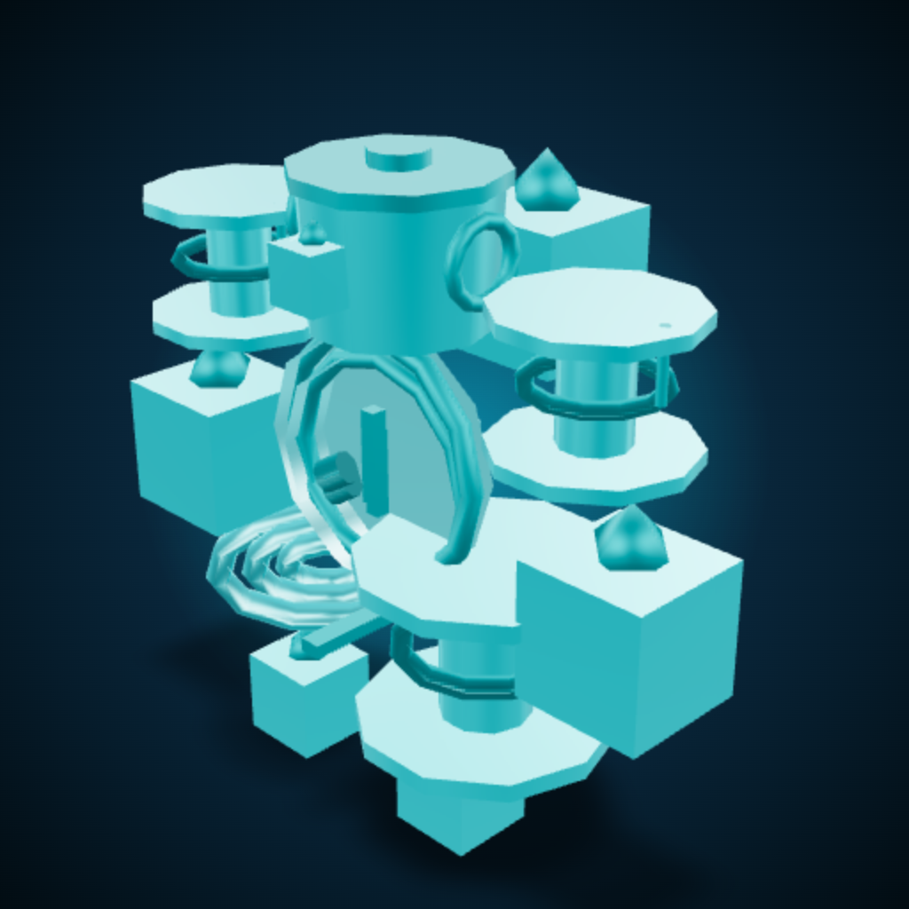 | **Artillero Chispeante** | ⚡ Galvánico | Tier 1 | 1.15m | 15 | 11 | 119 | 13 | 2x Alambre de cobre, 2x Manómetros, 1x Resortes de reloj, 1x Cables deshilachados, 2x Ollas de cocinar |
| #036 |  | **Espectro Engrane** | ⚙️ Mecánico | Tier 1 | 1.18m | 18 | 13 | 82 | 17 | 2x Clavos oxidados, 2x Brújulas magnéticas, 1x Transistores, 2x Tuercas gigantes, 1x Resortes de reloj, 2x Alambre de cobre |
| #037 |  | **Coloso Articulado** | ⚙️ Mecánico | Tier 1 | 1.25m | 16 | 13 | 102 | 8 | 1x Engranajes desgastados, 1x Manómetros, 1x Brújulas magnéticas, 2x Tornillos y pernos |
| #038 | 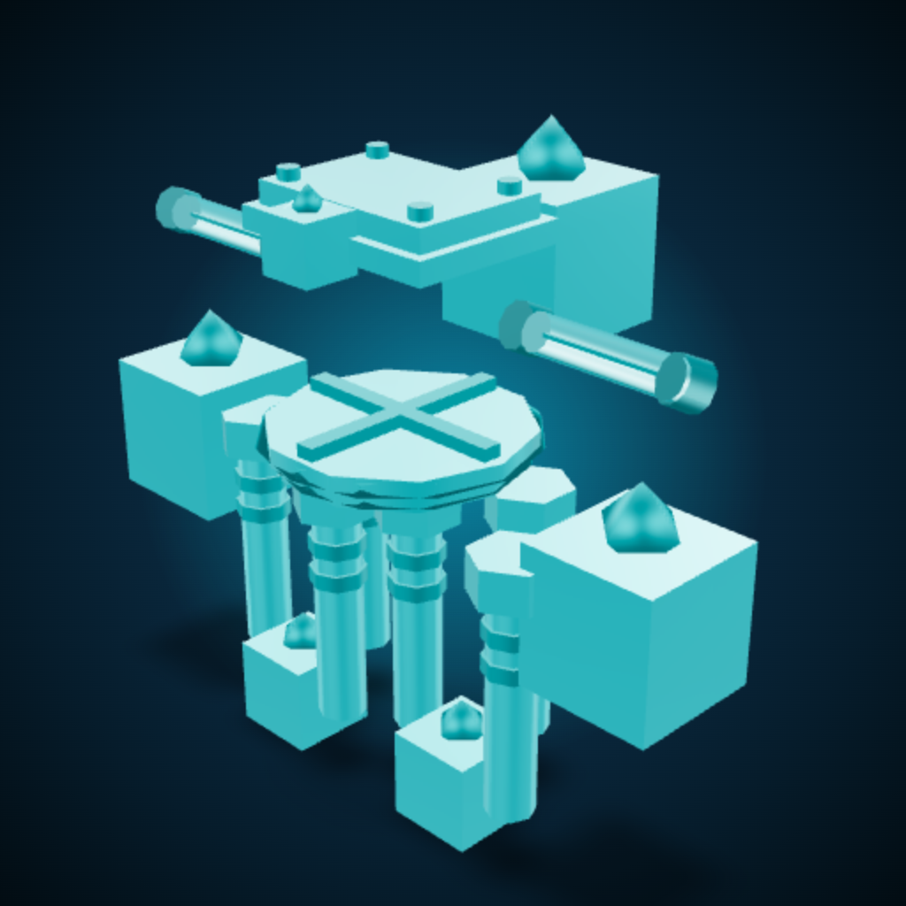 | **Destructor Baterión** | ⚡ Galvánico | Tier 1 | 1.13m | 20 | 21 | 84 | 8 | 1x Placas de latón, 2x Cables deshilachados, 2x Fusibles fundidos, 2x Tapas de alcantarilla, 2x Tornillos y pernos |
| #039 |  | **Servidor Vaporizado** | ♨️ Vapor | Tier 1 | 1.19m | 24 | 10 | 94 | 12 | 1x Transistores, 1x Residuos de carbón, 1x Cables deshilachados, 2x Válvulas de vapor, 1x Tuercas gigantes, 2x Lentes de televisor viejo |
| #040 |  | **Forjador Luminoso** | ☀️ Luminoso | Tier 1 | 1.22m | 16 | 14 | 107 | 8 | 1x Bombillas de filamento, 2x Ollas de cocinar, 1x Relojes de bolsillo rotos, 1x Clavos oxidados, 1x Engranajes desgastados |
| #041 |  | **Ejecutor Eléctrico** | ⚡ Galvánico | Tier 2 | 1.09m | 38 | 16 | 129 | 14 | 1x Bobinas de Tesla, 2x Brújulas magnéticas, 2x Engranajes desgastados, 1x Cadenas de hierro, 2x Fusibles fundidos, 2x Tubos de vacío, 1x Condensador alta presión |
| #042 | 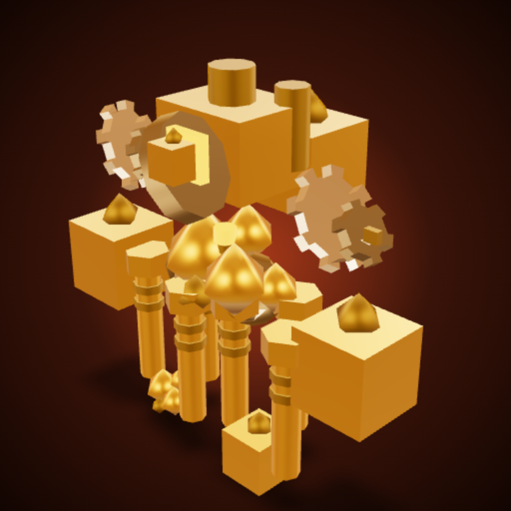 | **Rastreador Térmico** | ♨️ Vapor | Tier 2 | 1.06m | 33 | 18 | 136 | 8 | 1x Residuos de carbón, 2x Tornillos y pernos, 1x Motor de vapor, 2x Engranajes desgastados, 2x Transistores, 1x Condensador alta presión |
| #043 |  | **Titán Calderero** | ♨️ Vapor | Tier 2 | 1.09m | 24 | 18 | 111 | 14 | 1x Cables deshilachados, 1x Brújulas magnéticas, 2x Placas de latón, 1x Válvulas de vapor, 1x Lentes de televisor viejo |
| #044 | 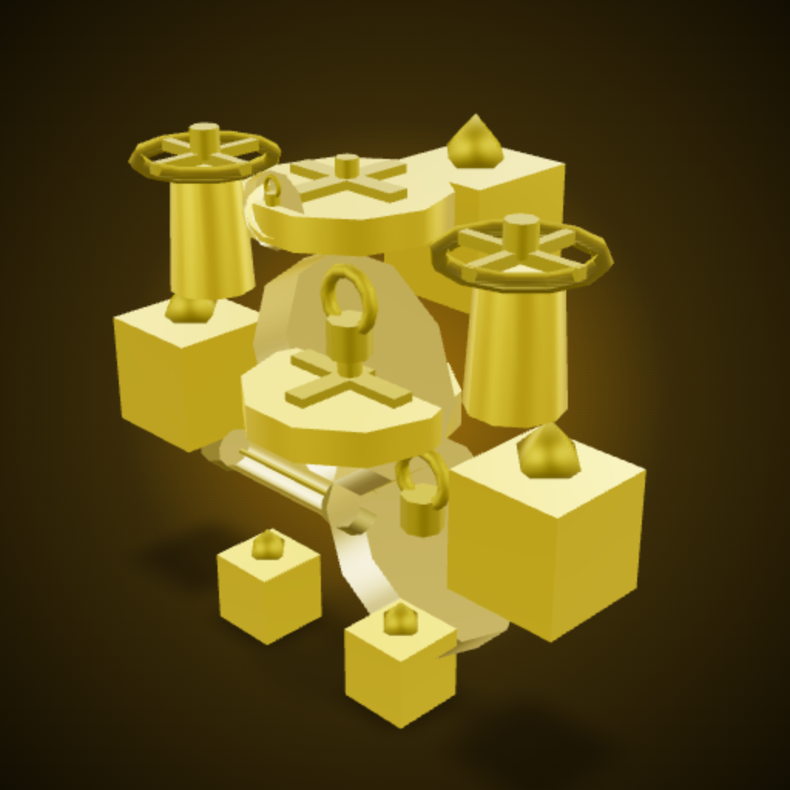 | **Caminante Mecánico** | ⚙️ Mecánico | Tier 2 | 1.08m | 28 | 22 | 110 | 19 | 1x Relojes de bolsillo rotos, 2x Válvulas de vapor, 1x Fusibles fundidos, 2x Giróscopo de precisión, 2x Brújulas magnéticas, 2x Cables deshilachados |
| #045 | 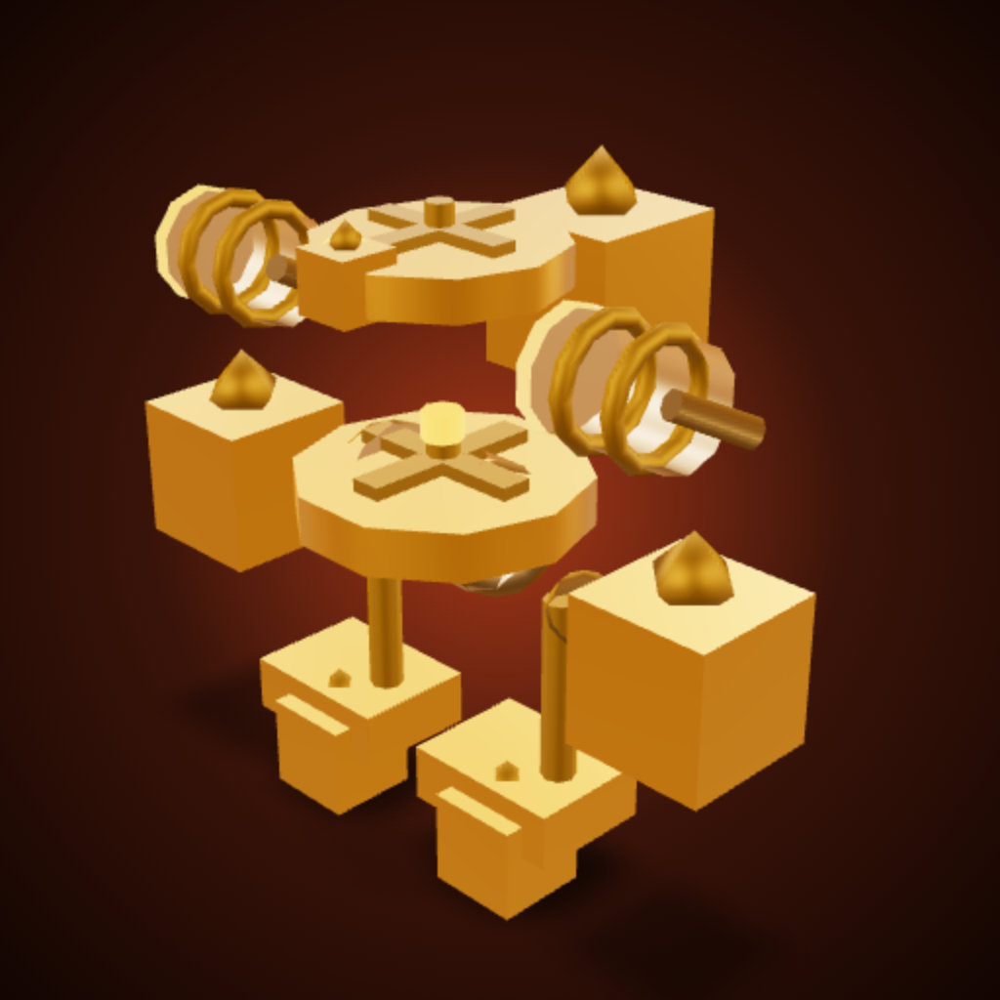 | **Gólem Presurizado** | ♨️ Vapor | Tier 2 | 0.97m | 33 | 16 | 186 | 12 | 2x Brújulas magnéticas, 2x Latas de conserva, 2x Dínamo galvánica, 1x Manómetros, 2x Palancas de interruptor, 2x Condensador alta presión |
| #046 |  | **Centinela Volcánico** | ♨️ Vapor | Tier 2 | 1.19m | 37 | 15 | 137 | 11 | 1x Motor de vapor, 1x Bobinas de Tesla, 1x Válvulas de vapor, 1x Resortes de reloj, 1x Condensador alta presión, 1x Tornillos y pernos |
| #047 |  | **Defensor Conductivo** | ⚡ Galvánico | Tier 2 | 0.95m | 33 | 19 | 127 | 17 | 2x Placas de latón, 2x Residuos de carbón, 2x Dínamo galvánica, 2x Resortes de reloj, 1x Alambre de cobre |
| #048 |  | **Ensamblaje Broncíneo** | ⚙️ Mecánico | Tier 2 | 1.15m | 27 | 33 | 134 | 6 | 2x Fusibles fundidos, 2x Palancas de interruptor, 1x Tuercas gigantes, 2x Engranajes de bronce, 2x Latas de conserva, 1x Ollas de cocinar |
| #049 |  | **Guardián Rayante** | ⚡ Galvánico | Tier 2 | 1.07m | 43 | 18 | 146 | 10 | 2x Bombillas de filamento, 1x Bobinas de Tesla, 2x Fusibles fundidos, 2x Palancas de interruptor, 1x Latas de conserva, 2x Alambre de cobre, 1x Clavos oxidados, 2x Dínamo galvánica |
| #050 | 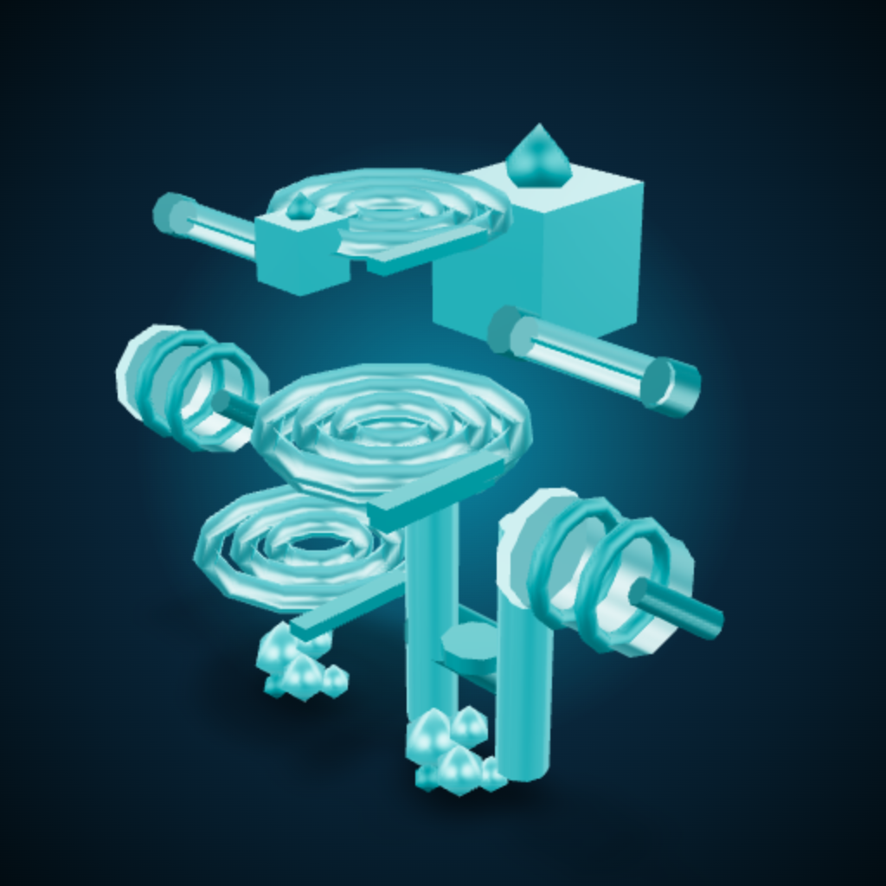 | **Cruzado Galvánico** | ⚡ Galvánico | Tier 2 | 0.90m | 37 | 12 | 136 | 10 | 1x Resortes de reloj, 1x Tubos de cobre, 2x Fusibles fundidos, 2x Dínamo galvánica, 2x Residuos de carbón |
| #051 | 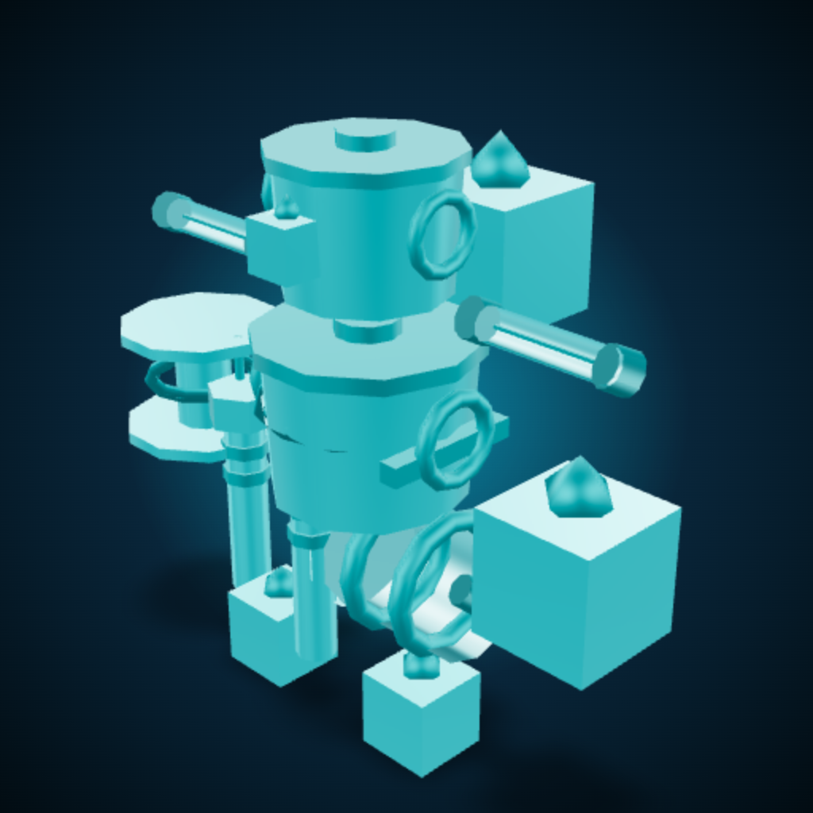 | **Poblador Eléctrico** | ⚡ Galvánico | Tier 2 | 1.08m | 34 | 21 | 118 | 8 | 1x Diodos LED, 2x Fusibles fundidos, 1x Tornillos y pernos, 1x Sartenes, 1x Dínamo galvánica, 2x Ollas de cocinar, 1x Alambre de cobre |
| #052 |  | **Fundidor Filamento** | ☀️ Luminoso | Tier 2 | 1.12m | 34 | 22 | 121 | 6 | 2x Placas de latón, 1x Motor de vapor, 1x Manómetros, 1x Clavos oxidados, 2x Diodos LED, 2x Palancas de interruptor |
| #053 | 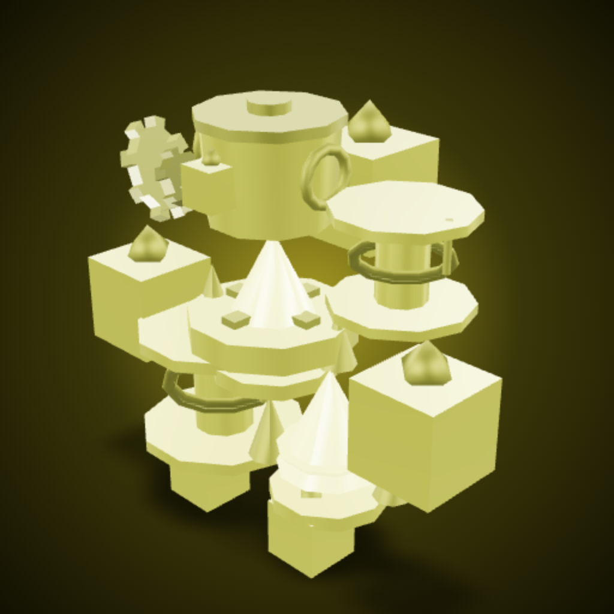 | **Vigía Óptico** | ☀️ Luminoso | Tier 2 | 1.15m | 24 | 15 | 112 | 23 | 2x Cristal cuarzo resonante, 1x Brújulas magnéticas, 2x Alambre de cobre, 1x Transistores, 1x Engranajes desgastados, 1x Ollas de cocinar |
| #054 |  | **Leviatán Neumático** | ♨️ Vapor | Tier 2 | 1.10m | 35 | 21 | 198 | 9 | 1x Placas de latón, 2x Baterías alquímicas, 1x Tubos de vacío, 2x Motor de vapor, 1x Engranajes de bronce, 1x Relojes de bolsillo rotos, 2x Condensador alta presión |
| #055 | 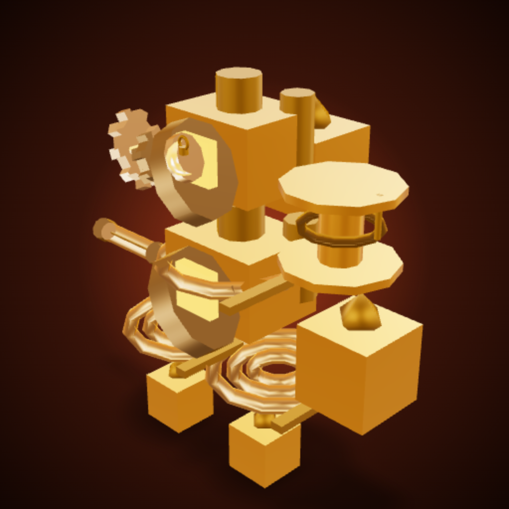 | **Vanguardia Presurizado** | ♨️ Vapor | Tier 2 | 0.94m | 35 | 21 | 114 | 23 | 2x Resortes de reloj, 1x Alambre de cobre, 1x Cadenas de hierro, 1x Engranajes de bronce, 2x Motor de vapor, 2x Relojes de bolsillo rotos, 1x Fusibles fundidos |
| #056 | 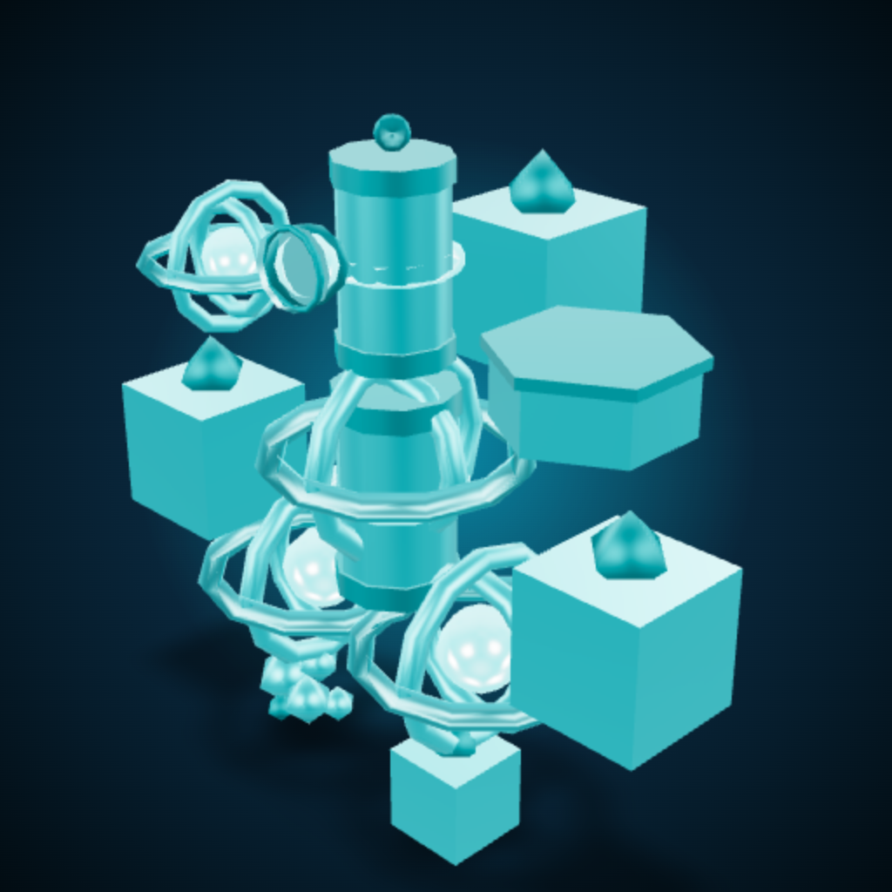 | **Autómata Plasmático** | ⚡ Galvánico | Tier 2 | 1.05m | 39 | 20 | 161 | 12 | 1x Giróscopo de precisión, 2x Lentes de televisor viejo, 2x Baterías alquímicas, 2x Transistores, 2x Tuercas gigantes, 1x Residuos de carbón, 2x Bobinas de Tesla |
| #057 |  | **Protector Lúmen** | ☀️ Luminoso | Tier 2 | 1.17m | 31 | 19 | 111 | 32 | 2x Tubos de vacío, 1x Tapas de alcantarilla, 1x Brújulas magnéticas, 1x Transistores, 2x Antenas de radio, 2x Relojes de bolsillo rotos, 1x Cristal cuarzo resonante, 2x Palancas de interruptor |
| #058 |  | **Portador Baterión** | ⚡ Galvánico | Tier 2 | 0.92m | 27 | 17 | 159 | 13 | 2x Fusibles fundidos, 2x Cadenas de hierro, 2x Latas de conserva, 2x Brújulas magnéticas, 1x Baterías alquímicas |
| #059 | 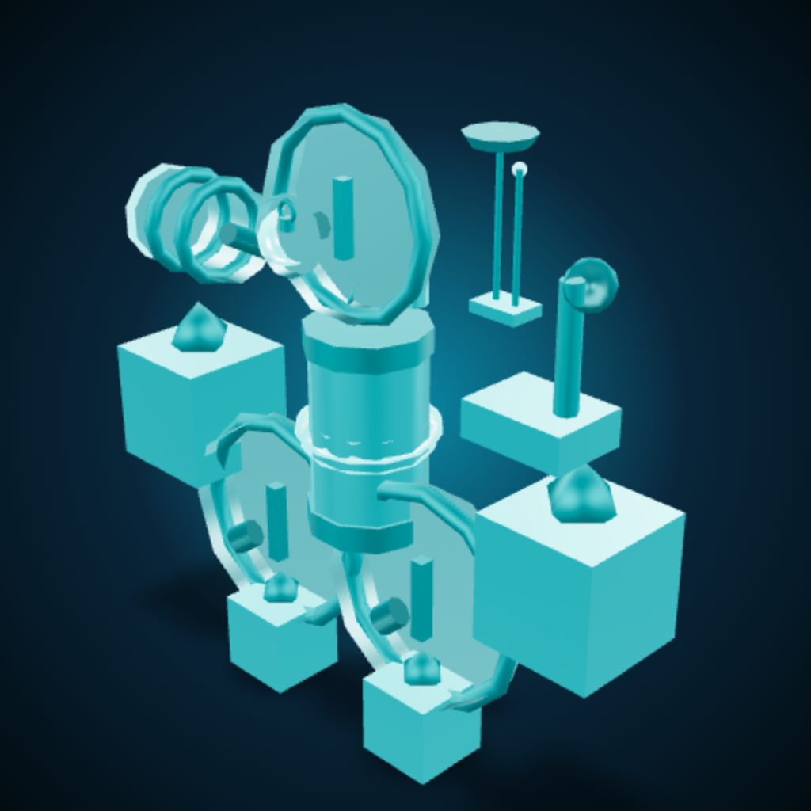 | **Monolito Rayante** | ⚡ Galvánico | Tier 2 | 1.14m | 30 | 14 | 177 | 24 | 1x Manómetros, 2x Antenas de radio, 2x Relojes de bolsillo rotos, 1x Tubos de vacío, 2x Baterías alquímicas, 1x Dínamo galvánica, 1x Palancas de interruptor |
| #060 |  | **Chatarrero Galvánico** | ⚡ Galvánico | Tier 2 | 1.27m | 33 | 20 | 112 | 12 | 1x Engranajes de bronce, 1x Relojes de bolsillo rotos, 1x Palancas de interruptor, 1x Brújulas magnéticas, 2x Dínamo galvánica |
| #061 | 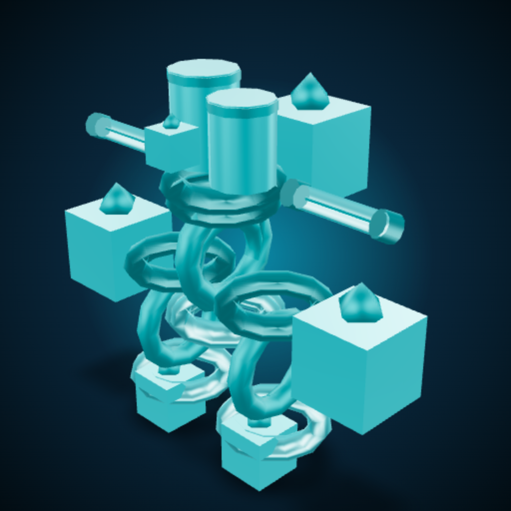 | **Excavador Eléctrico** | ⚡ Galvánico | Tier 2 | 1.13m | 30 | 15 | 112 | 10 | 2x Cadenas de hierro, 2x Transistores, 2x Fusibles fundidos, 1x Latas de conserva, 1x Resortes de reloj |
| #062 |  | **Patrullero Térmico** | ♨️ Vapor | Tier 2 | 1.29m | 39 | 11 | 156 | 9 | 2x Manómetros, 1x Transistores, 2x Motor de vapor, 1x Lentes de televisor viejo, 1x Bobinas de Tesla, 2x Bombillas de filamento |
| #063 |  | **Basilisco Calderero** | ♨️ Vapor | Tier 2 | 1.03m | 40 | 15 | 126 | 6 | 2x Diodos LED, 2x Residuos de carbón, 1x Motor de vapor, 1x Sartenes, 2x Válvulas de vapor |
| #064 | 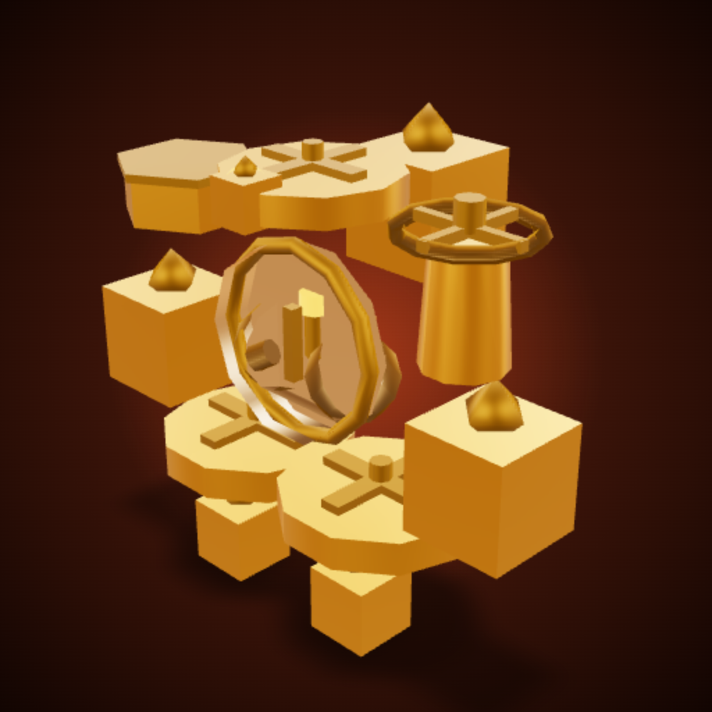 | **Guardia Neumático** | ♨️ Vapor | Tier 2 | 1.29m | 32 | 14 | 144 | 19 | 1x Brújulas magnéticas, 2x Transistores, 1x Tuercas gigantes, 2x Válvulas de vapor, 1x Manómetros, 1x Condensador alta presión, 2x Cristal cuarzo resonante |
| #065 |  | **Baluarte Resonante** | ☀️ Luminoso | Tier 2 | 1.04m | 33 | 20 | 147 | 9 | 1x Latas de conserva, 2x Sartenes, 1x Tubos de vacío, 1x Ollas de cocinar, 1x Brújulas magnéticas, 2x Diodos LED, 1x Baterías alquímicas |
| #066 | 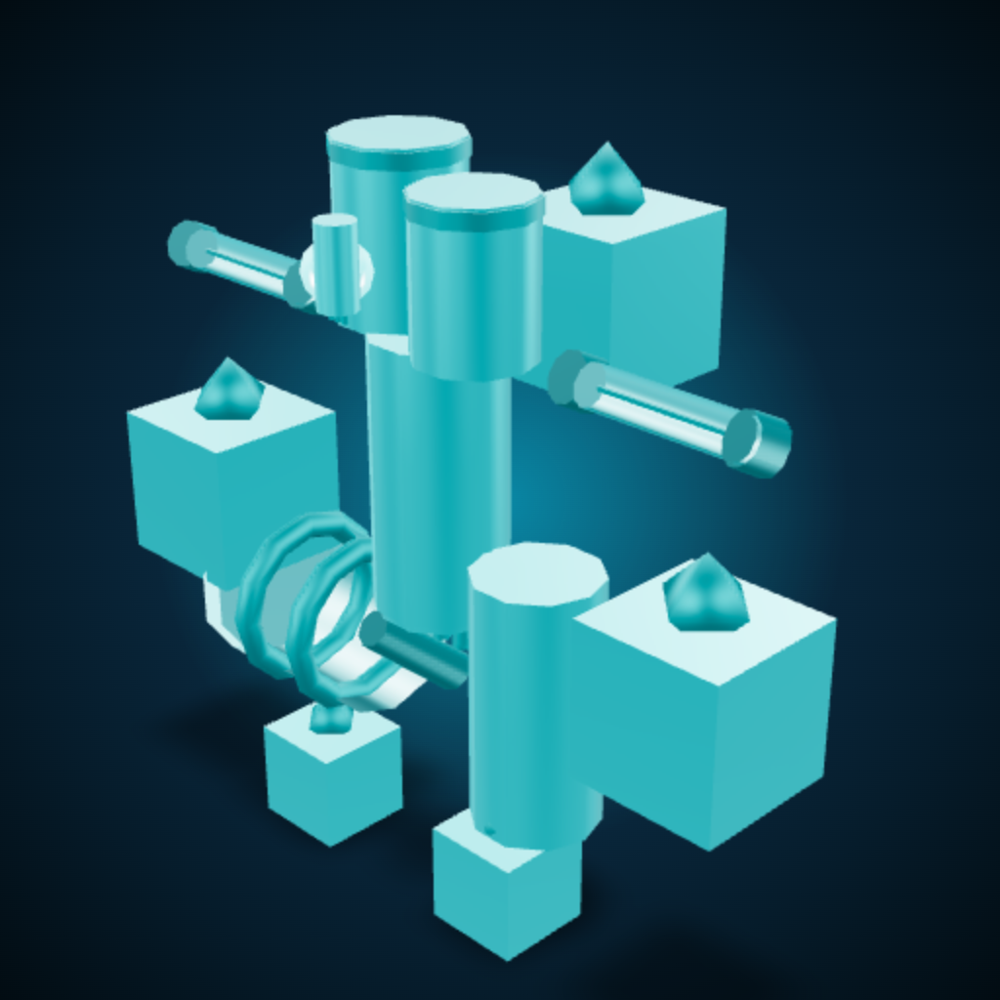 | **Cazador Plasmático** | ⚡ Galvánico | Tier 2 | 1.05m | 40 | 12 | 118 | 6 | 2x Tubos de vacío, 1x Latas de conserva, 1x Transistores, 2x Fusibles fundidos, 1x Dínamo galvánica |
| #067 | 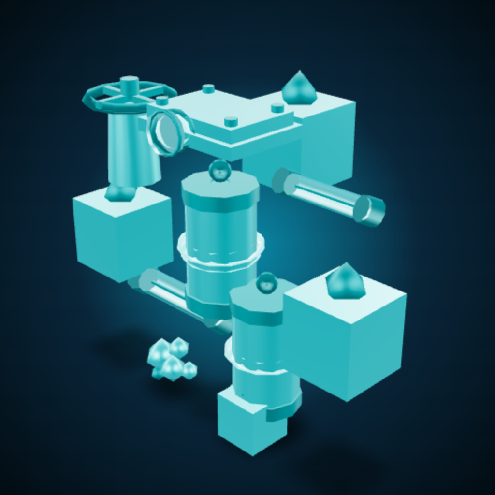 | **Artillero Conductivo** | ⚡ Galvánico | Tier 2 | 1.14m | 28 | 15 | 168 | 9 | 2x Baterías alquímicas, 1x Residuos de carbón, 1x Lentes de televisor viejo, 1x Válvulas de vapor, 2x Fusibles fundidos, 1x Placas de latón |
| #068 |  | **Espectro Centellante** | ☀️ Luminoso | Tier 2 | 1.18m | 21 | 17 | 127 | 21 | 2x Relojes de bolsillo rotos, 1x Cables deshilachados, 2x Resortes de reloj, 2x Bombillas de filamento, 1x Palancas de interruptor, 2x Tornillos y pernos |
| #069 | 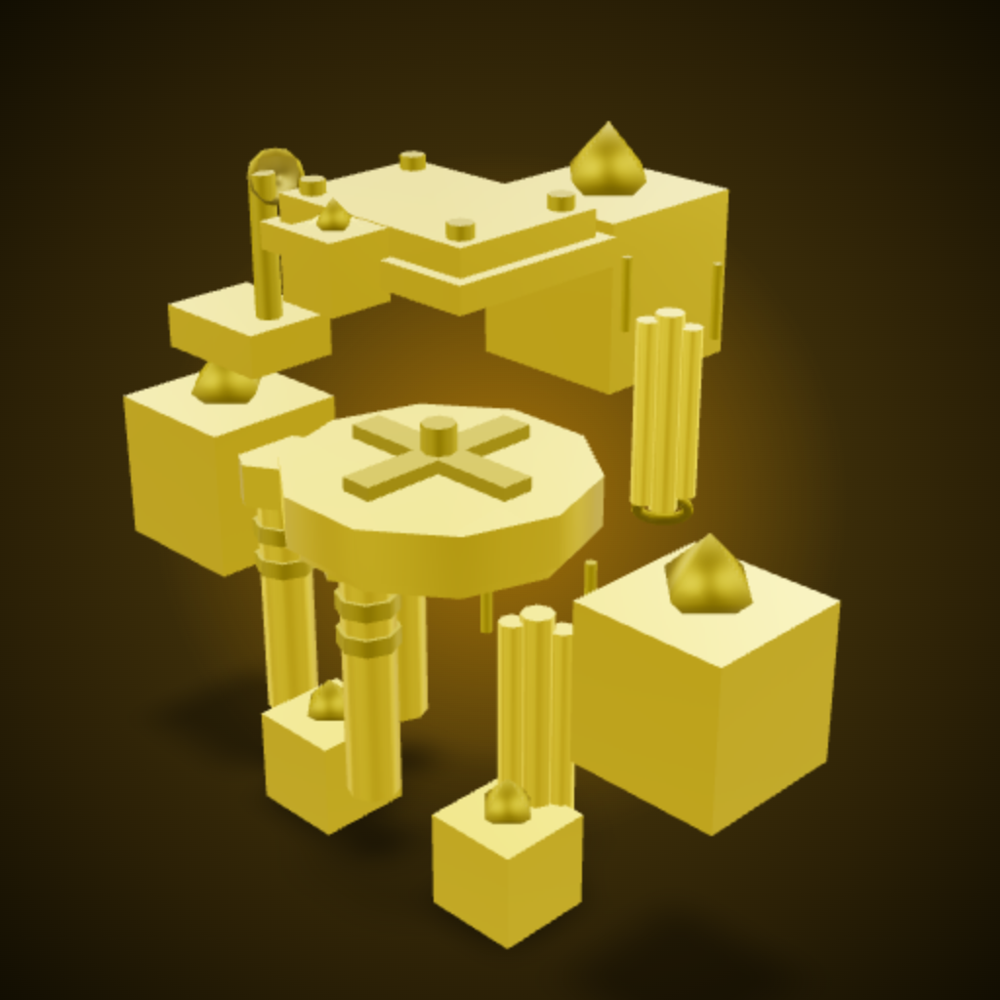 | **Coloso Titánico** | ⚙️ Mecánico | Tier 2 | 0.94m | 31 | 18 | 106 | 15 | 2x Cables deshilachados, 1x Diodos LED, 1x Tornillos y pernos, 1x Placas de latón, 1x Palancas de interruptor, 2x Brújulas magnéticas, 2x Transistores |
| #070 |  | **Destructor Engranado** | ⚙️ Mecánico | Tier 2 | 1.25m | 37 | 29 | 114 | 12 | 1x Motor de vapor, 2x Tuercas gigantes, 2x Engranajes de bronce, 1x Tubos de vacío, 2x Transistores, 2x Lentes de televisor viejo |
| #071 | 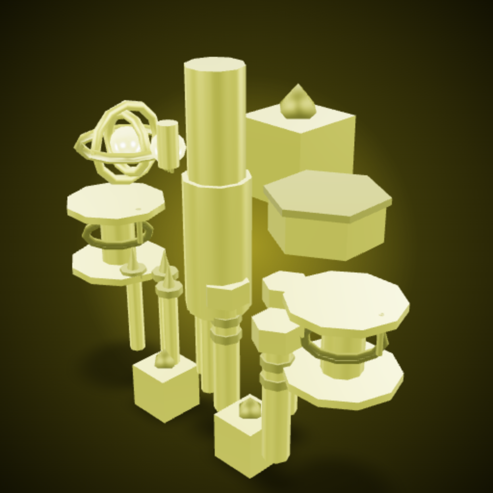 | **Servidor Fotonico** | ☀️ Luminoso | Tier 2 | 1.10m | 30 | 23 | 105 | 10 | 2x Tubos de vacío, 2x Alambre de cobre, 1x Giróscopo de precisión, 1x Diodos LED, 2x Tuercas gigantes, 1x Clavos oxidados, 1x Tornillos y pernos |
| #072 | 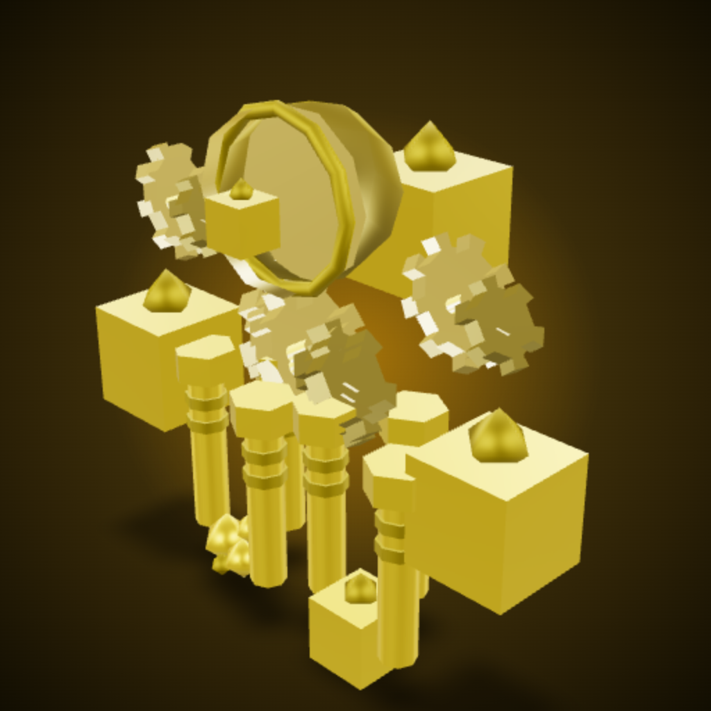 | **Forjador Autómata** | ⚙️ Mecánico | Tier 2 | 1.13m | 21 | 28 | 110 | 16 | 2x Engranajes de bronce, 2x Tornillos y pernos, 1x Lentes de televisor viejo, 2x Resortes de reloj, 1x Clavos oxidados, 1x Residuos de carbón |
| #073 | 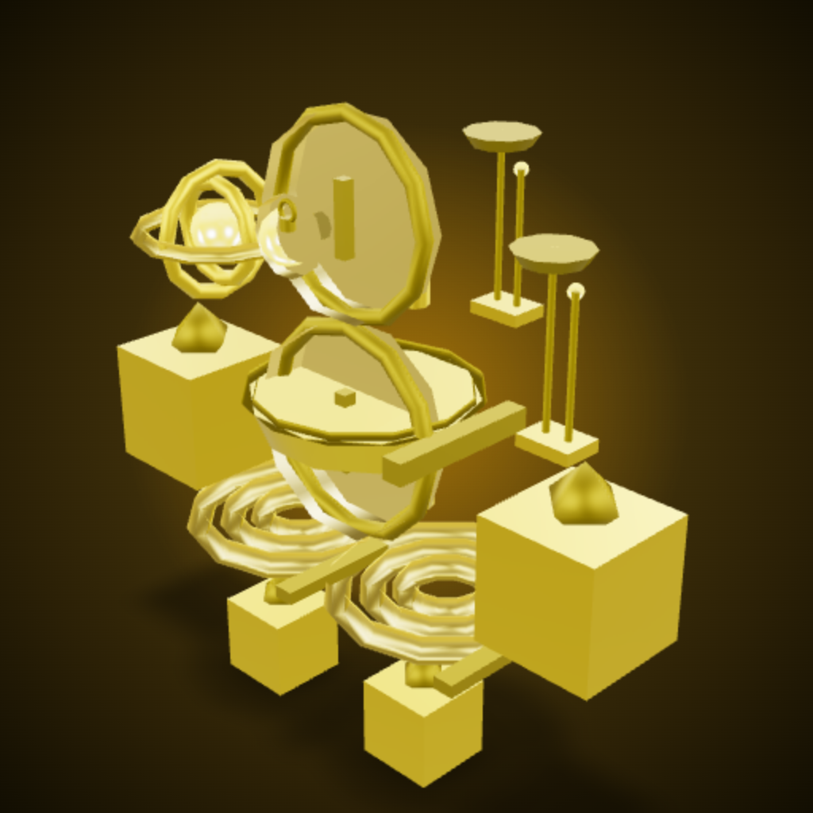 | **Ejecutor Férreo** | ⚙️ Mecánico | Tier 2 | 1.06m | 22 | 20 | 143 | 37 | 2x Antenas de radio, 2x Relojes de bolsillo rotos, 1x Giróscopo de precisión, 2x Resortes de reloj, 2x Manómetros, 2x Cables deshilachados, 1x Sartenes |
| #074 | 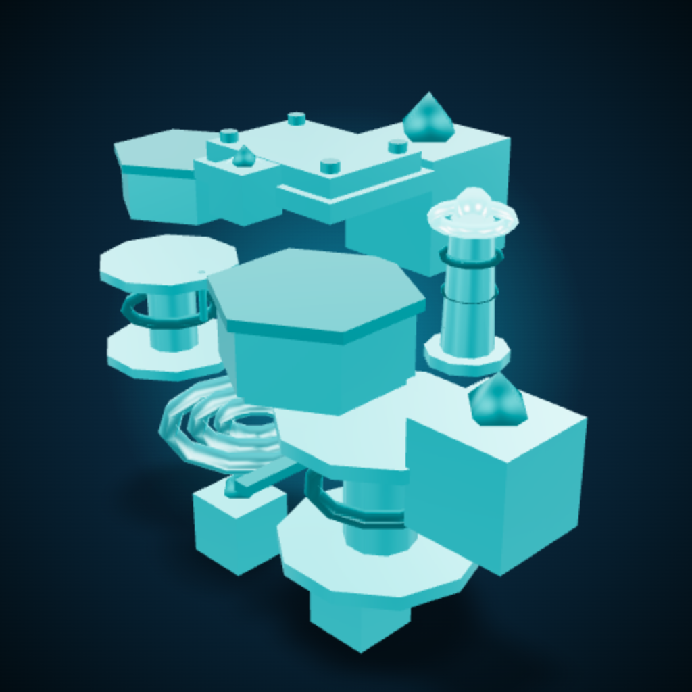 | **Rastreador Voltaico** | ⚡ Galvánico | Tier 2 | 1.01m | 34 | 17 | 109 | 14 | 1x Tuercas gigantes, 1x Resortes de reloj, 2x Alambre de cobre, 1x Placas de latón, 2x Transistores, 1x Bobinas de Tesla |
| #075 |  | **Titán Presurizado** | ♨️ Vapor | Tier 2 | 1.19m | 26 | 25 | 123 | 14 | 2x Cadenas de hierro, 2x Resortes de reloj, 1x Diodos LED, 2x Placas de latón, 2x Residuos de carbón, 1x Sartenes |
| #076 | 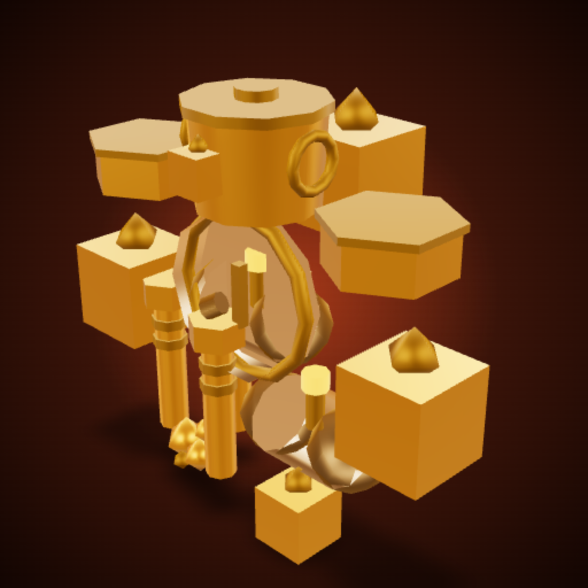 | **Caminante Volcánico** | ♨️ Vapor | Tier 2 | 1.15m | 29 | 23 | 190 | 6 | 2x Condensador alta presión, 2x Tuercas gigantes, 2x Transistores, 1x Manómetros, 1x Residuos de carbón, 2x Ollas de cocinar, 1x Tornillos y pernos |
| #077 |  | **Gólem Lúmen** | ☀️ Luminoso | Tier 2 | 1.20m | 22 | 16 | 153 | 7 | 2x Bombillas de filamento, 1x Manómetros, 1x Residuos de carbón, 1x Engranajes desgastados, 1x Sartenes |
| #078 | 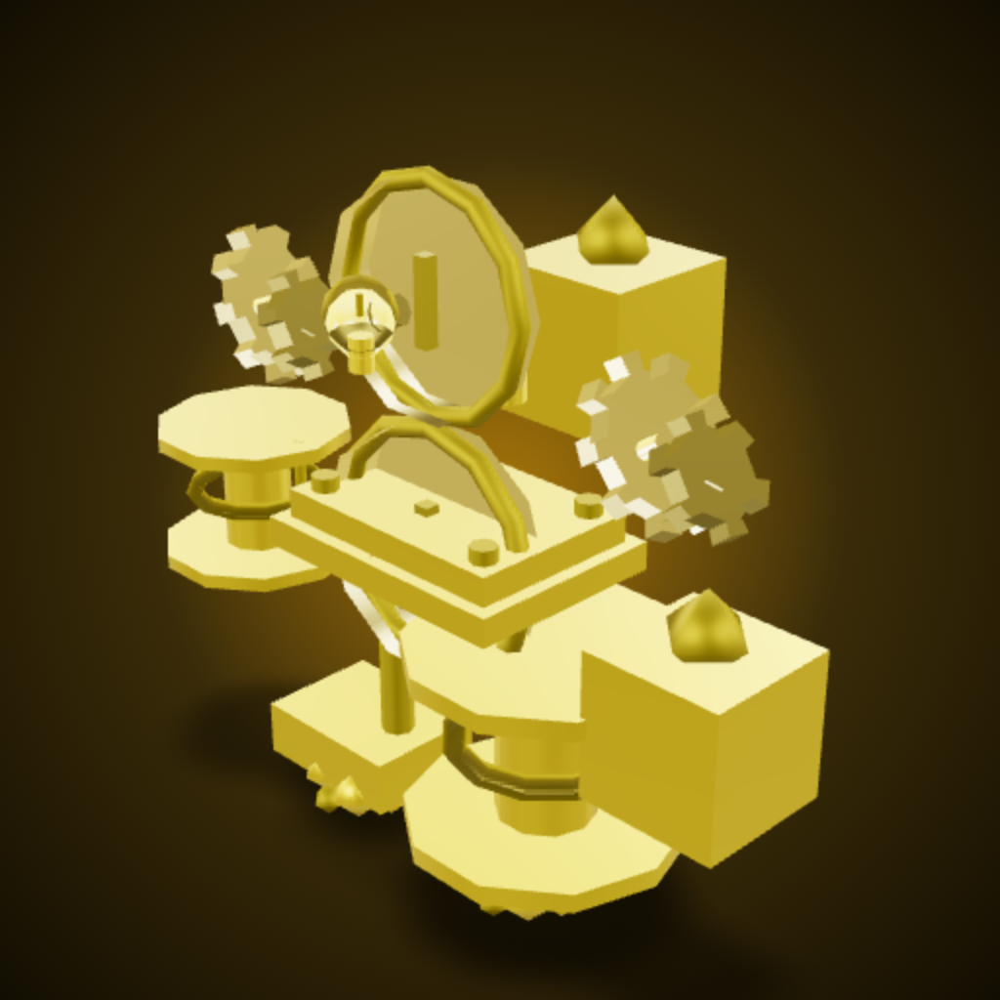 | **Centinela Broncíneo** | ⚙️ Mecánico | Tier 2 | 1.02m | 23 | 30 | 171 | 12 | 1x Palancas de interruptor, 2x Manómetros, 2x Engranajes de bronce, 1x Bombillas de filamento, 1x Placas de latón, 1x Cables deshilachados, 2x Residuos de carbón, 2x Alambre de cobre |
| #079 |  | **Defensor Vaporizado** | ♨️ Vapor | Tier 2 | 1.01m | 28 | 16 | 155 | 9 | 1x Tubos de vacío, 1x Condensador alta presión, 1x Baterías alquímicas, 1x Transistores, 2x Palancas de interruptor, 1x Relojes de bolsillo rotos |
| #080 | 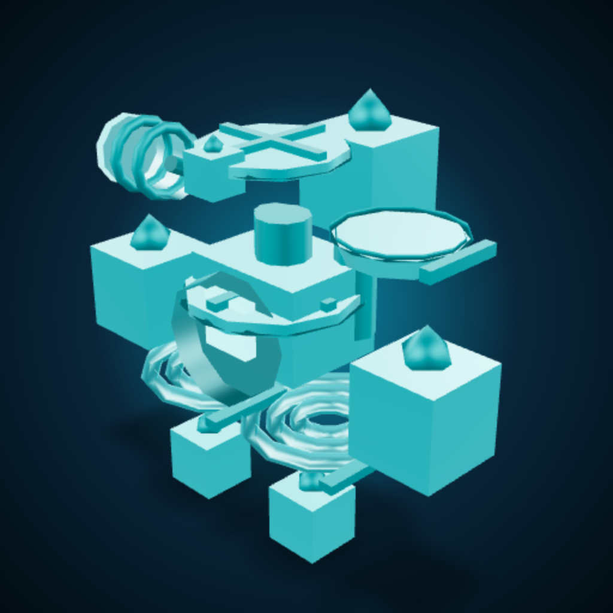 | **Ensamblaje Galvánico** | ⚡ Galvánico | Tier 2 | 1.17m | 32 | 21 | 135 | 10 | 1x Resortes de reloj, 2x Tapas de alcantarilla, 1x Dínamo galvánica, 1x Motor de vapor, 1x Baterías alquímicas, 1x Sartenes |
| #081 | 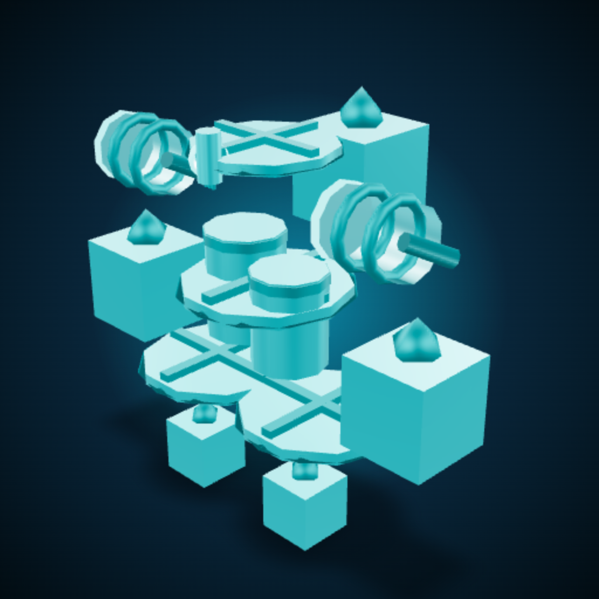 | **Guardián Eléctrico** | ⚡ Galvánico | Tier 2 | 0.93m | 46 | 16 | 123 | 10 | 1x Tapas de alcantarilla, 1x Latas de conserva, 2x Tubos de vacío, 2x Transistores, 2x Dínamo galvánica, 2x Cables deshilachados |
| #082 |  | **Cruzado Autómata** | ⚙️ Mecánico | Tier 2 | 1.09m | 23 | 31 | 144 | 12 | 1x Latas de conserva, 2x Ollas de cocinar, 2x Cadenas de hierro, 1x Brújulas magnéticas, 2x Tubos de cobre, 1x Válvulas de vapor, 1x Relojes de bolsillo rotos, 2x Engranajes de bronce |
| #083 |  | **Poblador Calderero** | ♨️ Vapor | Tier 2 | 1.05m | 23 | 18 | 142 | 13 | 1x Sartenes, 1x Lentes de televisor viejo, 1x Fusibles fundidos, 1x Condensador alta presión, 1x Resortes de reloj, 2x Latas de conserva, 2x Cadenas de hierro |
| #084 | 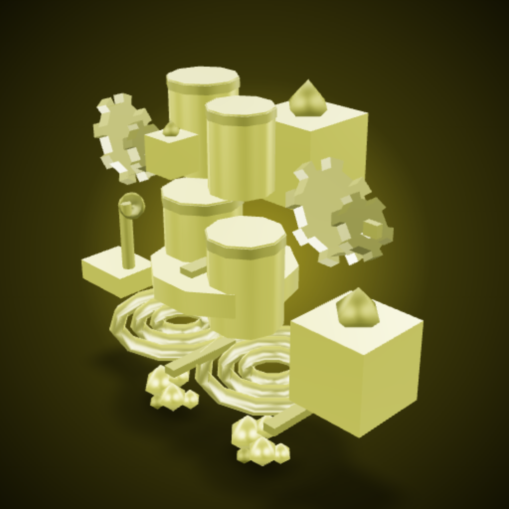 | **Fundidor Diódico** | ☀️ Luminoso | Tier 2 | 1.23m | 29 | 15 | 124 | 18 | 1x Latas de conserva, 2x Resortes de reloj, 2x Residuos de carbón, 2x Engranajes desgastados, 2x Diodos LED, 1x Brújulas magnéticas, 1x Palancas de interruptor |
| #085 | 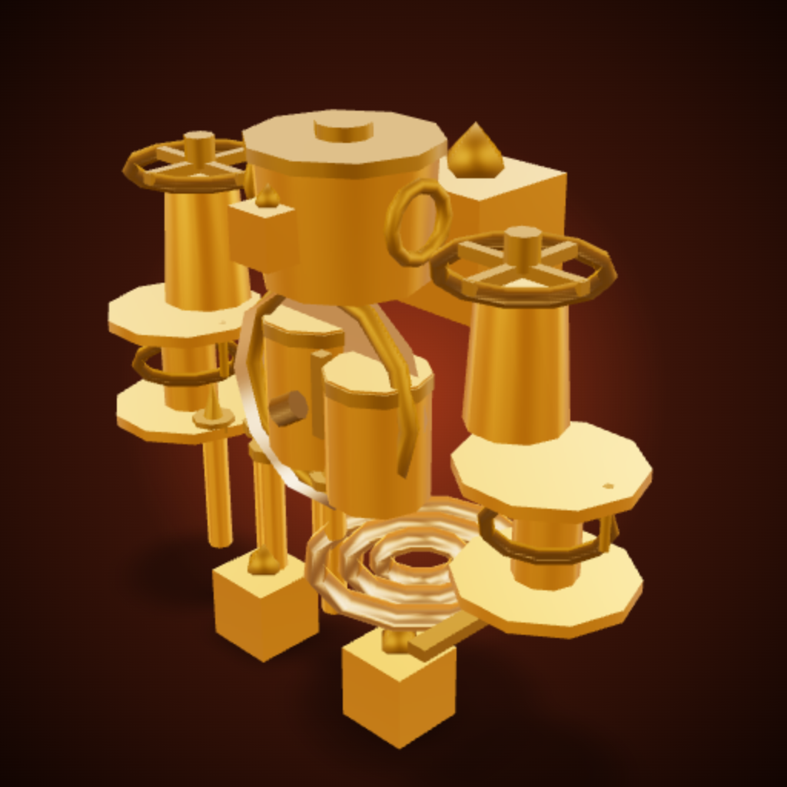 | **Vigía Presurizado** | ♨️ Vapor | Tier 2 | 1.06m | 33 | 18 | 164 | 19 | 1x Clavos oxidados, 2x Alambre de cobre, 2x Válvulas de vapor, 1x Bobinas de Tesla, 1x Latas de conserva, 2x Resortes de reloj, 2x Manómetros, 2x Ollas de cocinar |
| #086 |  | **Leviatán Plasmático** | ⚡ Galvánico | Tier 2 | 0.98m | 35 | 17 | 139 | 17 | 2x Dínamo galvánica, 2x Ollas de cocinar, 1x Válvulas de vapor, 2x Antenas de radio, 1x Tubos de cobre, 1x Tubos de vacío, 2x Clavos oxidados, 2x Latas de conserva |
| #087 | 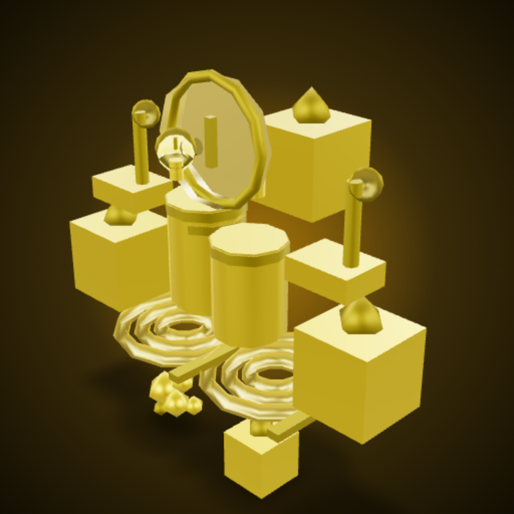 | **Vanguardia Articulado** | ⚙️ Mecánico | Tier 2 | 0.93m | 22 | 16 | 173 | 20 | 1x Manómetros, 2x Palancas de interruptor, 2x Bombillas de filamento, 2x Resortes de reloj, 2x Latas de conserva, 2x Brújulas magnéticas, 1x Residuos de carbón |
| #088 |  | **Autómata Centellante** | ☀️ Luminoso | Tier 2 | 1.29m | 36 | 17 | 114 | 18 | 1x Motor de vapor, 2x Tuercas gigantes, 2x Lentes de televisor viejo, 2x Diodos LED, 1x Cristal cuarzo resonante |
| #089 | 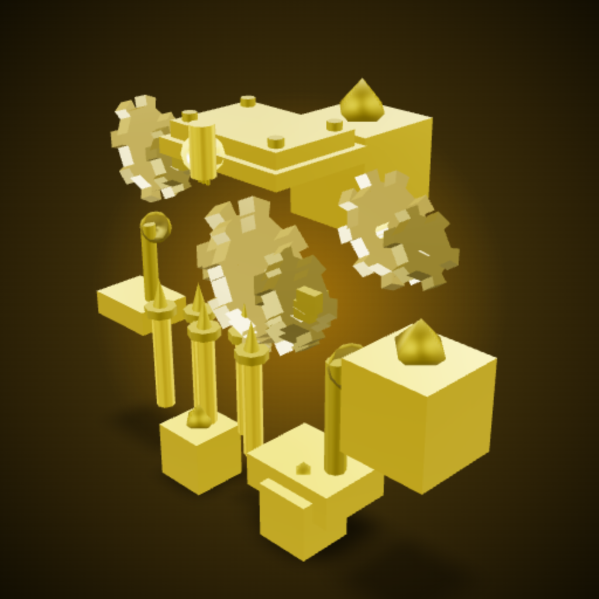 | **Protector Titánico** | ⚙️ Mecánico | Tier 2 | 1.13m | 28 | 31 | 111 | 7 | 1x Engranajes desgastados, 1x Engranajes de bronce, 2x Tubos de vacío, 1x Placas de latón, 2x Palancas de interruptor, 1x Clavos oxidados, 2x Tuercas gigantes |
| #090 |  | **Portador Engranado** | ⚙️ Mecánico | Tier 2 | 1.09m | 22 | 16 | 139 | 29 | 1x Latas de conserva, 2x Lentes de televisor viejo, 2x Alambre de cobre, 2x Brújulas magnéticas, 2x Tuercas gigantes, 2x Bombillas de filamento, 2x Resortes de reloj |
| #091 |  | **Monolito Primigenio** | 🔮 Éter | Tier 3 | 1.23m | 64 | 15 | 133 | 24 | 1x Motor de vapor, 2x Dínamo galvánica, 2x Brújulas magnéticas, 2x Cristal cuarzo resonante, 2x Núcleo de maná, 1x Cerebro de autómata |
| #092 | 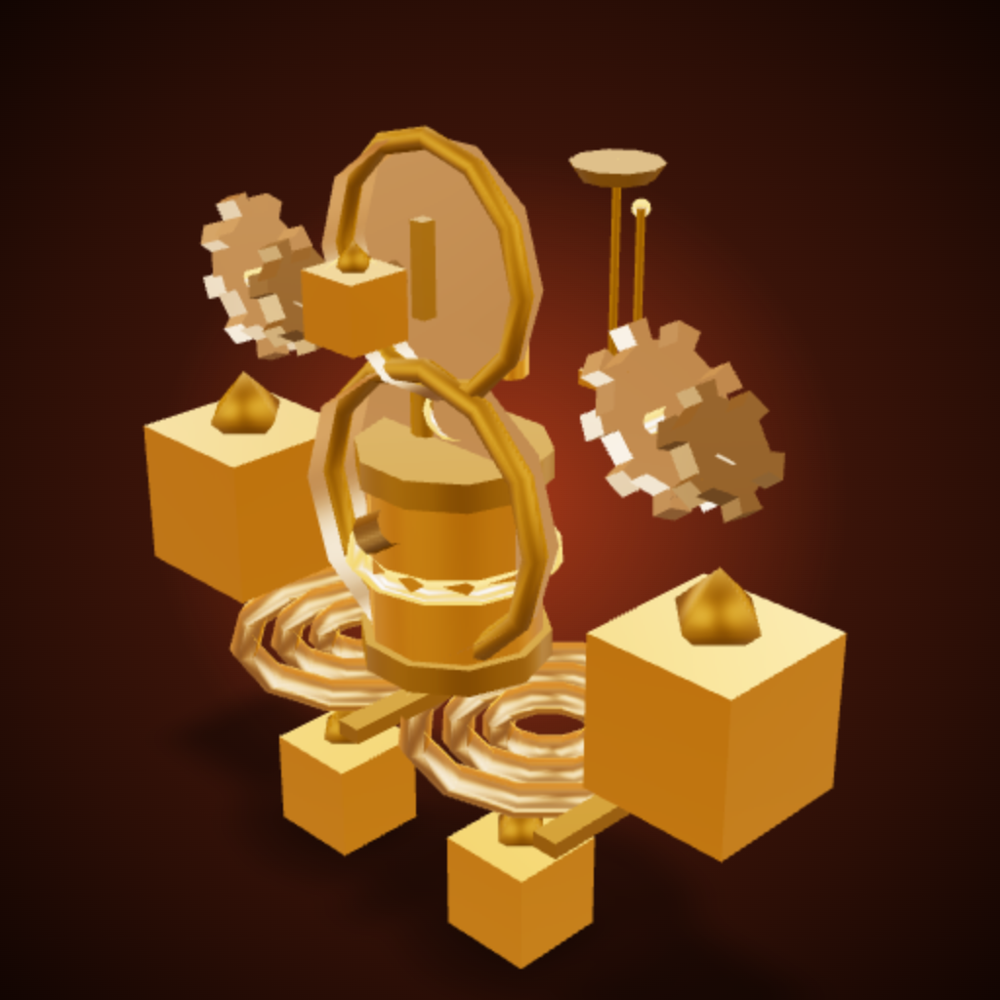 | **Chatarrero Térmico** | ♨️ Vapor | Tier 3 | 0.94m | 51 | 46 | 200 | 24 | 2x Batería plasma cargada, 1x Motor de vapor, 1x Condensador alta presión, 1x Antenas de radio, 2x Resortes de reloj, 2x Corazón de caldera, 2x Manómetros, 2x Engranajes de bronce |
| #093 |  | **Excavador Calderero** | ♨️ Vapor | Tier 3 | 1.17m | 58 | 20 | 191 | 26 | 1x Reactor de éter, 2x Palancas de interruptor, 2x Motor de vapor, 2x Condensador alta presión, 2x Antenas de radio, 1x Manómetros, 2x Lentes de televisor viejo, 1x Núcleo de maná, 1x Diodos LED |
| #094 | 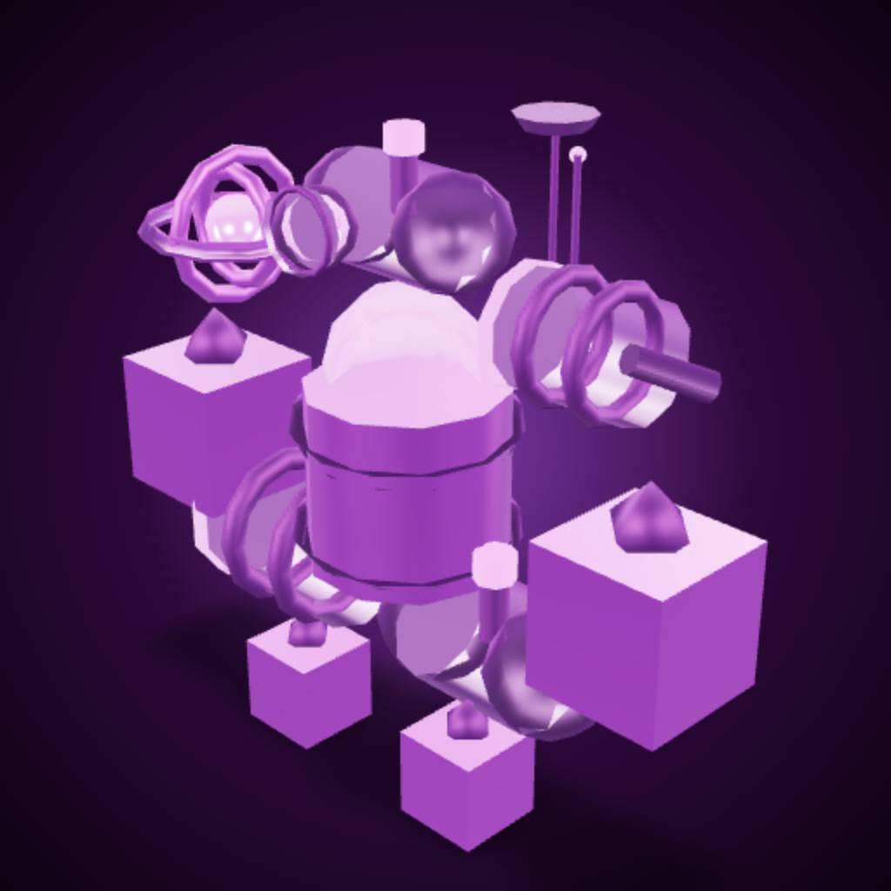 | **Patrullero Manático** | 🔮 Éter | Tier 3 | 1.26m | 58 | 22 | 166 | 22 | 1x Condensador alta presión, 1x Antenas de radio, 2x Dínamo galvánica, 2x Lentes de televisor viejo, 1x Giróscopo de precisión, 2x Reactor de éter |
| #095 | 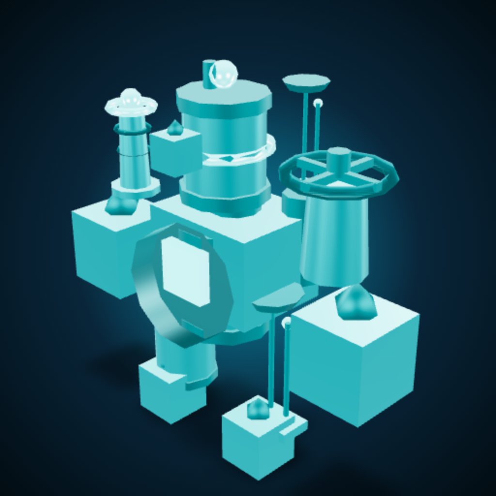 | **Basilisco Chispeante** | ⚡ Galvánico | Tier 3 | 1.05m | 59 | 23 | 140 | 40 | 2x Antenas de radio, 1x Bobinas de Tesla, 2x Batería plasma cargada, 1x Motor de vapor, 1x Émbolo titanio forjado, 1x Cristal cuarzo resonante, 2x Matriz óptica solar, 2x Válvulas de vapor |
| #096 |  | **Guardia Volcánico** | ♨️ Vapor | Tier 3 | 1.19m | 64 | 42 | 158 | 17 | 2x Núcleo de maná, 1x Bombillas de filamento, 1x Cerebro de autómata, 2x Motor de vapor, 1x Matriz óptica solar, 2x Giróscopo de precisión, 2x Émbolo titanio forjado |
| #097 |  | **Baluarte Lúmen** | ☀️ Luminoso | Tier 3 | 1.02m | 55 | 35 | 143 | 37 | 1x Núcleo de maná, 2x Antenas de radio, 1x Matriz óptica solar, 2x Tubos de vacío, 2x Bobinas de Tesla, 1x Corazón de caldera, 2x Resortes de reloj, 2x Giróscopo de precisión |
| #098 | 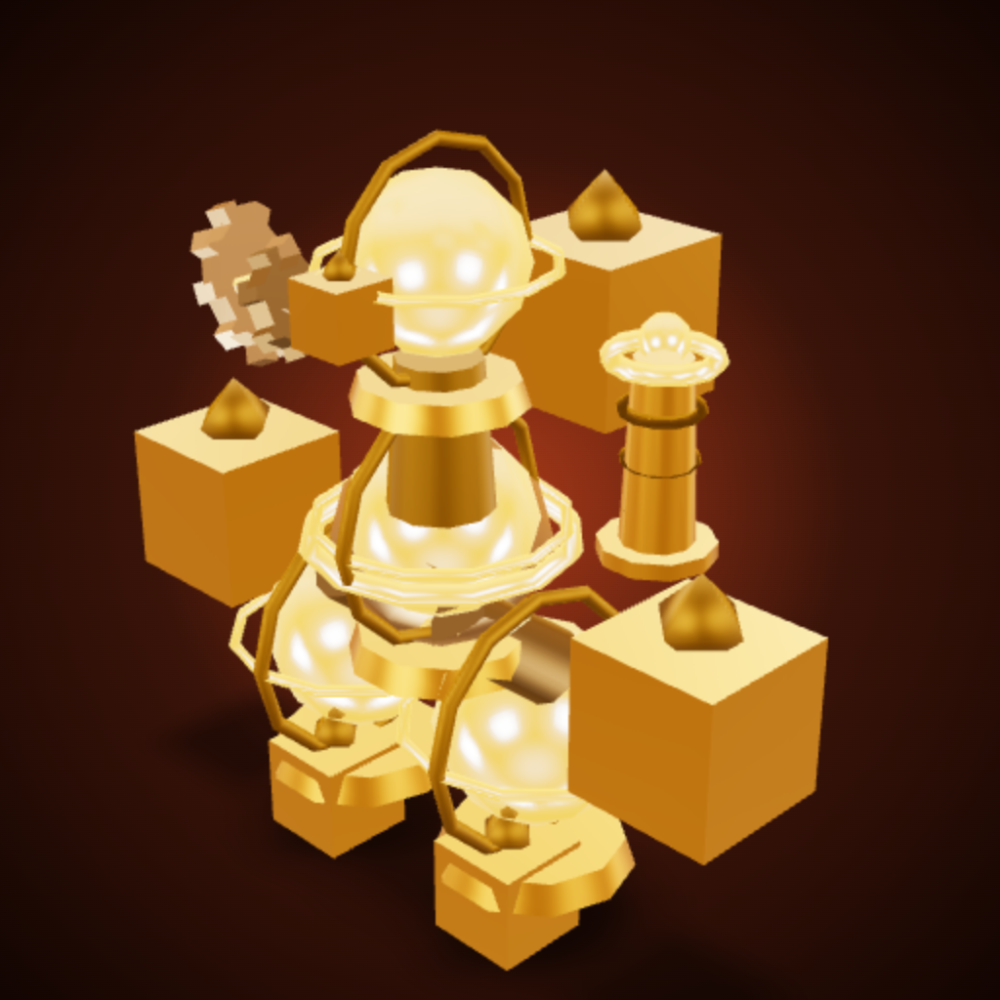 | **Cazador Pistón** | ♨️ Vapor | Tier 3 | 1.11m | 58 | 37 | 176 | 9 | 2x Núcleo de maná, 1x Engranajes de bronce, 2x Bobinas de Tesla, 2x Corazón de caldera, 1x Transistores, 2x Condensador alta presión |
| #099 | 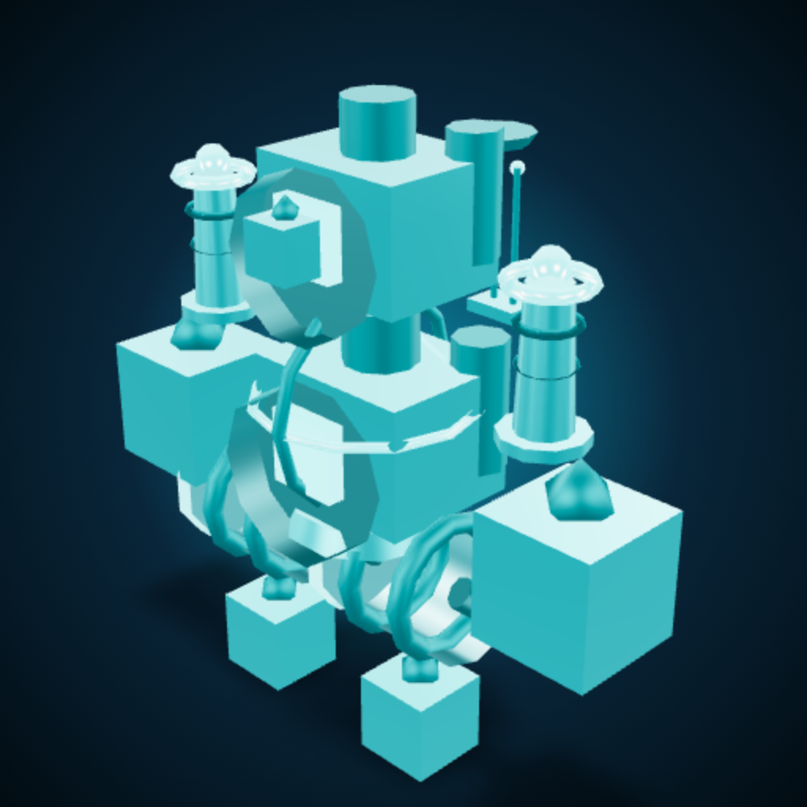 | **Artillero Rayante** | ⚡ Galvánico | Tier 3 | 1.11m | 81 | 16 | 136 | 20 | 2x Dínamo galvánica, 2x Diodos LED, 2x Motor de vapor, 2x Bobinas de Tesla, 2x Antenas de radio, 2x Núcleo de maná |
| #100 |  | **Espectro Vaporoso** | ♨️ Vapor | Tier 3 | 1.03m | 58 | 31 | 134 | 14 | 2x Núcleo de maná, 2x Dínamo galvánica, 2x Corazón de caldera, 1x Bobinas de Tesla, 1x Antenas de radio |
| #101 |  | **Coloso Humeante** | ♨️ Vapor | Tier 3 | 0.93m | 46 | 31 | 166 | 36 | 2x Brújulas magnéticas, 1x Condensador alta presión, 2x Antenas de radio, 2x Resortes de reloj, 2x Cerebro de autómata, 2x Émbolo titanio forjado |
| #102 |  | **Destructor Teslico** | ⚡ Galvánico | Tier 3 | 1.26m | 62 | 24 | 163 | 15 | 2x Dínamo galvánica, 1x Cristal cuarzo resonante, 1x Manómetros, 1x Émbolo titanio forjado, 1x Motor de vapor, 2x Batería plasma cargada |
| #103 |  | **Servidor Calderero** | ♨️ Vapor | Tier 3 | 0.93m | 48 | 33 | 182 | 16 | 1x Batería plasma cargada, 2x Giróscopo de precisión, 1x Matriz óptica solar, 2x Condensador alta presión, 1x Émbolo titanio forjado, 2x Bobinas de Tesla |
| #104 |  | **Forjador Diódico** | ☀️ Luminoso | Tier 3 | 1.26m | 58 | 30 | 203 | 22 | 1x Reactor de éter, 2x Núcleo de maná, 2x Giróscopo de precisión, 2x Baterías alquímicas, 2x Bombillas de filamento, 2x Diodos LED, 1x Engranajes de bronce, 2x Matriz óptica solar |
| #105 |  | **Ejecutor Presurizado** | ♨️ Vapor | Tier 3 | 1.00m | 34 | 38 | 210 | 9 | 2x Corazón de caldera, 1x Válvulas de vapor, 2x Baterías alquímicas, 1x Bombillas de filamento, 1x Émbolo titanio forjado, 1x Manómetros, 1x Motor de vapor |
| #106 |  | **Rastreador Plasmático** | ⚡ Galvánico | Tier 3 | 1.03m | 60 | 21 | 214 | 16 | 2x Baterías alquímicas, 1x Batería plasma cargada, 1x Matriz óptica solar, 1x Reactor de éter, 1x Giróscopo de precisión, 2x Dínamo galvánica, 2x Bombillas de filamento, 1x Motor de vapor |
| #107 |  | **Titán Ígneo** | ♨️ Vapor | Tier 3 | 1.04m | 45 | 32 | 260 | 22 | 1x Cristal cuarzo resonante, 1x Batería plasma cargada, 2x Manómetros, 2x Corazón de caldera, 1x Reactor de éter, 2x Baterías alquímicas, 2x Resortes de reloj, 2x Condensador alta presión |
| #108 |  | **Caminante Dragónico** | 🔮 Éter | Tier 3 | 1.17m | 58 | 23 | 166 | 26 | 1x Fusibles fundidos, 1x Resortes de reloj, 1x Condensador alta presión, 2x Antenas de radio, 1x Diodos LED, 2x Tubos de vacío, 2x Núcleo de maná, 1x Engranajes de bronce |
| #109 |  | **Gólem Vaporizado** | ♨️ Vapor | Tier 3 | 0.92m | 47 | 30 | 173 | 17 | 2x Diodos LED, 1x Cerebro de autómata, 1x Resortes de reloj, 1x Motor de vapor, 1x Émbolo titanio forjado, 1x Corazón de caldera, 2x Condensador alta presión, 1x Cristal cuarzo resonante |
| #110 |  | **Centinela Engranado** | ⚙️ Mecánico | Tier 3 | 1.25m | 44 | 31 | 157 | 24 | 1x Giróscopo de precisión, 2x Engranajes de bronce, 1x Núcleo de maná, 2x Cristal cuarzo resonante, 2x Motor de vapor, 1x Baterías alquímicas, 1x Antenas de radio |
| #111 |  | **Defensor Relojero** | ⚙️ Mecánico | Tier 3 | 0.91m | 45 | 43 | 155 | 16 | 1x Batería plasma cargada, 2x Giróscopo de precisión, 2x Palancas de interruptor, 2x Diodos LED, 2x Engranajes de bronce, 1x Matriz óptica solar, 1x Bombillas de filamento |
| #112 |  | **Ensamblaje Filamento** | ☀️ Luminoso | Tier 3 | 1.17m | 28 | 24 | 220 | 35 | 2x Baterías alquímicas, 1x Corazón de caldera, 2x Matriz óptica solar, 2x Antenas de radio, 2x Manómetros |
| #113 |  | **Guardián Férreo** | ⚙️ Mecánico | Tier 3 | 0.91m | 47 | 25 | 162 | 24 | 2x Antenas de radio, 1x Baterías alquímicas, 1x Brújulas magnéticas, 1x Dínamo galvánica, 2x Transistores, 2x Giróscopo de precisión, 1x Motor de vapor, 1x Diodos LED |
| #114 |  | **Cruzado Neumático** | ♨️ Vapor | Tier 3 | 1.09m | 46 | 45 | 136 | 16 | 2x Engranajes de bronce, 1x Relojes de bolsillo rotos, 1x Palancas de interruptor, 1x Tubos de vacío, 1x Cristal cuarzo resonante, 2x Núcleo de maná, 2x Corazón de caldera |
| #115 |  | **Poblador Singular** | 🔮 Éter | Tier 3 | 1.08m | 49 | 22 | 176 | 16 | 1x Diodos LED, 1x Matriz óptica solar, 2x Condensador alta presión, 1x Válvulas de vapor, 1x Engranajes de bronce, 2x Núcleo de maná |
| #116 |  | **Fundidor Místico** | 🔮 Éter | Tier 3 | 1.02m | 58 | 16 | 167 | 14 | 1x Baterías alquímicas, 1x Reactor de éter, 1x Diodos LED, 1x Cerebro de autómata, 1x Cristal cuarzo resonante, 1x Núcleo de maná |
| #117 |  | **Vigía Ígneo** | ♨️ Vapor | Tier 3 | 1.13m | 46 | 44 | 184 | 9 | 2x Batería plasma cargada, 2x Engranajes de bronce, 1x Manómetros, 2x Émbolo titanio forjado, 1x Condensador alta presión |
| #118 |  | **Leviatán Pistón** | ♨️ Vapor | Tier 3 | 1.28m | 70 | 27 | 171 | 29 | 2x Motor de vapor, 2x Relojes de bolsillo rotos, 1x Cerebro de autómata, 2x Condensador alta presión, 1x Resortes de reloj, 2x Dínamo galvánica, 2x Engranajes de bronce, 2x Antenas de radio, 2x Reactor de éter |
| #119 |  | **Vanguardia Vaporizado** | ♨️ Vapor | Tier 3 | 1.02m | 27 | 29 | 238 | 34 | 2x Matriz óptica solar, 2x Antenas de radio, 2x Émbolo titanio forjado, 2x Condensador alta presión, 1x Manómetros, 2x Baterías alquímicas |
| #120 |  | **Autómata Galvánico** | ⚡ Galvánico | Tier 3 | 1.21m | 40 | 20 | 189 | 16 | 1x Batería plasma cargada, 1x Matriz óptica solar, 1x Transistores, 1x Condensador alta presión, 2x Palancas de interruptor, 1x Baterías alquímicas |
| #121 |  | **Protector Primigenio** | 🔮 Éter | Tier 3 | 1.13m | 67 | 27 | 193 | 17 | 2x Reactor de éter, 1x Bobinas de Tesla, 2x Bombillas de filamento, 1x Matriz óptica solar, 2x Válvulas de vapor, 1x Engranajes de bronce, 1x Batería plasma cargada, 1x Condensador alta presión, 2x Palancas de interruptor |
| #122 |  | **Portador Térmico** | ♨️ Vapor | Tier 3 | 1.05m | 71 | 29 | 157 | 13 | 2x Tubos de vacío, 2x Émbolo titanio forjado, 2x Motor de vapor, 1x Cristal cuarzo resonante, 1x Baterías alquímicas, 1x Reactor de éter, 2x Bobinas de Tesla, 2x Dínamo galvánica |
| #123 |  | **Monolito Férreo** | ⚙️ Mecánico | Tier 3 | 0.98m | 78 | 22 | 200 | 20 | 1x Dínamo galvánica, 1x Giróscopo de precisión, 2x Cristal cuarzo resonante, 1x Motor de vapor, 2x Baterías alquímicas, 2x Núcleo de maná, 2x Fusibles fundidos, 2x Cerebro de autómata |
| #124 |  | **Chatarrero Voltaico** | ⚡ Galvánico | Tier 3 | 1.16m | 51 | 28 | 230 | 21 | 1x Giróscopo de precisión, 2x Antenas de radio, 1x Fusibles fundidos, 2x Bobinas de Tesla, 2x Baterías alquímicas, 2x Condensador alta presión, 1x Émbolo titanio forjado, 1x Reactor de éter |
| #125 |  | **Excavador Singular** | 🔮 Éter | Tier 3 | 1.30m | 69 | 42 | 133 | 17 | 2x Engranajes de bronce, 2x Núcleo de maná, 2x Corazón de caldera, 1x Transistores, 1x Antenas de radio, 1x Lentes de televisor viejo, 1x Dínamo galvánica, 2x Reactor de éter, 1x Tubos de vacío |
| #126 |  | **Patrullero Místico** | 🔮 Éter | Tier 4 | 1.06m | 111 | 40 | 187 | 31 | 3x Batería plasma cargada, 3x Reactor de éter, 3x Antenas de radio, 3x Diodos LED, 2x Corazón de caldera, 1x Núcleo de maná |
| #127 |  | **Basilisco Conductivo** | ⚡ Galvánico | Tier 4 | 1.22m | 71 | 21 | 245 | 23 | 1x Cristal cuarzo resonante, 3x Baterías alquímicas, 1x Matriz óptica solar, 2x Núcleo de maná, 2x Dínamo galvánica, 2x Bobinas de Tesla |
| #128 |  | **Guardia Dragónico** | 🔮 Éter | Tier 4 | 1.12m | 100 | 80 | 270 | 32 | 2x Matriz óptica solar, 2x Corazón de caldera, 1x Diodos LED, 2x Engranajes de bronce, 1x Singularidad etérica, 3x Núcleo de maná, 1x Bobinas de Tesla, 2x Reactor de éter, 3x Relicario engranajes |
| #129 |  | **Baluarte Arcano** | 🔮 Éter | Tier 4 | 1.02m | 112 | 89 | 307 | 30 | 2x Núcleo de maná, 2x Engranajes de bronce, 3x Relicario engranajes, 2x Corazón primigenio, 2x Singularidad etérica, 2x Corazón de caldera, 3x Reactor de éter |
| #130 |  | **Cazador Vaporoso** | ♨️ Vapor | Tier 4 | 1.02m | 104 | 28 | 233 | 17 | 1x Singularidad etérica, 2x Batería plasma cargada, 3x Condensador alta presión, 2x Motor de vapor, 2x Ojo de dragón mecánico, 1x Émbolo titanio forjado, 1x Dínamo galvánica |
| #131 |  | **Artillero Primigenio** | 🔮 Éter | Tier 4 | 1.20m | 107 | 70 | 216 | 27 | 3x Corazón de caldera, 2x Cerebro de autómata, 2x Bobinas de Tesla, 3x Reactor de éter, 1x Batería plasma cargada, 2x Corazón primigenio, 3x Giróscopo de precisión, 2x Cristal cuarzo resonante |
| #132 |  | **Espectro Relicario** | 🔮 Éter | Tier 4 | 1.00m | 115 | 44 | 223 | 15 | 1x Corazón primigenio, 2x Ojo de dragón mecánico, 2x Núcleo de maná, 1x Corazón de caldera, 1x Relicario engranajes, 2x Dínamo galvánica, 3x Batería plasma cargada |
| #133 |  | **Coloso Astral** | 🔮 Éter | Tier 4 | 0.96m | 74 | 68 | 337 | 35 | 3x Corazón primigenio, 1x Antenas de radio, 1x Batería plasma cargada, 3x Relicario engranajes, 1x Bobinas de Tesla, 1x Cerebro de autómata, 1x Matriz óptica solar |
| #134 |  | **Destructor Manático** | 🔮 Éter | Tier 4 | 1.17m | 116 | 57 | 235 | 55 | 2x Corazón de caldera, 2x Relicario engranajes, 2x Motor de vapor, 3x Antenas de radio, 3x Núcleo de maná, 2x Singularidad etérica, 2x Matriz óptica solar, 3x Batería plasma cargada |
| #135 |  | **Servidor Singular** | 🔮 Éter | Tier 4 | 1.14m | 136 | 68 | 333 | 33 | 3x Bobinas de Tesla, 3x Relicario engranajes, 2x Singularidad etérica, 1x Corazón primigenio, 2x Condensador alta presión, 1x Antenas de radio, 3x Batería plasma cargada, 2x Giróscopo de precisión, 2x Ojo de dragón mecánico |
| #136 |  | **Forjador Místico** | 🔮 Éter | Tier 4 | 1.27m | 94 | 88 | 375 | 33 | 2x Condensador alta presión, 3x Relicario engranajes, 1x Baterías alquímicas, 1x Corazón de caldera, 3x Ojo de dragón mecánico, 3x Corazón primigenio, 2x Matriz óptica solar, 3x Engranajes de bronce, 1x Bobinas de Tesla |
| #137 |  | **Ejecutor Cósmico** | 🔮 Éter | Tier 4 | 0.93m | 97 | 47 | 204 | 18 | 3x Reactor de éter, 1x Relicario engranajes, 1x Ojo de dragón mecánico, 1x Batería plasma cargada, 2x Corazón de caldera, 3x Motor de vapor, 1x Matriz óptica solar |
| #138 |  | **Rastreador Pistón** | ♨️ Vapor | Tier 4 | 1.25m | 56 | 86 | 295 | 26 | 1x Corazón primigenio, 3x Corazón de caldera, 2x Reactor de éter, 2x Antenas de radio, 2x Baterías alquímicas, 3x Engranajes de bronce, 3x Émbolo titanio forjado, 3x Condensador alta presión |
| #139 |  | **Titán Arcano** | 🔮 Éter | Tier 4 | 0.98m | 92 | 78 | 275 | 24 | 2x Cerebro de autómata, 2x Antenas de radio, 1x Ojo de dragón mecánico, 2x Giróscopo de precisión, 3x Batería plasma cargada, 3x Relicario engranajes, 2x Émbolo titanio forjado |
| #140 |  | **Caminante Etéreo** | 🔮 Éter | Tier 4 | 0.90m | 96 | 51 | 211 | 23 | 3x Émbolo titanio forjado, 2x Núcleo de maná, 1x Singularidad etérica, 1x Batería plasma cargada, 2x Reactor de éter, 2x Corazón primigenio |
| #141 |  | **Gólem Primigenio** | 🔮 Éter | Tier 4 | 0.96m | 144 | 23 | 210 | 32 | 2x Reactor de éter, 3x Cerebro de autómata, 1x Diodos LED, 3x Singularidad etérica, 1x Dínamo galvánica, 1x Ojo de dragón mecánico, 1x Condensador alta presión |
| #142 |  | **Centinela Relicario** | 🔮 Éter | Tier 4 | 1.01m | 118 | 61 | 245 | 12 | 2x Núcleo de maná, 2x Ojo de dragón mecánico, 3x Engranajes de bronce, 2x Relicario engranajes, 2x Batería plasma cargada, 1x Motor de vapor, 3x Dínamo galvánica |
| #143 |  | **Defensor Astral** | 🔮 Éter | Tier 4 | 1.22m | 99 | 78 | 259 | 35 | 3x Relicario engranajes, 1x Antenas de radio, 1x Corazón de caldera, 1x Ojo de dragón mecánico, 1x Dínamo galvánica, 3x Diodos LED, 3x Singularidad etérica, 3x Émbolo titanio forjado |
| #144 |  | **Ensamblaje Neumático** | ♨️ Vapor | Tier 4 | 1.15m | 114 | 66 | 189 | 13 | 3x Núcleo de maná, 2x Motor de vapor, 3x Corazón de caldera, 2x Giróscopo de precisión, 3x Batería plasma cargada, 3x Dínamo galvánica, 1x Émbolo titanio forjado |
| #145 |  | **Guardián Singular** | 🔮 Éter | Tier 4 | 0.91m | 176 | 57 | 235 | 43 | 3x Condensador alta presión, 3x Singularidad etérica, 2x Engranajes de bronce, 3x Ojo de dragón mecánico, 2x Motor de vapor, 3x Corazón de caldera, 2x Matriz óptica solar, 1x Núcleo de maná, 3x Cerebro de autómata, 3x Batería plasma cargada |
| #146 |  | **Cruzado Místico** | 🔮 Éter | Tier 4 | 1.01m | 54 | 44 | 291 | 20 | 1x Matriz óptica solar, 1x Núcleo de maná, 1x Cerebro de autómata, 2x Relicario engranajes, 2x Condensador alta presión |
| #147 |  | **Poblador Cósmico** | 🔮 Éter | Tier 4 | 0.90m | 139 | 79 | 284 | 32 | 3x Relicario engranajes, 1x Corazón primigenio, 3x Singularidad etérica, 3x Cerebro de autómata, 1x Dínamo galvánica, 1x Diodos LED, 1x Batería plasma cargada, 3x Núcleo de maná, 2x Émbolo titanio forjado, 2x Giróscopo de precisión |
| #148 |  | **Fundidor Dragónico** | 🔮 Éter | Tier 4 | 1.14m | 122 | 62 | 337 | 29 | 3x Corazón primigenio, 2x Ojo de dragón mecánico, 1x Matriz óptica solar, 3x Condensador alta presión, 1x Motor de vapor, 1x Engranajes de bronce, 1x Relicario engranajes, 3x Batería plasma cargada, 3x Diodos LED, 1x Corazón de caldera |
| #149 |  | **Vigía Arcano** | 🔮 Éter | Tier 4 | 0.91m | 169 | 60 | 270 | 61 | 1x Corazón de caldera, 3x Cerebro de autómata, 3x Matriz óptica solar, 3x Reactor de éter, 2x Batería plasma cargada, 3x Ojo de dragón mecánico, 1x Antenas de radio, 3x Relicario engranajes, 2x Singularidad etérica, 2x Cristal cuarzo resonante |
| #150 |  | **Leviatán Etéreo** | 🔮 Éter | Tier 4 | 1.15m | 130 | 47 | 216 | 18 | 2x Corazón primigenio, 2x Corazón de caldera, 2x Ojo de dragón mecánico, 1x Dínamo galvánica, 2x Batería plasma cargada, 1x Reactor de éter, 3x Cerebro de autómata, 1x Motor de vapor |


## 7. Las estadísticas y el combate en tiempo real

Cada golem posee 5 estadísticas fundamentales:
- **Ataque (ATK)**: Daño base por impacto ($20-38$).
- **Defensa (DEF)**: Reducción directa de daño recibido ($10-22$).
- **Vitalidad (HP)**: Puntos totales de salud ($100-160$).
- **Velocidad (SPD)**: Frecuencia de ataque ($T_{\text{cooldown}} = 2.2\text{s} / (1 + \text{SPD}\times 0.04)$) y traslación.
- **Afinidad Elemental (AFF)**: `STEAM`, `MECHANICAL`, `GALVANIC`, `LUMINOUS`, `AETHER`.

### El Pentágono de Afinidades Elementales
- `Vapor` vence a `Mecánico` ($\times 1.40$) | Desventaja ante `Éter` ($\times 0.75$)
- `Mecánico` vence a `Galvánico` ($\times 1.40$) | Desventaja ante `Vapor` ($\times 0.75$)
- `Galvánico` vence a `Luminoso` ($\times 1.40$) | Desventaja ante `Mecánico` ($\times 0.75$)
- `Luminoso` vence a `Éter` ($\times 1.40$) | Desventaja ante `Galvánico` ($\times 0.75$)
- `Éter` vence a `Vapor` ($\times 1.40$) | Desventaja ante `Luminoso` ($\times 0.75$)

Ecuación de daño: $\text{Daño} = \max\left(2, \text{round}\big((\text{ATK} - \text{DEF} \times 0.5) \times \text{Multiplicador}\big)\right)$.


## 8. Límite de golems, seguimiento Multi-Trail y etiquetas P2P

- **Escuadrón Activo (Máximo 3)**: El jugador lleva hasta 3 golems simultáneos en formación.
- **Asignación Aleatoria por Sesión**: Al ingresar a la escena, el usuario recibe 3 golems aleatorios de afinidades distintas en memoria volátil.
- **Algoritmo Multi-Trail (FIFO LERP/SLERP)**: Procesa trayectorias a 60 FPS desfasando posiciones a $1.8\text{m}$, $3.6\text{m}$ y $5.4\text{m}$ en fila india detrás del avatar local y remotos.
- **Etiquetas Floats `Billboard` & ASCII Health**: Cada golem muestra en tiempo real una etiqueta superior con su nombre, afinidad, barra de salud ASCII `[████████░░]` y dirección de billetera del dueño.
- **Handshake P2P (`MessageBus`)**: Los clientes anuncian y solicitan la composición de escuadrones mediante `golem_squad_announce` y `golem_squad_request`.


## 9. Misiones de recolección automatizadas

Los golems en reserva pueden enviarse a expediciones fuera de línea desde la interfaz:
- **Destino y Duración**: Desde 15 minutos hasta 12 horas.
- **Eficiencia**: Calculada en base a la velocidad y afinidad del golem.
- **Persistencia Asíncrona**: Computada en la API PHP/MySQL para continuar operando con el jugador desconectado.

## 10. Silas el Sobreviviente y los personajes no jugadores (NPCs)

- **Silas el Sobreviviente**: Mentor tutorial pacifista en el punto de aparición `(15.8m, 5.9m)`.
- **NPCs Hostiles y Guardianes de Zona**: Patrullas mecánicas con rutas de waypoints y radio de agresión que defienden las zonas PK (*Desierto Chatarra* y *Calderas*), custodiando los materiales épicos y legendarios con golems de alto nivel.

### 10.1 Vestimenta y Accesorios 3D Equipables (18 Wearables)

Además de la vestimenta nativa (`base-avatars`), el proyecto genera proceduralmente **18 accesorios 3D `.glb`** en `assets/wearables/`, equipables tanto en NPCs como en jugadores mediante `AvatarAttach` (PBR mobile-first, emisión solo en material `glow`, sin luces dinámicas):

| # | Render | Wearable | Anclaje (`AAPT_`) | Categoría | Tris |
| :-: | :-: | :--- | :--- | :--- | :-: |
| 1 |  | Gafas de Aviador Steampunk | `HEAD` | Eyewear | 788 |
| 2 |  | Máscara de Soldar Mad Max | `HEAD` | Mask | 684 |
| 3 |  | Mochila de Caldera de Vapor | `SPINE2` | Back | 884 |
| 4 |  | Generador Galvánico Tesla | `SPINE2` | Back | 996 |
| 5 |  | Llave Mecatrónica Gigante | `RIGHT_HAND` | Hand | 372 |
| 6 |  | Antorcha de Vapor Industrial | `RIGHT_HAND` | Hand | 604 |
| 7 |  | Hombrera Blindada con Púas | `LEFT_SHOULDER` | Shoulder | 644 |
| 8 |  | Corona de Cristal de Éter | `HEAD` | Tiara | 176 |
| 9 |  | Monóculo de Latón | `HEAD` | Eyewear | 680 |
| 10 |  | Sombrero de Copa a Vapor | `HEAD` | Hat | 938 |
| 11 |  | Collarín de Engranajes | `NECK` | Neck | 1200 |
| 12 |  | Peto Blindado Remachado | `SPINE1` | Chest | 1040 |
| 13 |  | Cinturón de Herramientas | `HIP` | Hip | 956 |
| 14 |  | Guantelete Blindado Izquierdo | `LEFT_FOREARM` | Handwear | 768 |
| 15 |  | Guantelete Blindado Derecho | `RIGHT_FOREARM` | Handwear | 768 |
| 16 |  | Brazo Mecánico con Pistón | `LEFT_ARM` | Arm | 992 |
| 17 |  | Cañón de Vapor al Hombro | `RIGHT_SHOULDER` | Shoulder | 840 |
| 18 |  | Bota Blindada con Grebas | `RIGHT_FOOT` | Feet | 648 |

- 📖 *Guía maestra*: [`guias/guia-fabricacion-y-catalogo-npcs.md`](guias/guia-fabricacion-y-catalogo-npcs.md) · Catálogo completo: [`GOLEMS/Golems-Wearables-18.md`](Golems-Wearables-18.md).

## 11. Progresión y niveles

- **Nivel del Jugador**: Desbloquea más ranuras de expedición, capacidad de bóveda en el escondite y mayor alcance del radar.
- **Nivel de Golems**: Incrementa ATK, DEF y HP proporcionalmente a su perfil de forja. El techo de nivel depende de la rareza de los componentes utilizados.

## 12. El torneo escalera y la Gran Arena Circular Steampunk (Colosal 72m - Cell Ring)


### 12.1 Formatos Competitivos (1v1 y 2v2)
- **1v1**: 3 golems vs 3 golems en tiempo real por estadísticas.
- **2v2**: 2 jugadores por bando (12 golems simultáneos en arena).
- **Matchmaking Elo**: Clasificación registrada en MySQL mediante peticiones firmadas `signedFetch`.

### 12.2 Especificación de la Gran Arena Circular de Torneo Steampunk (Ø 72m)
Ubicada en el centro geométrico del mundo `(X: 200m, Z: 200m)`:
- **Plataforma Elevada Radial (72m / $R=36\text{m}$)**: Elevada $+0.6\text{m}$ sobre el terreno con 250+ losas reforzadas y bordillos de adoquín.
- **4 Columnas Monumentales de 12 Metros**: En las 4 esquinas diagonales (NW, NE, SE, SW), integradas por calderas base ampliadas (1.8x), fustes triples de engranajes verticales (`Gear Shaft.glb`), doble anillo giratorio contragiro, farolas dobles y chimeneas superiores humeantes (`Smoker.glb`).
- **Gran Sigilo Planetario Central**: Un engranaje central colosal (`Gear Big.glb` escala 4.8x / ~12m Ø) girando a $+0.20\text{ rad/s}$ sincronizado con 8 engranajes satélites en formación orbital y un altar relicario con espada (`Arthur Sword.glb`).
- **16 Balizas Perimetrales y Rampas Ceremoniales**: Pedestales de barril con números Steampunk (`00` a `08`) y 4 grandes rampas cardinales de acceso (Norte, Sur, Este, Oeste) con doble barandilla de seguridad (`Tree Fence.glb`).

## 13. Arquitectura del servidor y persistencia

Architecture híbrida:
- **Runtime**: Decentraland SDK7 (`@dcl/sdk/ecs`, `@dcl/sdk/react-ecs`, `@dcl/sdk/math`).
- **Multijugador P2P**: `MessageBus` para difusión efímera de ataques, derrotas y escuadrones.
- **Backend Persistente**: API REST PHP 8.x + Base de Datos MySQL con solicitudes autenticadas por firmas Web3 (`signedFetch`).

## 14. Arquitectura de código en el SDK y Motor Bilingüe i18n

### 14.1 Estructura Modular
El código está organizado en carpetas dedicadas dentro de `src/`: `components/`, `config/`, `objects/`, `systems/` e `i18n/`.

### 14.2 Motor de Internacionalización Bilingüe (`src/i18n`)
- **Diccionarios Canónicos Tipados**: `src/i18n/locales/es.ts` y `en.ts` bajo `TranslationSchema`.
- **Selector en HUD**: Botón táctil `🌐 ES | EN` en la esquina superior derecha del HUD React-ECS que alterna dinámicamente el idioma en tiempo real sin recargar la escena.
- **Suscripción Reactiva**: Actualiza instantáneamente modales de diálogo de Silas, textos de HUD, menús de forja y registros de combate.

## 15. Multijugador en vivo
Sincronización P2P distribuida con separación estricta entre datos efímeros de red (ataques, posiciones) y datos persistentes en base de datos MySQL (inventario, recetas, ranking).

## 16. Restricciones para el cliente móvil (Mobile-First)
- 🚫 Sin luces dinámicas (materiales horneados / unlit emisivos).
- 🚫 Sin raycasting de puntero complejo (reemplazado por radar de distancia euclidiana).
- 🚫 Sin 9-slice complejo ni análisis FFT de audio.
- 🚫 Sin dependencia de teclado físico / ratón (controles 100% táctiles con hitboxes amplias $\ge 1.2\text{m}$ respetando zonas seguras de pantalla).

## 17. Cierre y camino a seguir
El ecosistema especificado proporciona un marco de desarrollo probado y completamente integrado en Decentraland SDK7, optimizado para ofrecer una experiencia fluida a 60 FPS tanto en dispositivos móviles como en clientes de escritorio.
