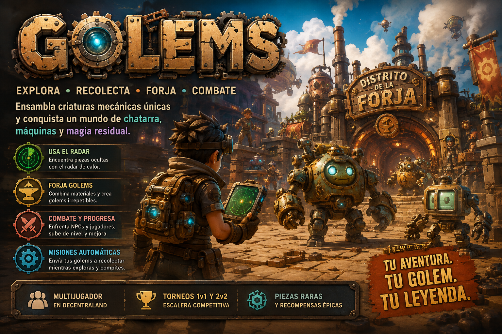

# Golems: Experiencia Multijugador en Decentraland

[](https://docs.decentraland.org)
[](https://decentraland.org)
[](https://docs.decentraland.org/creator/build-for-mobile/)
[-f59e0b.svg)](https://docs.decentraland.org)
[-3b82f6.svg)](https://docs.decentraland.org)

**Golems** es una experiencia multijugador masiva desarrollada sobre **Decentraland SDK7** ambientada en un fascinante universo de chatarra, tecnología steampunk y magia residual. Los jugadores exploran un extenso mundo de 160.000 m², rastrean piezas mecánicas ocultas mediante un innovador **Radar de Calor**, forjan autómatas de combate únicos mediante un sistema de **hash determinista**, dirigen expediciones automatizadas y combaten en tiempo real tanto en el entorno abierto como en un **Torneo Escalera** competitivo (1v1 y 2v2).

---

## 📑 Tabla de Contenidos

1. [De qué trata el juego](#-de-qu%C3%A9-trata-el-juego)
2. [El Bucle Principal de Juego](#-el-bucle-principal-de-juego)
3. [El Mundo y Mapa (Grid 25x25 - 400m × 400m)](#-el-mundo-y-mapa-grid-25x25---400m--400m)
4. [El Radar de Calor y la Recolección](#-el-radar-de-calor-y-la-recolecci%C3%B3n)
5. [Catálogo Completo de Materiales](#-cat%C3%A1logo-completo-de-materiales)
6. [La Forja y Unicidad de los Golems (Hash Determinista)](#-la-forja-y-unicidad-de-los-golems-hash-determinista)
7. [Estadísticas, Afinidades y Combate en Tiempo Real](#-estad%C3%ADsticas-afinidades-y-combate-en-tiempo-real)
8. [Golems Acompañantes y Misiones de Reserva](#-golems-acompa%C3%B1antes-y-misiones-de-reserva)
9. [NPCs Hostiles y Guardianes de Zona](#-npcs-hostiles-y-guardianes-de-zona)
10. [Progresión y Sistema de Niveles](#-progresi%C3%B3n-y-sistema-de-niveles)
11. [Torneo Escalera Competitivo (1v1 y 2v2)](#-torneo-escalera-competitivo-1v1-y-2v2)
12. [Arquitectura Técnica y Persistencia](#-arquitectura-t%C3%A9cnica-y-persistencia)
13. [Diseño Mobile-First y Restricciones de Rendimiento](#-dise%C3%B1o-mobile-first-y-restricciones-de-rendimiento)
14. [Instalación, Desarrollo y Despliegue](#-instalaci%C3%B3n-desarrollo-y-despliegue)
15. [Estructura del Proyecto](#-estructura-del-proyecto)

---

## ⚙️ De qué trata el juego

En el mundo de **Golems**, la civilización ha dejado atrás toneladas de maquinaria en desuso: transistores, calderas, manómetros, ollas, antenas de radio y baterías alquímicas impregnadas de energía residual. 

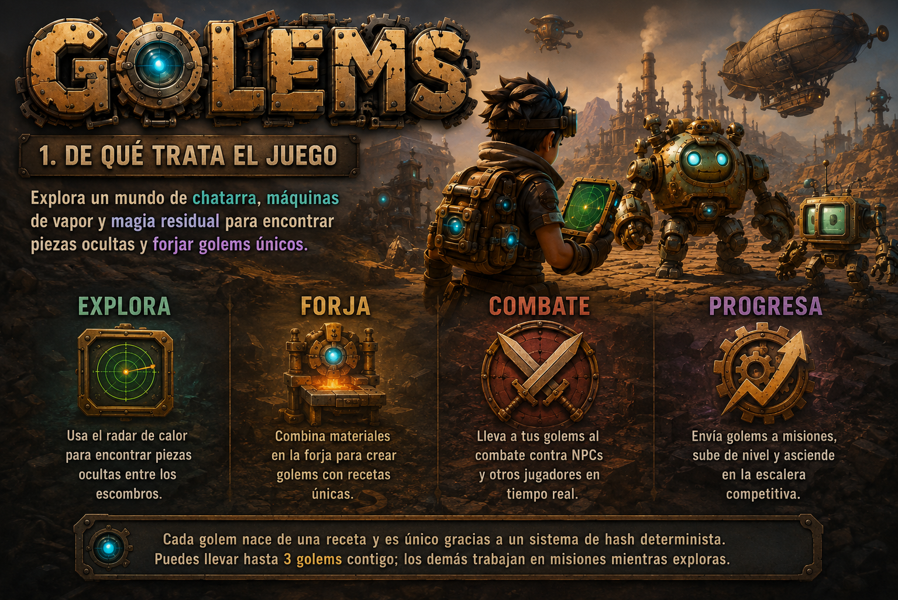

Los exploradores se adentran en este paisaje para:
- **Recolectar Chatarra**: Localizar 25 tipos de piezas mediante proximidad térmica con el Radar de Calor.
- **Forjar Criaturas Mecánicas**: Combinar de 5 a 12 componentes en el Distrito de la Forja para generar golems con apariencias, nombres y atributos únicos derivados algorítmicamente.
- **Comandar hasta 3 Golems Activos**: Criaturas que siguen al jugador en formación y defienden a su creador en tiempo real.
- **Automatizar Expediciones**: Asignar a los golems en reserva misiones de recolección fuera de línea que generan botín constante.
- **Competir en la Escalera**: Desafiar a otros jugadores en duelos 1v1 y 2v2 sincronizados por red.

---

## 🔄 El Bucle Principal de Juego

El flujo de juego está diseñado como un ciclo continuo y orgánico que recompensa tanto al jugador casual como al estratega competitivo:

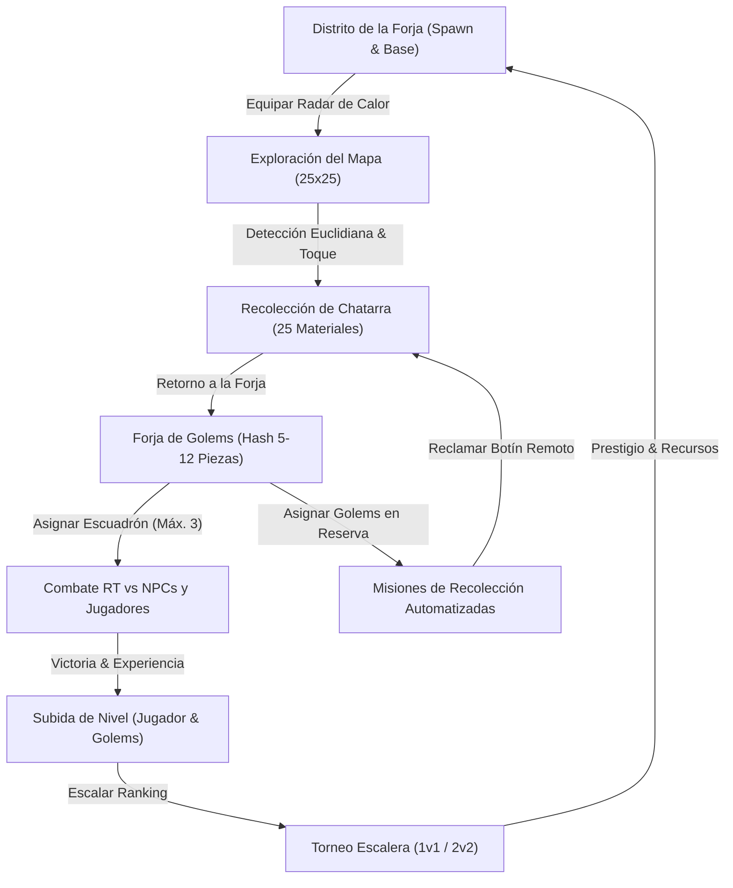

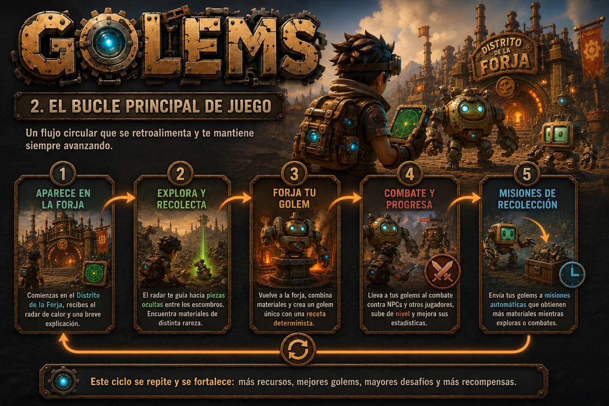

---

## 🗺️ El Mundo y Mapa (Grid 25x25 - 400m × 400m)

La experiencia se ubica en el Decentraland World `golems.dcl.eth`, compuesto por una cuadrícula de **25x25 parcelas** (desde `0,0` hasta `24,24`), abarcando un área de **400 metros de ancho por 400 metros de profundidad** (160.000 m² de superficie útil con terreno natural `landscapeTerrain: true`).

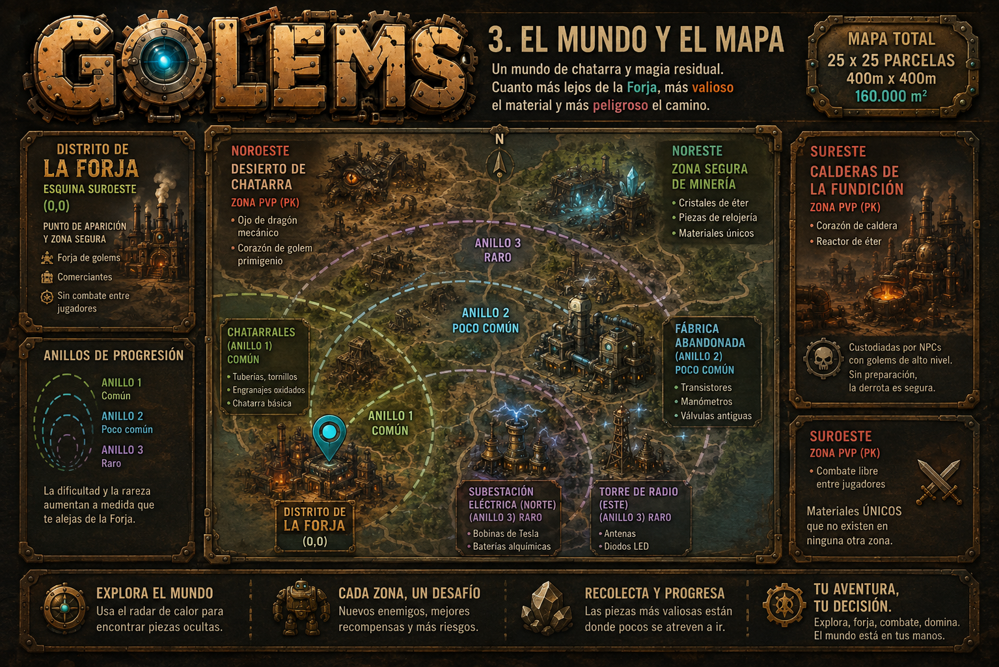

### Distribución Espacial de Zonas

| Zona | Ubicación (Coords Metros) | Nivel de Riesgo | Materiales Principales | Descripción |
| :--- | :--- | :--- | :--- | :--- |
| **Distrito de la Forja** | Esquina Suroeste `(0,0)` a `(80,80)` | 🟢 Zona Segura (No PK) | Ninguno (Taller) | Punto de aparición inicial, yunques de forja, gestión de misiones y tablón de torneos. |
| **Los Chatarrales** | Anillo Interior `(80,0)` a `(160,160)` | 🟢 Dificultad Baja | Comunes (Alambre, Tornillos, Ollas) | Terreno llano e ideal para novatos con alta tasa de reaparición de chatarra básica. |
| **Fábrica Abandonada** | Anillo Medio `(160,0)` a `(260,260)` | 🟡 Dificultad Media | Poco Comunes (Transistores, Manómetros) | Estructuras industriales derruidas con materiales de estadísticas avanzadas. |
| **Subestación Eléctrica** | Sector Norte `(140,280)` a `(260,400)` | 🟠 Dificultad Alta | Raros (Bobinas Tesla, Baterías, Motores) | Complejo de alta tensión con componentes de afinidad galvánica y vapor. |
| **Torre de Radio** | Sector Este `(280,140)` a `(400,260)` | 🟠 Dificultad Alta | Raros (Antenas de radio, Diodos LED) | Antiguas antenas de telecomunicación con materiales de afinidad luminosa. |
| **Reserva de Minería** | Esquina Noreste `(300,300)` a `(400,400)` | 🟢 Zona Segura (No PK) | Raros y Épicos (Núcleo Maná, Cerebro Autómata) | Cantera protegida donde recolectar materiales de alto valor sin peligro de asalto. |
| **Calderas de la Fundición** | Esquina Sureste `(300,0)` a `(400,100)` | 🔴 Zona PK Libre | Épicos (Reactor de Éter, Corazón de Caldera) | Zona volcánica e industrial hostil; custodiada por NPCs élite y con combate entre jugadores habilitado. |
| **Desierto de Chatarra** | Esquina Noroeste `(0,300)` a `(100,400)` | 🔴 Zona PK Libre | Legendarios (Ojo de Dragón, Corazón Primigenio) | Páramo desolado de máxima dificultad con las piezas más codiciadas de todo el mundo. |

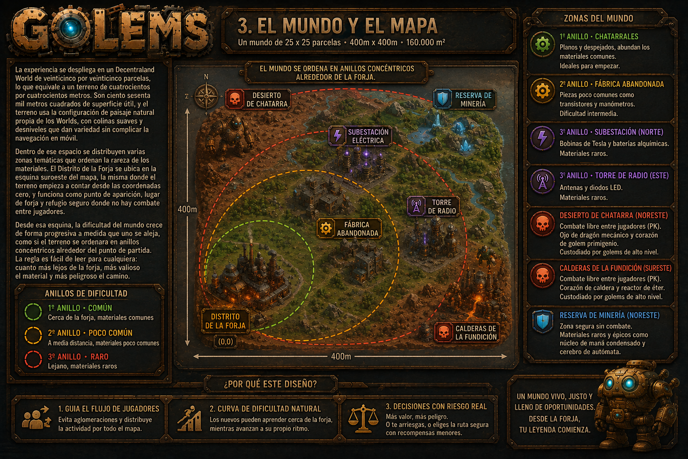

---

## 📡 El Radar de Calor y la Recolección

Para ofrecer la máxima fluidez en dispositivos móviles, los materiales enterrados no requieren sistemas de puntería o *raycasting* complejos. En su lugar, el **Radar de Calor** (construido con React-ECS) procesa la distancia euclidiana entre el avatar y los recursos activos:


- **Comportamiento del Radar**:
  - **Lejos (> 30m)**: Sensor inactivo con tonalidades frías y pulso apagado.
  - **Distancia Media (15m - 30m)**: Pulso rítmico suave en tonos amarillos.
  - **Cercanía (< 15m)**: Pulso acelerado en tonos rojos/naranjas brillantes.
  - **Proximidad Inmediata (< 4m)**: La pieza de chatarra emerge visualmente del suelo con un efecto de partículas emisivas.
- **Recolección Táctil**: Al emerger, la pieza dispone de un colisionador de puntero amplio (*hitbox* táctil optimizada para pantallas táctiles) que se recolecta con un simple toque.

---

## 🔩 Catálogo Completo de Materiales

Existen **25 tipos de materiales**, clasificados en 5 niveles de rareza. Los materiales épicos y legendarios tienen un límite de **una sola instancia activa simultánea** en todo el mapa:

| # | Material | Rareza | Peso Spawn | Tiempo Respawn | Zona | Aporte a Estadísticas y Afinidad |
| :-: | :--- | :--- | :-: | :-: | :--- | :--- |
| 1 | **Alambre de cobre** | Común | 9% | 1 a 3 min | Chatarrales | +Velocidad |
| 2 | **Tornillos y pernos** | Común | 9% | 1 a 3 min | Chatarrales | +Defensa |
| 3 | **Engranajes desgastados** | Común | 8% | 1 a 3 min | Chatarrales | +Velocidad |
| 4 | **Tubos de cobre** | Común | 8% | 1 a 3 min | Chatarrales | +Vitalidad |
| 5 | **Sartenes** | Común | 7% | 1 a 3 min | Chatarrales | +Defensa |
| 6 | **Ollas de cocinar** | Común | 7% | 1 a 3 min | Chatarrales | +Defensa |
| 7 | **Placas de latón** | Común | 6% | 1 a 3 min | Chatarrales | +Defensa |
| 8 | **Transistores** | Poco común | 6% | 4 a 7 min | Fábrica abandonada | +Ataque |
| 9 | **Bombillas de filamento** | Poco común | 6% | 4 a 7 min | Fábrica abandonada | +Vitalidad & Afinidad Luminosa |
| 10 | **Resortes de reloj** | Poco común | 5% | 4 a 7 min | Fábrica abandonada | +Velocidad |
| 11 | **Manómetros** | Poco común | 5% | 4 a 7 min | Fábrica abandonada | +Vitalidad |
| 12 | **Válvulas de vapor** | Poco común | 5% | 4 a 7 min | Fábrica abandonada | +Afinidad de Vapor |
| 13 | **Lentes de televisor viejo** | Poco común | 4% | 4 a 7 min | Fábrica abandonada | +Velocidad |
| 14 | **Motor de vapor** | Raro | 4% | 10 a 15 min | Subestación Eléctrica | +Ataque & Afinidad de Vapor |
| 15 | **Bobinas de Tesla** | Raro | 3% | 10 a 15 min | Subestación Eléctrica | +Ataque & Afinidad Galvánica |
| 16 | **Antenas de radio** | Raro | 3% | 10 a 15 min | Torre de Radio | +Velocidad |
| 17 | **Diodos LED** | Raro | 3% | 10 a 15 min | Torre de Radio | +Afinidad Luminosa |
| 18 | **Baterías alquímicas** | Raro | 3% | 10 a 15 min | Subestación Eléctrica | +Vitalidad & Afinidad Galvánica |
| 19 | **Engranajes de bronce perfectos**| Raro | 2% | 10 a 15 min | Reserva de Minería | +Defensa & Afinidad Mecánica |
| 20 | **Núcleo de maná condensado** | Épico | 2% | 20 a 30 min | Reserva de Minería | +Afinidad de Éter |
| 21 | **Cerebro de autómata** | Épico | 2% | 20 a 30 min | Reserva de Minería | +Ataque & Afinidad Mecánica |
| 22 | **Reactor de éter** | Épico | 2% | 20 a 30 min | Calderas de la Fundición (PK) | +Ataque & Afinidad de Éter |
| 23 | **Corazón de caldera** | Épico | 1% | 20 a 30 min | Calderas de la Fundición (PK) | +Defensa & Afinidad de Vapor |
| 24 | **Ojo de dragón mecánico** | Legendario | 0.5% | 45 a 60 min | Desierto de Chatarra (PK) | +Ataque & Afinidad de Éter |
| 25 | **Corazón de golem primigenio** | Legendario | 0.5% | 45 a 60 min | Desierto de Chatarra (PK) | +Todas las Estadísticas |

---

## 🔨 La Forja y Unicidad de los Golems (Hash Determinista)

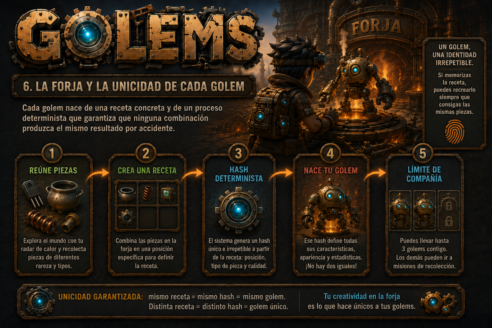

1. **Composición de Recetas**: El jugador selecciona entre **5 y 12 piezas** de su inventario. Se pueden apilar materiales idénticos o balancear piezas variadas.
2. **Serialización Canónica**: La receta se ordena alfabéticamente por identificador de material y cantidad (ej. `antena:2|bobina:1|cobre:3|engranaje:2|sarten:1`).
3. **Hash Determinista**: Se calcula un hash numérico de 32 bits (FNV-1a / SHA truncado).
4. **Derivación de Atributos y Rasgos**:
   - **Estadísticas Base**: Suma ponderada de los materiales constituyentes.
   - **Variación de Perfil**: El hash aplica ajustes porcentuales controlados.
   - **Rasgos Visuales**: Tono de emisión, escala proporcional y detalles cosméticos.
   - **Nomenclatura Procedural**: Prefijo y sufijo generados a partir de los componentes predominantes (ej. *«Vaporocrom Titánico»*, *«Galvanoide Blindado»*).
5. **Determinismo y Coleccionismo**: La misma combinación de materiales produce **exactamente el mismo golem**, lo que permite descubrir, documentar y compartir recetas secretas entre jugadores.

---

## ⚔️ Estadísticas, Afinidades y Combate en Tiempo Real

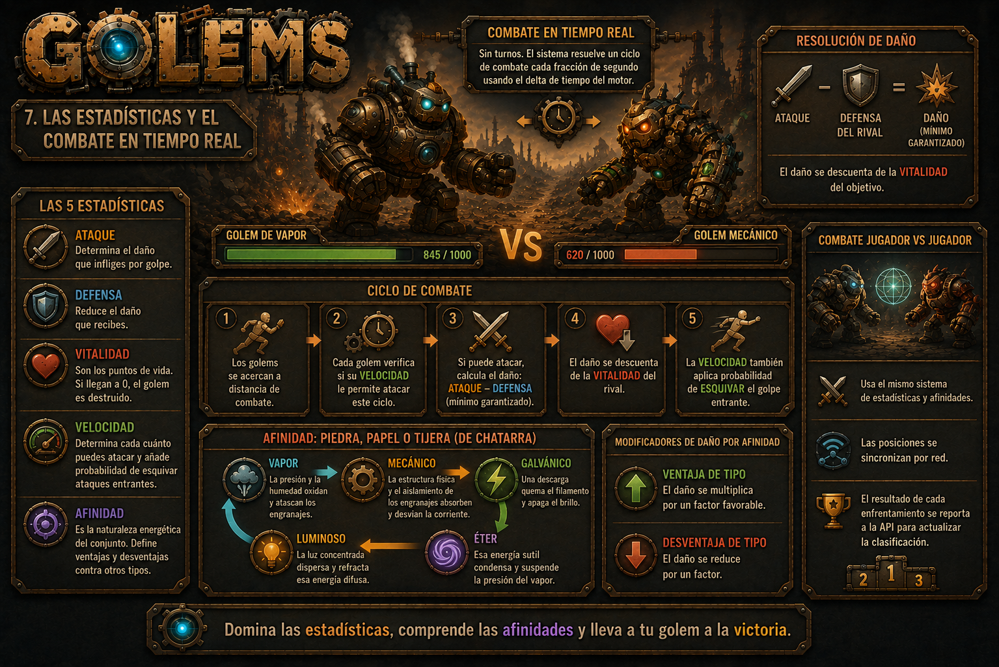

Cada golem posee 5 estadísticas clave:
- **Ataque (ATK)**: Daño base emitido por golpe.
- **Defensa (DEF)**: Reducción directa del daño recibido.
- **Vitalidad (HP)**: Puntos totales de salud del autómata.
- **Velocidad (SPD)**: Frecuencia de ciclo de ataque y probabilidad porcentual de esquivar.
- **Afinidad Elemental (AFF)**: Naturaleza energética del golem.

### El Pentágono de Afinidades Elementales

El sistema de combate incorpora un pentágono de ventajas/desventajas energéticas:

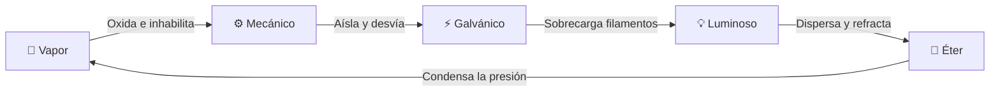

- **Ventaja de Afinidad**: Multiplicador de daño `×1.40` al golpear al tipo débil.
- **Desventaja de Afinidad**: Reducción de daño a `×0.75` al golpear al tipo fuerte.

---

## 🤖 Golems Acompañantes y Misiones de Reserva

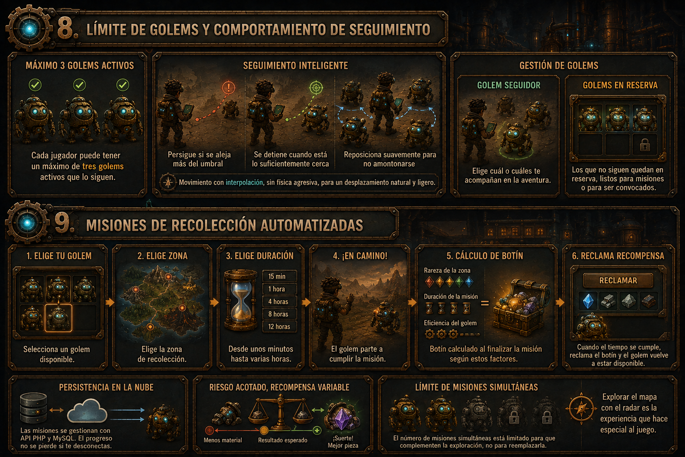

- **Escuadrón Activo en Fila (Máximo 3)**: El jugador puede llevar consigo hasta 3 golems simultáneos. Utilizan un avanzado **Sistema de Historial de Trayectoria (*Breadcrumb Trail FIFO*)** con interpolación suave (*LERP/SLERP*), que permite que los 3 autómatas sigan la curva real del camino trazado por el maestro ($1.8\text{m}$, $3.6\text{m}$, $5.4\text{m}$), con frenado natural y zona muerta anti-vibración (*anti-jitter*).
  - 📖 *Guías técnicas maestras:*
    - 🏭 [Guía de la Fábrica de Golems y Jerarquías](guias/guia-fabrica-de-golems-y-mecanicas.md)
    - 🤖 [Guía del Sistema de Seguimiento en Fila](guias/guia-sistema-seguimiento-y-mecanicas.md)
    - 🌐 [Guía de Red Multijugador y Mobile-First](guias/guia-multijugador-mobile.md)
- **Modelos 3D de Prueba (.glb)**: Incluye 3 autómatas optimizados para móvil con materiales PBR y canales emisivos propios:
  - ♨️ **Calderón de Vapor** (`assets/models/golem_steam.glb`): Caldera de cobre, chimenea y núcleo naranja de horno.
  - ⚡ **Chispazo Galvánico** (`assets/models/golem_galvanic.glb`): Chasis angular, bobinas de Tesla y reactor cian eléctrico.
  - ⚙️ **Acorazado Mecánico** (`assets/models/golem_mechanical.glb`): Blindaje de chatarra, hombreras dentadas y visor ámbar.
- **Golems en Reserva (Expediciones)**: Los golems que no viajan con el avatar pueden enviarse a misiones automáticas seleccionando:
  - **Zona de Destino**: Determina la tabla de botín y rareza de piezas.
  - **Duración**: Desde 15 minutos hasta 12 horas.
  - **Eficiencia**: Calculada en base a la velocidad y afinidad del golem asignado.
  - **Persistencia Asíncrona**: El progreso de la misión se computa en el servidor PHP/MySQL, permitiendo que sigan operando mientras el jugador no está conectado.

---

## 🛡️ NPCs Hostiles y Guardianes de Zona

El mundo cuenta con patrullas de NPCs mecánicos y guardianes que custodian las zonas más valiosas:

- **Comportamiento por Waypoints**: Rutas de patrulla optimizadas sin sobrecargar la CPU de dispositivos móviles.
- **Radio de Agresión**: Al aproximarse un jugador, el NPC activa el modo de combate contra los golems del usuario.
- **Guardianes Élite**: En el *Desierto de Chatarra* y las *Calderas de la Fundición*, los golems de los NPCs tienen estadísticas avanzadas para proteger las piezas épicas y legendarias.
- **Recompensas**: Derrotar NPCs otorga experiencia para el jugador y los golems, además de una probabilidad de dropeo de materiales directos.

---

## 📈 Progresión y Sistema de Niveles

- **Nivel del Jugador**: Se incrementa al recolectar, forjar, ganar batallas y completar expediciones. Desbloquea más espacios para misiones simultáneas, mayor capacidad de almacén y aumento del rango del radar.
- **Nivel de los Golems**: Ganado en combate y misiones. Aumenta las estadísticas de forma proporcional a su perfil de forja.
- **Techo de Nivel según Rareza**: Un golem forjado con materiales épicos o legendarios posee un límite de nivel superior al de un golem hecho de chatarra común.

---

## 🏆 Torneo Escalera Competitivo (1v1 y 2v2)

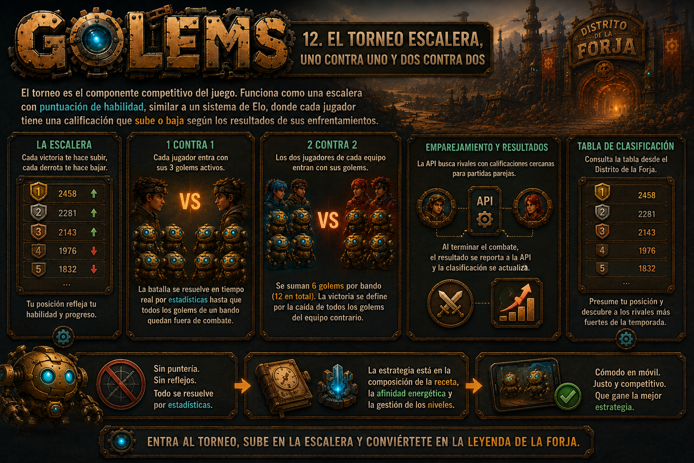

El Distrito de la Forja alberga el podio y panel interactivo de la **Escalera Competitiva**:

- **Formato 1v1**: 3 golems vs 3 golems (resolución en tiempo real por comparación de estadísticas y afinidades).
- **Formato 2v2**: 2 jugadores por equipo con 3 golems cada uno (12 golems simultáneos en arena de combate).
- **Clasificación Elo**: El matchmaking empareja a combatientes con puntuaciones similares y registra los resultados en la base de datos MySQL mediante firmas criptográficas.
- **Sin Dependencia de Reflejos de Disparo**: Al resolverse por estadísticas y afinidades, el torneo garantiza igualdad absoluta de condiciones entre jugadores de móviles y de escritorio.

---

## 🏗️ Arquitectura Técnica y Persistencia

El proyecto implementa una arquitectura híbrida optimizada para el entorno descentralizado y de alto rendimiento:

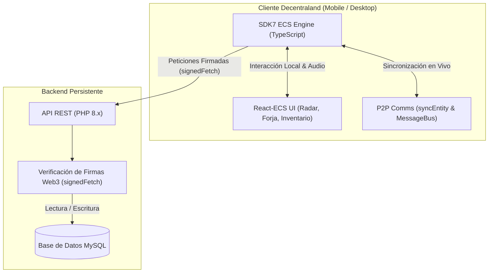

- **Runtime de Escena**: Decentraland SDK7 (`@dcl/sdk/ecs`, `@dcl/sdk/react-ecs`, `@dcl/sdk/math`).
- **Multijugador Efímero**: Sincronización P2P para posiciones, animaciones y eventos de combate en vivo vía `syncEntity` y `MessageBus`.
- **Persistencia de Datos**: Peticiones firmadas con `signedFetch` hacia la API PHP para operaciones críticas (inventario, recetas de golems, expediciones y ranking).

---

## 📱 Diseño Mobile-First y Restricciones de Rendimiento

Para asegurar 60 FPS estables y compatibilidad total con la aplicación móvil de Decentraland (Godot Explorer), la escena cumple estrictamente las directrices oficiales:

- 🚫 **Sin Luces Dinámicas**: Se utilizan materiales con textura horneada y emisivos unlit para efectos de radar y energía.
- 🚫 **Sin Raycasting Avanzado de Puntero**: Reemplazado por detección de distancia euclidiana del radar.
- 🚫 **Sin Nine-Slice Complejo**: Fondos de interfaz planos o con texturas de dimensiones fijas.
- 🚫 **Sin Análisis de Frecuencia de Audio (FFT)**: Audio espacial ligero con componentes `AudioSource`.
- 🚫 **Sin Dependencia de Teclado Físico / Ratón**: Controles 100% táctiles con hitboxes de gran tamaño y respeto a las zonas seguras (evitando colisión con los joysticks virtuales de la pantalla).

---

## 🚀 Instalación, Desarrollo y Despliegue

### Requisitos Previos
- **Node.js**: Versión `>= 18.0.0`
- **NPM**: Versión `>= 8.0.0`
- **Decentraland CLI**: Instalado automáticamente con el SDK

### Pasos de Instalación

```bash
# 1. Clonar el repositorio
git clone https://github.com/cjbaezilla/Hackathon-Decentraland-Scene.git
cd Hackathon-Decentraland-Scene

# 2. Instalar dependencias
npm install

# 3. Iniciar el entorno de desarrollo local con recarga en caliente
npm start
```

### Comandos Disponibles

| Comando | Descripción |
| :--- | :--- |
| `npm start` | Inicia el servidor de prueba local con interfaz web y depuración. |
| `npm run build` | Compila el código TypeScript a JavaScript en `bin/index.js`. |
| `npm run deploy` | Despliega la escena en el Decentraland World asignado (`golems.dcl.eth`). |
| `npm run upgrade-sdk` | Actualiza `@dcl/sdk` a la versión más reciente disponible. |

---

## 📁 Estructura del Proyecto

```text
Hackathon/
├── assets/                     # Modelos 3D (.glb), texturas, sonidos e iconos
│   └── models/                 # Modelos 3D GLB (golem_steam, golem_galvanic, golem_mechanical)
├── GOLEMS/                     # GDD oficial, diagramas, esquemas y portada de Golems
│   ├── GDD-Golems.md           # Documento de diseño de juego integral
│   ├── golems_cover.png        # Portada oficial de la experiencia
│   └── *.png                   # Ilustraciones e infografías conceptuales
├── guias/                      # Guías técnicas y documentación maestra de la experiencia
│   ├── guia-fabrica-de-golems-y-mecanicas.md   # Guía de la Fábrica de Golems y jerarquías
│   ├── guia-sistema-seguimiento-y-mecanicas.md # Guía del sistema de seguimiento en fila
│   └── guia-multijugador-mobile.md             # Guía de red P2P y Mobile-First
├── docs/                       # Documentación oficial de Decentraland y SDK Skills
│   ├── dcl-docs-main/          # Documentación oficial de Decentraland SDK7
│   └── sdk-skills-main/        # Catálogo maestro de habilidades y patrones
├── scripts/                    # Scripts de generación de assets y utilidades
│   └── generate_models.js      # Generador binario procedural de modelos .glb glTF 2.0
├── src/                        # Código fuente TypeScript SDK7
│   ├── index.ts                # Inicializador principal y orquestador de sistemas
│   ├── state.ts                # Estado global reactivo de la escena
│   ├── ui.tsx                  # Interfaz de usuario con React-ECS (Radar, HUD)
│   ├── multiplayer.ts          # Gestión de red P2P y MessageBus
│   ├── config/                 # Configuraciones maestras y constantes
│   │   └── golems.ts           # Configuración de golems, afinidades y distancias
│   ├── components/             # Componentes ECS personalizados (Schemas)
│   │   └── follower.ts         # GolemFollowerComponent
│   ├── objects/                # Patrón Factory de GameObjects
│   │   └── golemFactory.ts     # Fábrica de entidades y billboards para Golems
│   └── systems/                # Sistemas ECS
│       └── followerSystem.ts   # Sistema de seguimiento Breadcrumb Trail FIFO
├── scene.json                  # Metadatos del World (25x25 parcelas, spawn, rating)
├── package.json                # Dependencias y scripts de construcción
├── tsconfig.json               # Configuración del compilador TypeScript
├── AGENTS.md                   # Instrucciones maestras y contexto para IA
└── README.md                   # Documentación principal del repositorio
```

---

## 👥 Créditos y Contacto

- **Creador y Desarrollador**: Carlos Baeza (`baeza.eth`)
- **Contacto**: `hola@cbaeza.com`
- **Mundo Desplegado**: `golems.dcl.eth`