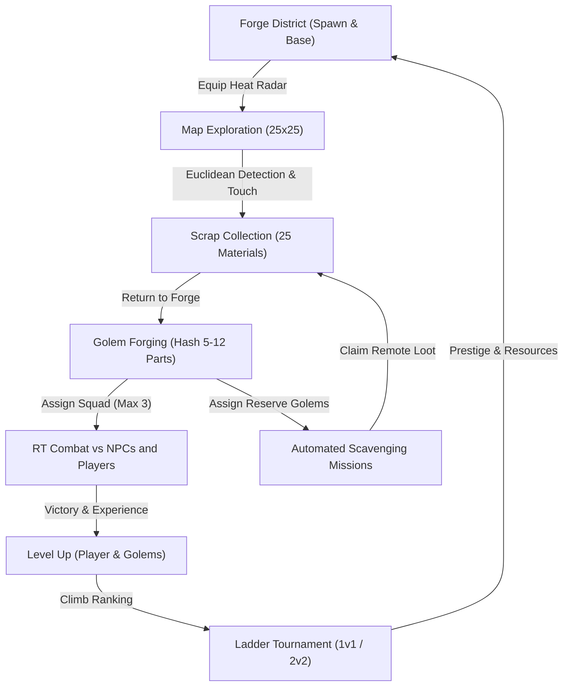
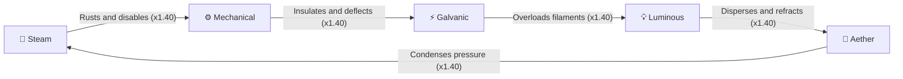
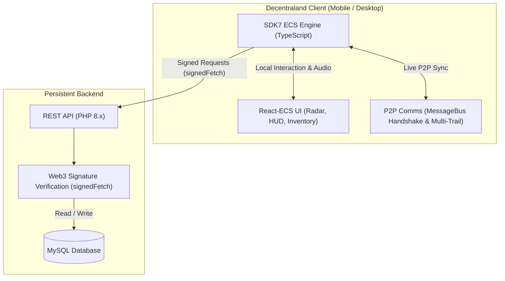

# Golems: Multiplayer Experience in Decentraland

[](https://docs.decentraland.org)
[](https://decentraland.org)
[-8b5cf6.svg)](guias/guia-soporte-bilingue-i18n.md)
[](https://docs.decentraland.org/creator/build-for-mobile/)
[-f59e0b.svg)](https://docs.decentraland.org)
[-3b82f6.svg)](https://docs.decentraland.org)

**Golems** is a massive multiplayer experience built on **Decentraland SDK7**, set in a fascinating universe of scrap metal, steampunk technology, and residual magic. Players explore a vast 160,000 m² world, track down hidden mechanical parts using an innovative **Heat Radar**, forge unique combat automatons using a **deterministic hashing** system, lead automated expeditions, and fight in real time both in the open world and in a competitive **Ladder Tournament** (1v1 and 2v2).

> 📚 **Official Game Design Document (GDD) & Recipe Catalog**:
> - 🇬🇧 **English**: [GOLEMS/GDD-Golems_eng.md](GOLEMS/GDD-Golems_eng.md) (GDD) | 📜 [GOLEMS/Golems-Recipes-150_eng.md](GOLEMS/Golems-Recipes-150_eng.md) (150 Deterministic Recipe Catalog)
> - 🇪🇸 **Español**: [GOLEMS/GDD-Golems.md](GOLEMS/GDD-Golems.md) (GDD) | 📜 [GOLEMS/Golems-Recetas-150.md](GOLEMS/Golems-Recetas-150.md) (Catálogo Maestro de 150 Recetas)

---

## 📑 Table of Contents

1. [What the Game Is About](#-what-the-game-is-about)
2. [The Core Game Loop](#-the-core-game-loop)
3. [The World and Map (Grid 25x25 - 400m × 400m)](#-the-world-and-map-grid-25x25---400m--400m)
4. [The Heat Radar and Scavenging](#-the-heat-radar-and-scavenging)
5. [Complete Materials Catalog](#-complete-materials-catalog)
6. [The Forge and Golem Uniqueness (Deterministic Hash)](#-the-forge-and-golem-uniqueness-deterministic-hash)
7. [Stats, Affinities, and Real-Time Combat](#-stats-affinities-and-real-time-combat)
8. [Companion Golems and Real-Time Multiplayer Following](#-companion-golems-and-real-time-multiplayer-following)
9. [Hostile NPCs and Zone Guardians](#-hostile-npcs-and-zone-guardians)
10. [Progression and Level System](#-progression-and-level-system)
11. [Competitive Ladder Tournament (1v1 and 2v2)](#-competitive-ladder-tournament-1v1-and-2v2)
12. [Colossal 72m Steampunk Tournament Arena (Cell Games Ring)](#-colossal-72m-steampunk-tournament-arena-cell-games-ring)
13. [Technical Architecture and Persistence](#-technical-architecture-and-persistence)
14. [Mobile-First Design and Performance Constraints](#-mobile-first-design-and-performance-constraints)
15. [Installation, Development, and Deployment](#-installation-development-and-deployment)
16. [Project Structure](#-project-structure)

---

## ⚙️ What the Game Is About

In the world of **Golems**, civilization has left behind tons of disused machinery: transistors, boilers, pressure gauges, cooking pots, radio antennas, and alchemical batteries imbued with residual energy. 


Explorers venture into this landscape to:
- **Scavenge Scrap**: Locate 25 types of parts via thermal proximity using the Heat Radar.
- **Forge Mechanical Creatures**: Combine 5 to 12 components in the Forge District to generate golems with unique appearances, names, and algorithmically derived attributes.
- **Command up to 3 Active Golems**: Creatures follow the player in formation and defend their creator in real time.
- **Automate Expeditions**: Assign reserve golems to offline scavenging missions that generate continuous loot.
- **Compete in the Ladder**: Challenge other players in network-synchronized 1v1 and 2v2 duels.

---

## 🔄 The Core Game Loop

The gameplay loop is designed as a continuous, organic cycle rewarding both casual players and competitive strategists:




---

## 🗺️ The World and Map (Grid 25x25 - 400m × 400m)

The experience takes place in the Decentraland World `golems.dcl.eth`, made of a **25x25 parcel grid** (from `0,0` to `24,24`), covering an area of **400 meters wide by 400 meters deep** (160,000 m² of usable surface with natural terrain `landscapeTerrain: true`).


> 📘 **Detailed Map Documentation**: To learn about all metric elevations, file architecture, landmarks, and detailed ASCII diagrams, check the [Master Guide: Map, Districts, Zones, and Coordinates](guias/guia-mapa-zonas-y-distritos.md).

### Spatial Distribution of Zones and the 4 Symmetrical Corners (140m × 140m each)

| Zone | Location (Coords Metros) | Dimension | Risk Level | Main Materials | Description |
| :--- | :--- | :--- | :--- | :--- | :--- |
| **Forge District** | Southwest Corner `(0,0)` to `(140,140)` | 140m × 140m (19,600 m²) | 🟢 Safe Zone (No PK) | None (Workshop/Forge) | Spawn `(16, 6)`, **Silas** at `(15.8, 5.9)`, Main Plaza `(70, 70)`, 10 Trading Posts, Wreckage Lab `[1,2]`, Trampoline, and **Player Hideout/Vault** at `(Z: 17.7m, X: 3.8m-8.0m)`. |
| **Scrap Desert** | Northwest Corner `(0,260)` to `(140,400)` | 140m × 140m (19,600 m²) | 🔴 Open PK Zone | Legendaries (`ojo_dragon`, `corazon_primigenio`) | Desolate, maximum difficulty wasteland, Primordial Automaton Crater `(70, 330)`, Dragon's Nest, and portal `(130, 270)`. |
| **Mining Reserve** | Northeast Corner `(260,260)` to `(400,400)` | 140m × 140m (19,600 m²) | 🟢 Safe Zone (No PK) | Epics (`nucleo_mana`, `cerebro_automata`, `engranajes_bronce`) | Protected aether quarry `(340, 340)`, watchmaking workshop, deep pit, explorers' shelter, and portal `(270, 270)`. |
| **Smelting Boilers** | Southeast Corner `(260,0)` to `(400,140)` | 140m × 140m (19,600 m²) | 🔴 Open PK Zone | Epics (`corazon_caldera`, `reactor_eter`) | Volcanic and thermal complex, Central Furnace `(330, 70)`, Aether Reactor, and portal `(270, 130)`. |
| **Corridor and South Highway**| South Sector `(140,0)` to `(260,140)` | ~16,800 m² | 🟢 Safe Zone (Transit) | Connection & infrastructure | Checkpoint Parcel 13,1 `(212, 24)`, Grand Junction `(200, 70)`, and Steam Station `(170, 40)`. |
| **The Junklands** | West Sector `(0,140)` to `(140,260)` | ~16,800 m² | 🟢 Low Difficulty | Commons (Wire, Screws, Pots) | Scavenger Camp `(70, 200)`, Brass Depot `(40, 170)`, and roadway $X=70$. |
| **Abandoned Factory** | Middle Ring `(140,140)` to `(260,260)` | ~20,000 m² | 🟡 Medium Difficulty | Uncommons (Transistors, Gauges) | Ruined industrial structures containing materials with advanced stats. |
| **Electrical Substation** | North Sector `(140,280)` to `(260,400)` | ~14,400 m² | 🟠 High Difficulty | Rares (Tesla Coils, Batteries, Engines) | High-voltage complex featuring galvanic and steam affinity components. |
| **Radio Tower** | East Sector `(280,140)` to `(400,260)` | ~14,400 m² | 🟠 High Difficulty | Rares (Radio antennas, LED Diodes) | Old telecommunication towers with luminous affinity materials. |
| **Grand Tournament Arena** | Center `(164,164)` to `(236,236)` | ~4,071 m² (Ø 72m) | 🏆 Competitive | 1v1 & 2v2 Ladder Tournament | Colossal circular steampunk tournament platform at `(200, 200)`. |


---

## 📡 The Heat Radar and Scavenging

To ensure optimal performance on mobile devices, buried materials do not require complex aiming or *raycasting* systems. Instead, the **Heat Radar** (built with React-ECS) computes the Euclidean distance between the avatar and active resources:


- **Radar Behavior**:
  - **Far (> 30m)**: Sensor inactive with cool blue tones and an off pulse.
  - **Medium Distance (15m - 30m)**: Gentle rhythmic pulse in yellow tones.
  - **Close (< 15m)**: Accelerated pulse in bright red/orange tones.
  - **Immediate Proximity (< 4m)**: The scrap part visually emerges from the ground with an emissive particle effect.
- **Touch Scavenging**: Upon emerging, the part features a wide pointer collider (a touch *hitbox* optimized for touchscreens) collected with a single tap.

---

## 🔩 Complete Materials Catalog

There are **46 types of materials**, categorized into 5 rarity tiers. Epic and Legendary materials are capped at **only one active instance at a time** across the entire map:

| # | Icon | Material | Rarity | Spawn Weight | Respawn Time | Zone | Attribute & Affinity Contribution |
| :-: | :-: | :--- | :--- | :-: | :-: | :--- | :--- |
| 1 |  | **Copper Wire** (`alambre_cobre`) | Common | 3.7% | 1 to 3 min | Junklands | +Speed (2) |
| 2 |  | **Screws & Bolts** (`tornillos_pernos`) | Common | 3.7% | 1 to 3 min | Junklands | +Defense (2) |
| 3 |  | **Worn Gears** (`engranajes_desgastados`) | Common | 3.7% | 1 to 3 min | Junklands | +Speed (1), +Defense (1) |
| 4 |  | **Copper Pipes** (`tubos_cobre`) | Common | 3.7% | 1 to 3 min | Junklands | +Vitality (10) |
| 5 |  | **Frying Pans** (`sartenes`) | Common | 3.7% | 1 to 3 min | Junklands | +Defense (3) |
| 6 |  | **Cooking Pots** (`ollas_cocinar`) | Common | 3.7% | 1 to 3 min | Junklands | +Defense (2), +Vitality (5) |
| 7 |  | **Brass Plates** (`placas_laton`) | Common | 3.7% | 1 to 3 min | Junklands | +Defense (3) |
| 8 |  | **Rusty Nails** (`clavos_oxidados`) | Common | 3.7% | 1 to 3 min | Junklands | +Defense (1) |
| 9 |  | **Tin Cans** (`latas_conserva`) | Common | 3.4% | 1 to 3 min | Junklands | +Vitality (8) |
| 10 |  | **Iron Chains** (`cadenas_hierro`) | Common | 3.4% | 1 to 3 min | Junklands | +Defense (2) |
| 11 |  | **Giant Nuts** (`tuercas_gigantes`) | Common | 3.4% | 1 to 3 min | Junklands | +Defense (2) |
| 12 |  | **Manhole Covers** (`tapas_alcantarilla`) | Common | 3.4% | 1 to 3 min | Junklands | +Defense (3) |
| 13 |  | **Frayed Cables** (`cables_deshilachados`) | Common | 3.4% | 1 to 3 min | Junklands | +Speed (2) |
| 14 |  | **Coal Residue** (`residuos_carbon`) | Common | 3.4% | 1 to 3 min | Junklands | +Vitality (6) & Steam Affinity |
| 15 |  | **Transistors** (`transistores`) | Uncommon | 2.6% | 4 to 7 min | Abandoned Factory | +Attack (3) |
| 16 |  | **Filament Bulbs** (`bombillas_filamento`) | Uncommon | 2.6% | 4 to 7 min | Abandoned Factory | +Vitality (12) & Luminous Affinity |
| 17 |  | **Clock Springs** (`resortes_reloj`) | Uncommon | 2.6% | 4 to 7 min | Abandoned Factory | +Speed (4) |
| 18 |  | **Pressure Gauges** (`manometros`) | Uncommon | 2.6% | 4 to 7 min | Abandoned Factory | +Vitality (15) |
| 19 |  | **Steam Valves** (`valvulas_vapor`) | Uncommon | 2.6% | 4 to 7 min | Abandoned Factory | +Attack (2) & Steam Affinity |
| 20 |  | **Old TV Lenses** (`lentes_tv_viejo`) | Uncommon | 2.6% | 4 to 7 min | Abandoned Factory | +Speed (3) |
| 21 |  | **Blown Fuses** (`fusibles_fundidos`) | Uncommon | 2.6% | 4 to 7 min | Abandoned Factory | +Attack (2) & Galvanic Affinity |
| 22 |  | **Broken Pocket Watches** (`relojes_bolsillo`) | Uncommon | 2.45% | 4 to 7 min | Abandoned Factory | +Speed (3) |
| 23 |  | **Magnetic Compasses** (`brujulas_magneticas`) | Uncommon | 2.45% | 4 to 7 min | Abandoned Factory | +Speed (3) & Mechanical Affinity |
| 24 |  | **Vacuum Tubes** (`tubos_vacio`) | Uncommon | 2.45% | 4 to 7 min | Abandoned Factory | +Attack (3) & Luminous Affinity |
| 25 |  | **Switch Levers** (`palancas_interruptor`) | Uncommon | 2.45% | 4 to 7 min | Abandoned Factory | +Defense (2) |
| 26 |  | **Steam Engine** (`motor_vapor`) | Rare | 1.5% | 10 to 15 min | Electrical Substation | +Attack (5) & Steam Affinity |
| 27 |  | **Tesla Coils** (`bobinas_tesla`) | Rare | 1.5% | 10 to 15 min | Electrical Substation | +Attack (6) & Galvanic Affinity |
| 28 |  | **Radio Antennas** (`antenas_radio`) | Rare | 1.5% | 10 to 15 min | Radio Tower | +Speed (6) |
| 29 |  | **LED Diodes** (`diodos_led`) | Rare | 1.5% | 10 to 15 min | Radio Tower | +Attack (4) & Luminous Affinity |
| 30 |  | **Alchemical Batteries** (`baterias_alquimicas`) | Rare | 1.5% | 10 to 15 min | Electrical Substation | +Vitality (25) & Galvanic Affinity |
| 31 |  | **Perfect Bronze Gears** (`engranajes_bronce`) | Rare | 1.5% | 10 to 15 min | Mining Reserve | +Defense (6) & Mechanical Affinity |
| 32 |  | **Galvanic Dynamo** (`dinamo_galvanica`) | Rare | 1.5% | 10 to 15 min | Electrical Substation | +Attack (5) & Galvanic Affinity |
| 33 |  | **Resonating Quartz Crystal** (`cristal_fuerza`) | Rare | 1.5% | 10 to 15 min | Radio Tower | +Speed (5) & Luminous Affinity |
| 34 |  | **Precision Gyroscope** (`giroscopio_precision`) | Rare | 1.5% | 10 to 15 min | Mining Reserve | +Defense (5) & Mechanical Affinity |
| 35 |  | **High-Pressure Condenser** (`condensador_presion`) | Rare | 1.5% | 10 to 15 min | Electrical Substation | +Vitality (20) & Steam Affinity |
| 36 |  | **Condensed Mana Core** (`nucleo_mana`) | Epic | 0.8% | 20 to 30 min | Mining Reserve | +Attack (8) & Aether Affinity |
| 37 |  | **Automaton Brain** (`cerebro_automata`) | Epic | 0.8% | 20 to 30 min | Mining Reserve | +Attack (8) & Mechanical Affinity |
| 38 |  | **Aether Reactor** (`reactor_eter`) | Epic | 0.8% | 20 to 30 min | Smelting Boilers (PK) | +Attack (9) & Aether Affinity |
| 39 |  | **Boiler Heart** (`corazon_caldera`) | Epic | 0.8% | 20 to 30 min | Smelting Boilers (PK) | +Defense (8) & Steam Affinity |
| 40 |  | **Supercharged Plasma Battery** (`bateria_plasma`) | Epic | 0.8% | 20 to 30 min | Electrical Substation | +Attack (8) & Galvanic Affinity |
| 41 |  | **Solar Optical Array** (`matriz_optica_solar`) | Epic | 0.8% | 20 to 30 min | Radio Tower | +Speed (7) & Luminous Affinity |
| 42 |  | **Forged Titanium Piston** (`embolo_titanio`) | Epic | 0.8% | 20 to 30 min | Smelting Boilers (PK) | +Defense (7) & Steam Affinity |
| 43 |  | **Mechanical Dragon Eye** (`ojo_dragon`) | Legendary | 0.35% | 45 to 60 min | Scrap Desert (PK) | +Attack (14) & Aether Affinity |
| 44 |  | **Primordial Golem Heart** (`corazon_primigenio`) | Legendary | 0.35% | 45 to 60 min | Scrap Desert (PK) | +All Stats |
| 45 |  | **Aetheric Singularity** (`singularidad_eterica`) | Legendary | 0.35% | 45 to 60 min | Scrap Desert (PK) | +Attack (12), +Speed (6) & Aether Affinity |
| 46 |  | **Celestial Gear Reliquary** (`relicario_astral`) | Legendary | 0.35% | 45 to 60 min | Scrap Desert (PK) | +Defense (10), +Vitality (30) & Aether Affinity |

### 🌐 Interactive 3D Showcase Pages

All 46 materials can be previewed in an interactive 3D showcase web application featuring rotating 3D glTF models, bilingual metadata (ES / EN), stat breakdowns, and high-resolution PNG exports.

To launch the local showcase server:

```bash
php -S localhost:8000
```

Then navigate to the showcase index or individual item pages in your web browser:
- **Main Showcase Catalog**: [http://localhost:8000/showcase/](http://localhost:8000/showcase/)
- **Sample Item Page (Precision Gyroscope)**: [http://localhost:8000/showcase/rare/giroscopio_precision.html](http://localhost:8000/showcase/rare/giroscopio_precision.html)


---

## 🔨 The Forge and Golem Uniqueness (Deterministic Hash)


1. **Recipe Composition**: The player selects between **5 and 12 parts** from their inventory. Identical materials can be stacked or varied parts balanced.
2. **Canonical Serialization**: The recipe is sorted alphabetically by material identifier and quantity (e.g., `antena:2|bobina:1|cobre:3|engranaje:2|sarten:1`).
3. **Deterministic Hash**: A 32-bit numerical hash is calculated (FNV-1a / truncated SHA).
4. **Derivation of Attributes and Features**:
   - **Base Stats**: Weighted sum of constituent materials.
   - **Profile Variation**: The hash applies controlled percentage adjustments.
   - **Visual Features**: Emissive color hue, proportional scale, and cosmetic details.
   - **Procedural Naming**: Prefix and suffix generated from predominant components (e.g., *"Titanic Steamchrome"*, *"Armored Galvanoid"*).
5. **Determinism and Collectibility**: The exact same material combination yields **the exact same golem**, allowing players to discover, document, and share secret recipes with one another.

> 📜 **Complete 150 Deterministic Recipe Catalog**:
> - 🇬🇧 **English**: [GOLEMS/Golems-Recipes-150_eng.md](GOLEMS/Golems-Recipes-150_eng.md) — 150 Master Golem Recipe Catalog (Deterministic FNV-1a designs)
> - 🇪🇸 **Español**: [GOLEMS/Golems-Recetas-150.md](GOLEMS/Golems-Recetas-150.md) — Catálogo Maestro de 150 Recetas de Golems (Especificación algorítmica)

---

## ⚔️ Stats, Affinities, and Real-Time Combat (FFA in the Grand Arena)


Each golem has 5 core stats generated procedurally or via forging:
- **Attack (ATK)**: Base damage delivered per hit ($20-38$).
- **Defense (DEF)**: Direct reduction of incoming damage ($10-22$).
- **Vitality (HP)**: Total health points of the automaton ($100-160$).
- **Speed (SPD)**: Attack frequency ($T_{\text{cooldown}} = 2.2\text{s} / (1 + \text{SPD}\times 0.04)$) and movement speed.
- **Elemental Affinity (AFF)**: Energy type of the golem (`STEAM`, `MECHANICAL`, `GALVANIC`, `LUMINOUS`, `AETHER`).

### The Elemental Affinity Pentagon

The combat system features a cyclical pentagon of energy advantages and disadvantages:



- **Affinity Advantage**: `×1.40` damage multiplier when striking the weak type with golden text `⚡ CRITICAL`.
- **Affinity Disadvantage**: Damage reduction to `×0.75` when striking the strong type.
- **Damage per Tick Equation**: $\text{Damage} = \max\left(2, \text{round}\big((\text{ATK} - \text{DEF} \times 0.5) \times \text{Multiplier}\big)\right)$.
- **Canonical Team Architecture (`GOLEM_TEAMS`)**: Complete friendly fire immunity (`TEAM_PLAYER` vs `TEAM_REMOTE_*`).
- **Boids Physical Separation & Combat Ring**: Horizontal repulsion (`1.6m`) and distance stopping (`1.8m`) to prevent 3D models from overlapping.
- **P2P Synchronization via MessageBus**: Instant broadcast of attacks (`golem_combat_attack`) and defeats (`golem_combat_defeat`).
- **Progression and Rewards**: $+60$ to $+120$ EXP per kill; leveling up restores health and increases ATK, DEF, and HP.
- 📖 *Master technical guide:* [FFA Combat System and Battles Guide](guias/guia-sistema-combate-y-batallas.md).

---

## 🤖 Companion Golems and Real-Time Multiplayer Following


- **Active Squad in Line (Maximum 3)**: The player can carry up to 3 golems simultaneously.
- **Random Assignment of 3 Different Types (Per Session / Non-Persistent)**: Every player who enters or re-enters the scene automatically receives a random set of **3 golems of completely distinct types** (selected at random with no duplicates among the 5 elemental affinities: Steam, Galvanic, Mechanical, Luminous, and Aether). Upon reloading or rejoining the scene, a new unique set is generated in volatile memory.
- **Real-Time P2P Multiplayer Visualization (Multi-Trail System)**: All players present in the scene can see each user's 3 companion golems in real time. The system uses a distributed architecture processing independent trajectories for the local avatar (`engine.PlayerEntity`) and for all remote avatars (`PlayerIdentityData` + `Transform`), performing smooth interpolation (*LERP/SLERP*) at 60 FPS with staggered slots at $1.8\text{m}$, $3.6\text{m}$, and $5.4\text{m}$ without saturating the CRDT bus.
- **P2P Handshake and Identification Tags**: Via lightweight `MessageBus` events (`golem_squad_announce` and `golem_squad_request`), each client broadcasts and stores the squad composition of other avatars, displaying floating `Billboard` tags with the owner's name, affinity, level, ASCII health bar `[████████░░]`, and abbreviated wallet address.
  - 📖 *Master technical guides:*
    - ⚔️ [FFA Combat System and Battles Guide](guias/guia-sistema-combate-y-batallas.md)
    - 🏟️ [Steampunk Tournament Grand Circular Arena Guide (72m)](guias/guia-arena-torneo-steampunk.md)
    - 🏭 [Golem Factory and Hierarchies Guide](guias/guia-fabrica-de-golems-y-mecanicas.md)
    - 🤖 [Single-File Following System Guide](guias/guia-sistema-seguimiento-y-mecanicas.md)
    - 🌐 [Multiplayer Network and Mobile-First Guide](guias/guia-multijugador-mobile.md)
- **Catalog of 25 3D Models (.glb) in 5 Themed Folders**: Includes mobile-optimized glTF 2.0 binary models with PBR materials and pure emissive channels without dynamic lights:
  - ♨️ **Steam (`assets/models/steam/`)**: Copper, boilers, chimneys, and orange fire (`golem_steam_01.glb` to `05.glb`).
  - ⚡ **Galvanic (`assets/models/galvanic/`)**: Angular chassis, Tesla coils, and electric cyan (`golem_galvanic_01.glb` to `05.glb`).
  - ⚙️ **Mechanical (`assets/models/mechanical/`)**: Scrap armor, gears, and amber (`golem_mechanical_01.glb` to `05.glb`).
  - ☀️ **Luminous (`assets/models/luminous/`)**: Silver chrome, prismatic headlights, and sunlight (`golem_luminous_01.glb` to `05.glb`).
  - 🔮 **Aether (`assets/models/aether/`)**: Mystical obsidian, floating resonators, and amethyst (`golem_aether_01.glb` to `05.glb`).
- **Reserve Golems (Expeditions)**: Golems not travelling with the avatar can be sent on automated missions by selecting:
  - **Destination Zone**: Determines the loot table and part rarity.
  - **Duration**: From 15 minutes to 12 hours.
  - **Efficiency**: Calculated based on the assigned golem's speed and affinity.
  - **Asynchronous Persistence**: Mission progress is computed on the PHP/MySQL server, enabling them to operate while the player is offline.

---

## 🛡️ Hostile NPCs and Zone Guardians

The world features mechanical NPC patrols and guardians guarding the most valuable areas:

- **Waypoint Behavior**: Optimized patrol routes without overloading mobile device CPUs.
- **Aggression Radius**: When a player approaches, the NPC enters combat mode against the user's golems.
- **Elite Guardians**: In the *Scrap Desert* and *Smelting Boilers*, NPC golems have advanced stats to protect epic and legendary parts.
- **Rewards**: Defeating NPCs awards experience to the player and golems, along with a chance for direct material drops.

---

## 📈 Progression and Level System

- **Player Level**: Increased by scavenging, forging, winning battles, and completing expeditions. Unlocks more simultaneous mission slots, larger vault capacity, and extended radar range.
- **Golem Level**: Earned in combat and missions. Proportionally increases stats based on their forge profile.
- **Level Cap by Rarity**: A golem forged with epic or legendary materials has a higher level ceiling than one made of common scrap.

---

## 🏆 Competitive Ladder Tournament (1v1 and 2v2)


The Forge District houses the podium and interactive panel for the **Competitive Ladder**:

- **1v1 Format**: 3 golems vs 3 golems (resolved in real time by comparing stats and affinities).
- **2v2 Format**: 2 players per team with 3 golems each (12 simultaneous golems in the combat arena).
- **Elo Rating**: Matchmaking pairs combatants with similar scores and logs results to the MySQL database via cryptographic signatures.
- **No Reliance on Reflexes/Shooting**: By resolving via stats and affinities, the tournament guarantees absolute equal footing between mobile and desktop players.

---

## 🏟️ Colossal 72m Steampunk Tournament Arena (Cell Games Ring)

Located at the geometric center of the world (`X: 200m, Z: 200m`), this colossal **72-meter diameter** ($R = 36\text{m}$) structure is inspired by the ring architecture from Cell's Tournament (*Dragon Ball Z*) reinterpreted with a post-industrial steam-and-gear aesthetic:

- **Radial Elevated Platform (72m)**: Over 250 reinforced wooden planks and metal elevated $+0.6\text{m}$ above the terrain, with 56 continuous cobble curb segments.
- **Four 12-Meter Monumental Pillars**: At the 4 diagonal corners (NW, NE, SE, SW), built with enlarged base boilers (1.8x), triple vertical gear shafts (`Gear Shaft.glb`), double counter-rotating gear rings (`Gear 10 Teeth` and `Gear 8 Teeth`), double streetlights, and smoking top chimneys (`Smoker.glb`).
- **Grand Central Planetary Sigil**: A colossal central gear (`Gear Big.glb` scale 4.8x / ~12m diameter) rotating at $+0.20\text{ rad/s}$ synchronized with 8 satellite gears in orbital formation and a reliquary altar with sword (`Arthur Sword.glb`).
- **16 Perimeter Beacons and Ceremonial Ramps**: Barrel pedestals with Steampunk numbers (`00` to `08`) and 4 large cardinal access ramps (North, South, East, West) with double safety guardrails (`Tree Fence.glb`).
- **Detailed Technical Guide**: See [`guias/guia-arena-torneo-steampunk.md`](file:///d:/DECENTRALAND/Scenes/Hackathon/guias/guia-arena-torneo-steampunk.md).

---

## 🏗️ Technical Architecture and Persistence

The project implements a hybrid architecture optimized for decentralized and high-performance environments:



- **Scene Runtime**: Decentraland SDK7 (`@dcl/sdk/ecs`, `@dcl/sdk/react-ecs`, `@dcl/sdk/math`).
- **Autonomous P2P Multiplayer**: Lightweight squad broadcast via `MessageBus` and distributed local simulation without relying on external servers for live movement.
- **Data Persistence**: Signed requests via `signedFetch` to the PHP API for critical operations (inventory, golem recipes, expeditions, and ranking).

---

## 📱 Mobile-First Design and Performance Constraints

To guarantee a stable 60 FPS and complete compatibility with the Decentraland mobile app (Godot Explorer), the scene strictly complies with official guidelines:

- 🚫 **No Dynamic Lights**: Materials with baked textures and unlit emissives are used for radar and energy effects.
- 🚫 **No Advanced Pointer Raycasting**: Replaced by Euclidean distance detection from the radar.
- 🚫 **No Complex Nine-Slice**: Flat UI backgrounds or textures with fixed dimensions.
- 🚫 **No Audio Frequency Analysis (FFT)**: Lightweight spatial audio using `AudioSource` components.
- 🚫 **No Physical Keyboard / Mouse Dependency**: 100% touch controls with oversized hitboxes respecting safe zones (avoiding collision with virtual on-screen joysticks).

---

## 🚀 Installation, Development, and Deployment

### Prerequisites
- **Node.js**: Version `>= 18.0.0`
- **NPM**: Version `>= 8.0.0`
- **Decentraland CLI**: Installed automatically with the SDK

### Installation Steps

```bash
# 1. Clone the repository
git clone https://github.com/cjbaezilla/Hackathon-Decentraland-Scene.git
cd Hackathon-Decentraland-Scene

# 2. Install dependencies
npm install

# 3. Start local development environment with hot reload
npm start
```

### Available Commands

| Command | Description |
| :--- | :--- |
| `npm start` | Starts local test server with web interface and debugging. |
| `npm run build` | Compiles TypeScript code to JavaScript in `bin/index.js`. |
| `npm run deploy` | Deploys scene to assigned Decentraland World (`golems.dcl.eth`). |
| `npm run upgrade-sdk` | Upgrades `@dcl/sdk` to latest available version. |
| `php -S localhost:8000` | Launches a local PHP server to view the interactive 3D material showcase at `http://localhost:8000/showcase/`. |
| `node scripts/download_steampunk_assets.js` | Automatically downloads and organizes official Decentraland Steampunk package 3D models and textures. |
| `node scripts/generate_models.js` | Procedurally generates 25 GLB 3D models (glTF 2.0) organized by type (`--help` to see CLI options). |
| `node scripts/generate_item_htmls.js` | Generates the 46 bilingual HTML showcase pages and index catalog in `showcase/`. |
| `node scripts/generate_item_pngs.js` | Generates 1024x1024 PNG showcase cards for all 46 materials in `showcase/`. |

### 🌐 Viewing the 3D Material Showcase

To inspect all 46 collectible scrap materials with interactive 3D viewports, stat breakdown cards, and bilingual descriptions:

```bash
php -S localhost:8000
```

Access the showcase in your browser at:
- **Catalog Index**: [http://localhost:8000/showcase/](http://localhost:8000/showcase/)
- **Example Item Showcase Page**: [http://localhost:8000/showcase/rare/giroscopio_precision.html](http://localhost:8000/showcase/rare/giroscopio_precision.html)

---

## 📁 Project Structure

```text
Hackathon/
├── assets/                     # 3D models (.glb), textures, sounds, and icons
│   ├── asset-packs/            # Official Decentraland models (Steampunk pack & arena)
│   └── models/                 # GLB 3D models organized by affinity (25 models in total)
│       ├── steam/              # Steam Golems (golem_steam_01.glb to 05.glb)
│       ├── galvanic/           # Galvanic Golems (golem_galvanic_01.glb to 05.glb)
│       ├── mechanical/         # Mechanical Golems (golem_mechanical_01.glb to 05.glb)
│       ├── luminous/           # Luminous Golems (golem_luminous_01.glb to 05.glb)
│       └── aether/             # Aether Golems (golem_aether_01.glb to 05.glb)
├── GOLEMS/                     # Official GDD, diagrams, schemas, and Golems cover
│   ├── GDD-Golems.md           # Comprehensive game design document (Spanish)
│   ├── GDD-Golems_eng.md       # Comprehensive game design document (English)
│   ├── Golems-Recetas-150.md   # Master 150 deterministic golem recipe catalog (Spanish)
│   ├── Golems-Recipes-150_eng.md # Master 150 deterministic golem recipe catalog (English)
│   ├── golems_cover_eng.png    # Official experience cover (English version)
│   └── *.png                   # Conceptual illustrations and infographics
├── guias/                      # Technical guides and master documentation
│   ├── README.md               # Master Index and Directory of All Technical Guides
│   ├── guia-npc-bienvenida-silas.md           # Welcome NPC Silas the Survivor & Camp Master Guide
│   ├── guia-mapa-zonas-y-distritos.md         # 25x25 Map, 9 Zones, Trampolines & Posts Master Guide
│   ├── guia-arena-torneo-steampunk.md         # Steampunk Tournament Grand Circular Arena (72m) Guide
│   ├── guia-fabrica-de-golems-y-mecanicas.md   # Wreckage Lab and Golem Forge Guide
│   ├── guia-sistema-combate-y-batallas.md     # Real-Time FFA Combat System Guide
│   ├── guia-sistema-seguimiento-y-mecanicas.md # Multi-Trail FIFO LERP Following System Guide
│   ├── guia-multijugador-mobile.md             # MessageBus P2P Network and Mobile-First Guide
│   └── guia-soporte-bilingue-i18n.md          # Dual-Language System & i18n Guide (ES / EN)
├── docs/                       # Official Decentraland documentation and SDK Skills
│   ├── dcl-docs-main/          # Official Decentraland SDK7 documentation
│   └── sdk-skills-main/        # Master catalog of skills and patterns
├── scripts/                    # Asset generation scripts and utilities
│   ├── download_steampunk_assets.js # Automated downloader for official Decentraland GLB models
│   ├── generate_models.js      # Procedural binary generator for .glb glTF 2.0 models (parametric CLI)
│   └── README.md               # Detailed CLI generator manual and model catalog
├── src/                        # SDK7 TypeScript source code
│   ├── index.ts                # Main initializer and systems orchestrator
│   ├── state.ts                # Scene reactive global state (EXP, kills, logs, NPC dialogue)
│   ├── ui.tsx                  # React-ECS user interface (HUD, Language Selector, Silas Modal)
│   ├── multiplayer.ts          # P2P infrastructure (MessageBus handshake, attacks & defeats)
│   ├── i18n/                   # Internationalization engine and bilingual dictionaries
│   │   ├── types.ts            # Type schemas and TranslationSchema
│   │   ├── index.ts            # Engine t(), toggleLanguage() and reactive subscriptions
│   │   └── locales/            # Canonical typed dictionaries (es.ts and en.ts)
│   ├── config/                 # Master configurations and constants
│   │   ├── arenaConfig.ts      # Spatial configuration, dimensions & models for Steampunk Arena
│   │   ├── userHideoutConfig.ts# Player Hideout and Vault configuration (3 locked chests)
│   │   ├── forgeDistrictConfig.ts # Forge District configuration and road layout
│   │   └── golems.ts           # Golems configuration, affinities, pentagon & RPG generator
│   ├── components/             # Custom ECS components (Schemas)
│   │   ├── arena.ts            # ArenaRotatorComponent (Continuous deterministic rotation)
│   │   ├── combat.ts           # GolemCombatComponent, FloatingDamageComponent & GOLEM_TEAMS
│   │   └── follower.ts         # GolemFollowerComponent (with ownerAddress & squad DTOs)
│   ├── objects/                # GameObjects Factory Pattern
│   │   ├── welcomeNpc.ts       # Welcome NPC Silas factory, camp & reactive animation
│   │   ├── userHideoutBuilder.ts# Player Hideout & Vault builder factory
│   │   ├── arenaBuilder.ts     # Steampunk Tournament Grand Arena procedural builder
│   │   ├── wreckageLabBuilder.ts# Wreckage Lab builder
│   │   ├── tradingPostsBuilder.ts# Steampunk trading posts builder (10 posts)
│   │   ├── golemFactory.ts     # Entities factory, billboards, ASCII health & floating numbers
│   │   └── trampoline.ts       # Steampunk steam booster trampoline
│   └── systems/                # ECS Systems
│       ├── arenaAnimationSystem.ts # Arena gears and crowns continuous animation system
│       ├── followerSystem.ts   # Multi-Trail FIFO LERP/SLERP following system & arena leap
│       ├── golemCombatSystem.ts# FFA Combat ECS system, tactical AI, ring & Boids repulsion
│       └── trampolineSystem.ts # Trampoline detection and jump system
├── scene.json                  # World metadata (25x25 parcels, spawn, rating)
├── package.json                # Dependencies and build scripts
├── tsconfig.json               # TypeScript compiler configuration
├── AGENTS.md                   # AI master instructions and context
└── README.md                   # Main repository documentation
```

---

## 👥 Credits and Contact

- **Creator and Developer**: Carlos Baeza (`baeza.eth`)
- **Contact**: `hola@cbaeza.com`
- **Deployed World**: `golems.dcl.eth`