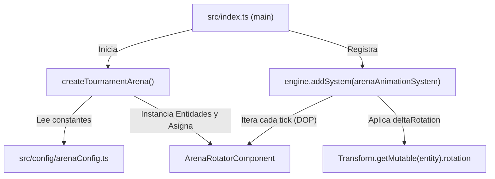

# 🏟️ Guía Técnica: Gran Arena Circular de Torneo Steampunk (Estilo "Torneo de Cell") en Decentraland SDK7

Esta guía documenta en profundidad el diseño arquitectónico, las fórmulas matemáticas, el pipeline de assets 3D de Decentraland, los componentes ECS y la integración del **Cuadrilátero Colosal de Torneo** en el centro del mundo de **Golems** (`X: 200m, Z: 200m`).

---

## 📑 Tabla de Contenidos

1. [Visión y Concepto: "Cell Games Ring" en un Universo Steampunk](#1-visión-y-concepto-cell-games-ring-en-un-universo-steampunk)
2. [Arquitectura Espacial y Trigonometría Radial](#2-arquitectura-espacial-y-trigonometría-radial)
   - [2.1 Posicionamiento en el Centro del Grid 25x25 (400m × 400m)](#21-posicionamiento-en-el-centro-del-grid-25x25-400m--400m)
   - [2.2 Dimensiones Colosales: Diámetro de 72 Metros](#22-dimensiones-colosales-diámetro-de-72-metros)
   - [2.3 Diagrama Esquemático del Ring](#23-diagrama-esquemático-del-ring)
3. [Pipeline de Assets y Descargador Automatizado](#3-pipeline-de-assets-y-descargador-automatizado)
   - [3.1 Catálogo Oficial de Decentraland (`@dcl/asset-packs`)](#31-catálogo-oficial-de-decentraland-dclasset-packs)
   - [3.2 Script de Descarga con Fallback Multired (`scripts/download_steampunk_assets.js`)](#32-script-de-descarga-con-fallback-multired-scriptsdownload_steampunk_assetsjs)
   - [3.3 Estructura Local de Assets y Normalización de Slugs](#33-estructura-local-de-assets-y-normalización-de-slugs)
4. [Estructura de Código y Arquitectura ECS](#4-estructura-de-código-y-arquitectura-ecs)
   - [4.1 Configuración Centralizada (`src/config/arenaConfig.ts`)](#41-configuración-centralizada-srcconfigarenaconfigts)
   - [4.2 Componente ECS `ArenaRotatorComponent` (`src/components/arena.ts`)](#42-componente-ecs-arenarotatorcomponent-srccomponentsarenats)
   - [4.3 Constructor Modular `arenaBuilder.ts` (`src/objects/arenaBuilder.ts`)](#43-constructor-modular-arenabuilderts-srcobjectsarenabuilderts)
   - [4.4 Sistema de Animación y Rotación (`src/systems/arenaAnimationSystem.ts`)](#44-sistema-de-animación-y-rotación-srcsystemsarenaanimationsystemts)
5. [Desglose Detallado de los Elementos Constructivos](#5-desglose-detallado-de-los-elementos-constructivos)
   - [5.1 Plataforma Elevada Radial y Cuadrícula de Losas](#51-plataforma-elevada-radial-y-cuadrícula-de-losas)
   - [5.2 Los 4 Pilares Monumentales de Esquina (12m de Altura)](#52-los-4-pilares-monumentales-de-esquina-12m-de-altura)
   - [5.3 Sigilo Central y Sistema Planetario de Engranajes](#53-sigilo-central-y-sistema-planetario-de-engranajes)
   - [5.4 16 Balizas Perimetrales y Marcadores Numéricos](#54-16-balizas-perimetrales-y-marcadores-numéricos)
   - [5.5 4 Grandes Rampas de Acceso Ceremoniales](#55-4-grandes-rampas-de-acceso-ceremoniales)
   - [5.6 Vallas de Protección y Zona de Ring-Out](#56-vallas-de-protección-y-zona-de-ring-out)
6. [Integración con el Sistema de Combate y Torneos (Golems Ladder)](#6-integración-con-el-sistema-de-combate-y-torneos-golems-ladder)
7. [Optimizaciones Mobile-First y Rendimiento (Godot Mobile Explorer)](#7-optimizaciones-mobile-first-y-rendimiento-godot-mobile-explorer)
8. [Manual para Desarrolladores: Parámetros y Personalización](#8-manual-para-desarrolladores-parámetros-y-personalización)

---

## 1. Visión y Concepto: "Cell Games Ring" en un Universo Steampunk

En el manga/anime *Dragon Ball Z*, el ring del **Torneo de Cell** es una plataforma cuadrada elevada con baldosas de piedra, escalinatas y cuatro enormes pilares esquineros que definen el espacio sagrado del combate de vida o muerte.

En **Golems**, hemos reinterpretado este icónico escenario adaptándolo a la identidad **Steampunk / Post-Industrial**:
- **Geometría Circular y Elevada**: Una plataforma masiva elevada $+0.6\text{m}$ sobre el terreno, delimitada por rebordes de adoquín y vallas de chatarra.
- **Cuatro Columnas Monumentales de 12 Metros**: En lugar de simples pilares de piedra, son titanes de maquinaria a vapor con calderas base, fustes de triple eje de engranajes, anillos giratorios mecánicos y chimeneas humeantes en la cúspide.
- **Engranaje Planetario Central**: En el centro del ring, un gigantesco engranaje de 12 metros de diámetro rota continuamente, rodeado por 8 engranajes satélites sincronizados y un altar relicario.
- **Funcionalidad Competitiva**: Diseñada como el escenario principal para el **Torneo Escalera (1v1 y 2v2)** y batallas de escuadrones de Golems.

---

## 2. Arquitectura Espacial y Trigonometría Radial

### 2.1 Posicionamiento en el Centro del Grid 25x25 (400m × 400m)
El mapa de Decentraland está configurado como un Decentraland World de **25x25 parcelas** (400m en el eje X y 400m en el eje Z).

El centro matemático exacto de la experiencia se sitúa en:
$$\vec{P}_{\text{centro}} = (X: 200.0\text{ m}, Y: 0.0\text{ m}, Z: 200.0\text{ m})$$

### 2.2 Dimensiones Colosales: Diámetro de 72 Metros
- **Radio de Combate ($R$)**: $36.0\text{ m}$ (Diámetro total: $72.0\text{ m}$).
- **Superficie de Combate**: $\pi \times R^2 \approx 4.071\text{ m}^2$ (equivalente a más de 16 parcelas de Decentraland dedicadas exclusivamente a la arena).
- **Altura de la Plataforma**: $+0.6\text{m}$ sobre el nivel del suelo.
- **Radio de los 4 Pilares de Esquina**: $R_{\text{pilar}} = 37.8\text{ m}$ en ángulos diagonales ($\frac{\pi}{4}, \frac{3\pi}{4}, \frac{5\pi}{4}, \frac{7\pi}{4}$).
- **Altura de los Pilares**: $12.0\text{ m}$ de altura total.

### 2.3 Diagrama Esquemático del Ring

```text
                                    [ ACCESO NORTE ]
                                 (X: 200m, Z: 236m)
                                         ▲
                                ┌───────═══───────┐
                          /                           \
               [PILAR NO]                               [PILAR NE]
           (X: 173m, Z: 227m)                       (X: 227m, Z: 227m)
          /                                                   \
  [ACCESO OESTE] ◄───       [ ⚙️ NÚCLEO PLANETARIO ]        ───► [ACCESO ESTE]
(X: 164m, Z: 200m)             (X: 200m, Z: 200m)             (X: 236m, Z: 200m)
          \                                                   /
               [PILAR SO]                               [PILAR SE]
           (X: 173m, Z: 173m)                       (X: 227m, Z: 173m)
                          \                           /
                                └───────═══───────┘
                                         ▼
                                 (X: 200m, Z: 164m)
                                    [ ACCESO SUR ]
```

---

## 3. Pipeline de Assets y Descargador Automatizado

### 3.1 Catálogo Oficial de Decentraland (`@dcl/asset-packs`)
Los modelos 3D provienen del paquete oficial **Steampunk** de la Fundación Decentraland incluido en `node_modules/@dcl/asset-packs/catalog.json`.

### 3.2 Script de Descarga con Fallback Multired (`scripts/download_steampunk_assets.js`)
Para garantizar que la escena sea **100% autocontenida**, offline y compatible con el empaquetador de producción de Decentraland, se diseñó un script en Node.js que descarga los modelos `.glb` y texturas directamente desde los gateways IPFS oficiales con sistema de reintento en cascada:

```javascript
const GATEWAYS = [
  'https://builder-api.decentraland.org/v1/storage/contents/',
  'https://peer.decentraland.org/content/contents/',
  'https://dweb.link/ipfs/',
  'https://ipfs.io/ipfs/'
]
```

### 3.3 Estructura Local de Assets y Normalización de Slugs
Los modelos se almacenan bajo la ruta canónica `assets/asset-packs/<slug_normalizado>/`:

```text
assets/asset-packs/
├── arthur_sword/             # Arthur Sword.glb (Espada relicario)
├── barrel/                   # Barrel.glb (Pedestales y tanques auxiliares)
├── ceiling_4x4m/             # Ceiling 4x4M.glb (Placas metálicas de piso)
├── chest_gear/               # Chest Gear.glb (Cofre mecánico de recompensas)
├── chest_plates/             # Chest Plates.glb (Blindaje de altar)
├── chest_tube/               # Chest Tube.glb (Collarines de tuberías de pilares)
├── gear_10_teeth/            # Gear 10 Teeth.glb (Engranajes de pilares y satélites)
├── gear_5_teeth/             # Gear 5 Teeth.glb (Engranaje satélite planetario)
├── gear_8_teeth/             # Gear 8 Teeth.glb (Engranaje satélite planetario)
├── gear_angled_10_teeth/     # Gear Angled 10 Teeth.glb (Engranajes angulares)
├── gear_big/                 # Gear Big.glb (Gran engranaje central de 12m)
├── gear_shaft/               # Gear Shaft.glb (Fuste triple de columnas)
├── gear_small_01/02/03/      # Gear Small (Engranajes decorativos menores)
├── hidrant/                  # Hidrant.glb (Bocas de seguridad en rampas)
├── lamp/                     # Lamp.glb (Faroles monumentales de pilares)
├── road_angle/               # Road Angle.glb (Esquinas de bordillo)
├── road_cobble_angled/       # Road Cobble Angled.glb (Bordillo curvo)
├── road_cobble_straight/     # Road Cobble Straight.glb (Rampas y bordillos rectos)
├── road_cross/               # Road Cross.glb (Intersecciones)
├── smoker/                   # Smoker.glb (Chimeneas de escape de 12m)
├── steampunk_number_00..08/  # Placas numéricas perimetrales
├── switch/                   # Switch.glb (Consolas con interruptor)
├── table_lamp/               # Table Lamp.glb (Lámparas de balizas)
├── tank/                     # Tank.glb (Calderas base de 1.8x)
├── tree_fence/               # Tree Fence.glb (Vallas de protección lateral)
├── wood_plank_floor_2x2m/    # Losas de madera auxiliares
├── wood_plank_floor_4x4m/    # Losas de madera principales
└── wood_planks_broken_4x4m/  # Losas de madera desgastadas
```

---

## 4. Estructura de Código y Arquitectura ECS

El sistema sigue estrictamente las tres reglas troncales de Decentraland SDK7:
1. **Separación Modular (`game-objects.md`)**: El archivo `src/index.ts` solo contiene 1 línea de invocación (`createTournamentArena()`). Toda la lógica constructiva reside en `src/objects/arenaBuilder.ts`.
2. **Componentes Puros (`mutable-data.md` - DOP)**: Los estados de rotación residen en `ArenaRotatorComponent`, evaluados en solo lectura y mutados únicamente por el sistema ECS.
3. **Optimización Mobile-First**: Animaciones puras mediante cuaterniones sin luces dinámicas (`PBPointLight`) ni física pesada.



### 4.1 Configuración Centralizada (`src/config/arenaConfig.ts`)
Define todos los parámetros físicos y rutas de archivos:

```typescript
export const ARENA_CONFIG = {
  center: Vector3.create(200, 0, 200),
  radius: 36,
  platformHeight: 0.6,
  pillarHeight: 12.0,
  centerGearRotationSpeed: 0.20,
  pillarGearRotationSpeed: 0.45,
  models: { ... }
}
```

### 4.2 Componente ECS `ArenaRotatorComponent` (`src/components/arena.ts`)
```typescript
export const ArenaRotatorComponent = engine.defineComponent('golems::ArenaRotatorComponent', {
  speedY: Schemas.Float,
  speedX: Schemas.Float,
  speedZ: Schemas.Float
})
```

### 4.3 Constructor Modular `arenaBuilder.ts` (`src/objects/arenaBuilder.ts`)
Orquestador que ensambla las entidades padre-hijo:
- `buildElevatedPlatform(root)`: Piso radial y bordillos.
- `buildMonumentalCornerPillars(root)`: 4 pilares esquineros.
- `buildPerimeterMarkersAndLamps(root)`: 16 balizas numéricas.
- `buildCenterSigil(root)`: Núcleo planetario de engranajes.
- `buildAccessRamps(root)`: 4 rampas cardinales.
- `buildPerimeterFences(root)`: Vallas y cofres de arena.

### 4.4 Sistema de Animación y Rotación (`src/systems/arenaAnimationSystem.ts`)
```typescript
export function arenaAnimationSystem(dt: number) {
  for (const [entity, rotator] of engine.getEntitiesWith(ArenaRotatorComponent, Transform)) {
    const currentTransform = Transform.get(entity)
    const angleDeltaDeg = (rotator.speedY * dt * 180) / Math.PI
    const deltaRotation = Quaternion.fromAngleAxis(angleDeltaDeg, Vector3.Up())

    const mutableTransform = Transform.getMutable(entity)
    mutableTransform.rotation = Quaternion.multiply(currentTransform.rotation, deltaRotation)
  }
}
```

---

## 5. Desglose Detallado de los Elementos Constructivos

### 5.1 Plataforma Elevada Radial y Cuadrícula de Losas
- **Piso Interior**: Generado mediante un barrido de cuadrícula de $[-36\text{m}, +36\text{m}]$ en pasos de 4m. Cada celda con distancia euclidiana $\sqrt{x^2 + z^2} \le 35\text{m}$ se puebla con baldosas `Wood Plank Floor 4x4M`, alternando con baldosas desgastadas `Wood Planks Broken` y placas de techo metálico `Ceiling 4x4M` en la periferia.
- **Bordillo Perimetral**: 56 segmentos de adoquines rectos y angulados orientados tangencialmente a lo largo de la circunferencia con $R = 36.3\text{m}$, dejando 4 vanos libres en los puntos cardinales.

### 5.2 Los 4 Pilares Monumentales de Esquina (12m de Altura)
Ubicados en las 4 diagonales exactas ($45^\circ, 135^\circ, 225^\circ, 315^\circ$):
1. **Base Triple**: Caldera central `Tank.glb` (escala 1.8x) flanqueada por dos barriles de expansión `Barrel.glb` y un collar de tuberías `Chest Tube.glb`.
2. **Fuste Triple**: 3 módulos verticales de `Gear Shaft.glb` apilados a alturas $Y = 3.2\text{m}, 6.2\text{m}, 9.2\text{m}$ (escala 1.6x).
3. **Doble Anillo Rotatorio Contragiro**:
   - Anillo inferior ($Y = 5.0\text{m}$): Engranaje de 10 dientes girando a $+0.45\text{ rad/s}$.
   - Anillo superior ($Y = 8.2\text{m}$): Engranaje de 8 dientes girando a $-0.58\text{ rad/s}$.
4. **Cúspide de Chimenea**: Caldera de escape `Smoker.glb` (escala 2.0x) a $11.2\text{m}$ de altura.
5. **Focos Dobles**: Farolas de bronce `Lamp.glb` a $5.8\text{m}$ y $9.0\text{m}$ proyectadas hacia el centro del ring.

### 5.3 Sigilo Central y Sistema Planetario de Engranajes
- **Gran Engranaje Central**: `Gear Big.glb` con escala masiva de $4.8\text{x}$ (~12m de diámetro) rotando a $+0.20\text{ rad/s}$.
- **8 Engranajes Satélites en Órbita**:
  - 4 engranajes mayores a $R = 7.5\text{m}$ en cruz cardinal (`Gear 8 Teeth` y `Gear 5 Teeth`) con giro inverso.
  - 4 engranajes medianos a $R = 7.5\text{m}$ en diagonal (`Gear 10 Teeth` y `Gear Angled 10 Teeth`).
- **Altar Central**: Cofre de placas `Chest Gear.glb` con la espada relicario vertical `Arthur Sword.glb` (escala 2.2x).

### 5.4 16 Balizas Perimetrales y Marcadores Numéricos
Distribuidas cada $22.5^\circ$ a lo largo de la circunferencia interior ($R = 35.0\text{m}$):
- Pedestal de barril de roble y hierro.
- Lámpara de gas de mesa `Table Lamp.glb`.
- Placas metálicas numeradas con números Steampunk (`00` a `08`) para designar estaciones de combate y puntos de spawn de gladiadores.

### 5.5 4 Grandes Rampas de Acceso Ceremoniales
Ubicadas en Norte, Sur, Este y Oeste ($R = 36.0\text{m}$ a $43.5\text{m}$):
- Tramo doble inclinado de pavimento de adoquines `Road Cobble Straight.glb` conectando suavemente el terreno $Y=0.0\text{m}$ con la plataforma $Y=0.6\text{m}$.
- Doble barandilla lateral de protección `Tree Fence.glb`.
- Consola de control con interruptor `Switch.glb` e hidrante de presión `Hidrant.glb`.

### 5.6 Vallas de Protección y Zona de Ring-Out
32 módulos de valla perimetral colocados a lo largo del borde exterior para delimitar la zona de caída o *ring-out*, decorados con cofres mecánicos periódicos.

---

## 6. Integración con el Sistema de Combate y Torneos (Golems Ladder)

La arena se encuentra preparada para la integración con los subsistemas de juego de Golems:
- **Combates 1v1**: Cada duelista se ubica en un extremo de la arena con su escuadrón de 3 golems acompañantes.
- **Combates 2v2**: 4 jugadores y hasta 12 golems simultáneos operando en el área de 72m con total fluidez.
- **Regla de Ring-Out**: Si un golem o jugador es empujado fuera de la plataforma ($d > 36.0\text{m}$ y $Y < 0.3\text{m}$), se declara caída y penalización de vitalidad.
- **Sincronización P2P**: Las posiciones de combate y los impactos se transmiten por `MessageBus` (`golem_attack_event`, `golem_damage_tick`).

---

## 7. Optimizaciones Mobile-First y Rendimiento (Godot Mobile Explorer)

| Criterio | Solución Implementada | Beneficio en Móvil |
| :--- | :--- | :--- |
| **Iluminación Dinámica** | Cero luces `PBPointLight` utilizadas. Farolas y chimeneas usan texturas unlit y materiales reflectantes. | Evita caídas críticas de FPS en la GPU móvil. |
| **Animación Continua** | Solo 13 entidades activas poseen `ArenaRotatorComponent`. | El sistema ECS procesa el bucle en $<0.05\text{ms}$ por frame. |
| **Jerarquías ECS** | Uso de `parent` vinculado a la entidad raíz `arenaRoot`. | Facilita ocultar, mover o reposicionar toda la arena con un único `Transform`. |
| **Colisiones** | El suelo utiliza los colisionadores de malla nativos embebidos en los modelos `.glb` de DCL. | Sin raycasting intensivo ni física compleja en tiempo de ejecución. |

---

## 8. Manual para Desarrolladores: Parámetros y Personalización

Para modificar cualquier aspecto de la arena, edite el archivo [`src/config/arenaConfig.ts`](file:///d:/DECENTRALAND/Scenes/Hackathon/src/config/arenaConfig.ts):

```typescript
// Cambiar la posición de la arena en el mapa
ARENA_CONFIG.center = Vector3.create(200, 0, 200)

// Cambiar el tamaño del ring (ej. reducir a 24m o ampliar a 40m)
ARENA_CONFIG.radius = 36

// Cambiar la velocidad de giro de los engranajes
ARENA_CONFIG.centerGearRotationSpeed = 0.20 // rad/s
ARENA_CONFIG.pillarGearRotationSpeed = 0.45 // rad/s
```

Para añadir nuevos elementos o decoraciones, modifique las funciones auxiliares en [`src/objects/arenaBuilder.ts`](file:///d:/DECENTRALAND/Scenes/Hackathon/src/objects/arenaBuilder.ts).
