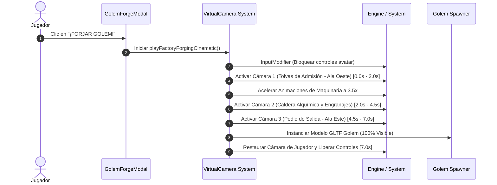

# 🏭 Guía Maestra: Fábrica de Golems Interactiva, UI React-ECS de Mezclas, Cinemática 3D y Catálogo de 150 Recetas

> **Ubicación Técnica**: `src/objects/wreckageLabBuilder.ts`, `src/ui/golemForgeComponent.tsx`, `src/systems/factoryAnimationSystem.ts`, `src/cinematics/factoryForgingCinematic.ts`, `src/data/recipesCatalog.ts`, `src/utils/golemRecipeHash.ts`  
> **Ubicación en Escena**: Distrito de la Forja, Parcela `[1, 2]` (`X: 35.0m`, `Z: 34.0m`)  
> **Ámbito**: Mobile-First, Arquitectura ECS SDK7, Cinemáticas de Cámara, Validación Estricta de 150 Recetas

---

## 📜 1. Visión General del Sistema

La **Fábrica de Golems (Wreckage Lab)** es el núcleo alquímico y mecánico del proyecto *Decentraland Golems' World*. Permite a los jugadores transformar las piezas de chatarra rescadas por el mapa en autómatas funcionales y seguidos por hash determinista FNV-1a de 32 bits.

El sistema integra 6 ejes tecnológicos principales:
1. **Interactividad In-World Mobile-First**: Consola de mandos, palancas y caldera clicables/táctiles con textos flotantes traducidos mediante `i18n`.
2. **UI React-ECS de Mezclas (`<GolemForgeModal />`)**: Interfaz táctil de 2 columnas para seleccionar de 5 a 12 componentes de chatarra con miniaturas PNG y vista previa en tiempo real.
3. **Validación Estricta de 150 Recetas (`src/data/recipesCatalog.ts`)**: Verificación en tiempo real que contrasta la mezcla canónica (`id:count|id:count`) contra el catálogo oficial de 150 recetas del GDD.
4. **Vista Previa Visual con Render 3D PNG**: Despliegue de la imagen PNG ($300 \times 300\text{ px}$) almacenada en `assets/models/<afinidad>/golem_<NNN>.png` previa a la forja.
5. **Animación Estructural Mecánica (`factoryAnimationSystem`)**: Sistema ECS que hace girar engranajes y vibrar la caldera en modo *Idle* (ambiente) y modo *Forging* (acelerado a 3.5x).
6. **Cinemática de Cámara en 3 Perspectivas (`playFactoryForgingCinematic`)**: Barrido automatizado con `VirtualCamera` e `InputModifier` que enfoca tolvas de admisión, gran caldera central y podio de salida.
7. **Compatibilidad Bilingüe Nativa (Dual Language Compatibility `nameEs` / `nameEn`)**: Generación simultánea de nombres en Español e Inglés durante la forja para recetas oficiales (vía `translateOfficialRecipeNameEs`) y mezclas procedurales (vía `generateProceduralGolemName(affinity, hash, lang)`), almacenados de forma persistente en `GolemConfig`.


---

## 🛠️ 2. Arquitectura de Archivos y Componentes

```text
src/
├── data/
│   └── recipesCatalog.ts             # Indexador de las 150 recetas oficiales (Cadena Canónica -> Datos)
├── utils/
│   └── golemRecipeHash.ts            # Hash FNV-1a 32-bit, derivación de atributos RPG y validación de recetas
├── systems/
│   └── factoryAnimationSystem.ts     # Animación ECS de rotación de engranajes y oscilación de caldera
├── cinematics/
│   └── factoryForgingCinematic.ts    # Orquestador de cámaras de 3 fases y bloqueo de controles del avatar
├── ui/
│   └── golemForgeComponent.tsx       # Componente modal React-ECS Mobile-First de mezclas y forja
└── objects/
    └── wreckageLabBuilder.ts         # Instanciación 3D de la estructura, registro en sistemas e interacciones pointer
```

---

## ⚙️ 3. Catálogo de 150 Recetas y Validación Estricta

### 3.1 Serialización y Cadena Canónica
Toda combinación de materiales seleccionada por el usuario en la UI se serializa alfabéticamente:
$$\text{CanonicalString} = \text{id}_1:\text{count}_1 \mid \text{id}_2:\text{count}_2 \mid \dots \mid \text{id}_k:\text{count}_k$$
*Ejemplo (Golem #001 — Baluarte Eléctrico)*:
`cadenas_hierro:2|manometros:2|palancas_interruptor:2|tornillos_pernos:2|tuercas_gigantes:2`

### 3.2 Proceso de Validación
```typescript
import { findOfficialRecipe } from '../data/recipesCatalog'

const canonical = buildCanonicalRecipe(materials)
const official = findOfficialRecipe(canonical)

if (official) {
  // Receta oficial válida (#001 a #150)
  // nameEn = official.nameEn ("Electric Bulwark")
  // nameEs = official.nameEs ("Baluarte Eléctrico")
  // modelSrc = assets/models/<afinidad>/golem_<NNN>.glb
} else {
  // Receta no válida: UI bloquea el botón de forja y muestra advertencia
}

```

---

## 🎨 4. Interfaz Modal de Forja (`GolemForgeModal`)

La interfaz modal está diseñada respetando los principios **Mobile-First** (hitboxes amplios de toque, sin hover obligado, adaptabilidad táctil):

- **Columna Izquierda (Inventario de Chatarra)**:
  - Muestra las piezas disponibles en el inventario del jugador.
  - Cada fila incluye la **miniatura PNG de la pieza** (`assets/items/<rarity>/<id>.png`), el nombre traducido, la cantidad poseída y la cantidad insertada en el crisol.
  - **Botones Táctiles Ampliados `+` y `-` (Mobile-First 50x42px)**: Diseñados con dimensiones amplias para pantallas táctiles (`width: 50`, `height: 42`), con `pointerFilter: 'block'` en el contenedor y `pointerFilter: 'none'` en la etiqueta de texto interna, evitando la intercepción de eventos de puntero en el cliente móvil Godot Explorer.
  - **Inmutabilidad y Re-renderizado Inmediato**: Las funciones `addForgeMaterial` y `removeForgeMaterial` actualizan el mapa de seleccionados generando nuevas referencias de objeto (`sceneState.selectedForgeMaterials = { ... }`), garantizando la actualización instantánea de la UI en el mismo tick.

- **Columna Derecha (Crisol Alquímico y Vista Previa)**:
  - **Caché y Memoización de Recetas (`getMemoizedForgedGolem`)**: Almacena en memoria el resultado proyectado evaluado con la cadena canónica (`buildCanonicalRecipe`), evitando re-ejecutar el algoritmo de atributos y la búsqueda en el catálogo de 150 recetas durante interacciones táctiles continuas.
  - Fila visual con las miniaturas PNG e insignias con la cantidad de los ingredientes dentro del crisol.
  - **Banner de Estado**: Muestra *`✨ Receta Oficial Válida (#NNN)`* o *`⚠️ Receta No Válida: La mezcla de componentes no coincide con ninguna de las 150 recetas del catálogo`*.
  - **Render 3D PNG del Golem**: Muestra la miniatura PNG del autómata resultante ($88 \times 88\text{ px}$) si la receta es válida.
  - **Grilla de Atributos**: Muestra la proyección determinista de Vitalidad (HP), Ataque (ATK), Defensa (DEF) y Velocidad (SPD).
  - **Botón `¡FORJAR GOLEM!`**: Habilitado **únicamente** cuando hay entre 5 y 12 materiales y la mezcla coincide con una receta válida del catálogo.

### 4.1 Pausa Automática de Animaciones 3D en Segundo Plano
Para erradicar el lag en pantallas móviles mientras se manipula la interfaz, `factoryAnimationSystem` detecta automáticamente si la modal está abierta (`getIsForgeUIOpen() === true`). Cuando la UI está desplegada, **se pausan las mutaciones `Transform.getMutable` per-frame** sobre las 8 entidades de engranajes y la caldera, liberando el bus CRDT y la CPU en dispositivos móviles.

---

## 🎥 5. Cinemática de Cámara de 3 Perspectivas

Durante el proceso de forja, la escena ejecuta una cinemática automatizada mediante `playFactoryForgingCinematic`:



---

## 🤖 6. Regla del Golem Seguidor Único Activo

El sistema cumple estrictamente la regla de **1 único golem seguidor activo por el mapa**:

1. Si el jugador **no posee ningún golem seguidor activo** (`getLocalActiveSquad().length === 0`):
   - El nuevo golem forjado se asigna como seguidor activo (`setLocalActiveSquad([config])`).
   - Se invoca `spawnActivePlayerGolem(config)` para que comience a seguir al avatar.
2. Si el jugador **ya posee un golem seguidor activo**:
   - El nuevo golem forjado se almacena de forma persistente en la **Reserva / Bóveda de Golems** (`addGolemToReserve(config)`).

---

## 🧪 7. Guía de Pruebas Rápidas (Golem #001)

Para probar el flujo completo en la vista previa del SDK:

1. Camina a la Parcela `[2, 1]` (`X: 40.0m | Z: 21.1m`).
2. Recoge las 10 piezas emergidas (2x palancas, 2x tuercas, 2x cadenas, 2x manómetros, 2x tornillos).
3. Ve al Consola del Laboratorio (`X: 35.0m | Z: 34.0m`) y pulsa sobre ella.
4. En la UI, selecciona los 10 materiales recolectados.
5. Confirma que la UI reconozca la **Receta #001: Baluarte Eléctrico**, mostrando su miniatura 3D PNG.
6. Pulsa **`¡FORJAR GOLEM!`** para presenciar la cinemática y la aparición del autómata galvánico 100% visible.
