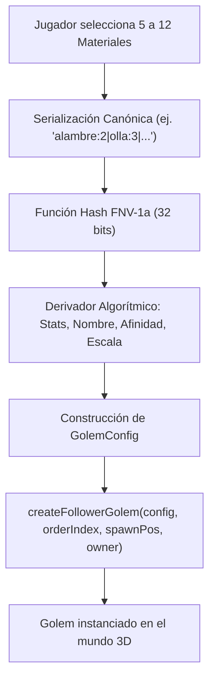

# 🏭 Guía Técnica: Fábrica de Golems (Golem Factory) y Mecánicas de Instanciación en Decentraland SDK7

Esta guía documenta en detalle el diseño, arquitectura y funcionamiento del patrón **Factory** implementado en `src/objects/golemFactory.ts`, el sistema de parametrización en `src/config/golems.ts`, la jerarquía de entidades padre-hijo con componentes `Billboard`/`TextShape`, la relación con los modelos 3D generados y la futura integración con la **Forja Determinista** del GDD de Golems.

---

## 📑 Tabla de Contenidos

1. [El Patrón Factory en Decentraland SDK7](#1-el-patrón-factory-en-decentraland-sdk7)
   - [1.1 Principio de Responsabilidad Única y Arquitectura Modular](#11-principio-de-responsabilidad-única-y-arquitectura-modular)
   - [1.2 Ciclo de Vida de una Entidad Golem](#12-ciclo-de-vida-de-una-entidad-golem)
2. [Estructura y Jerarquía de la Entidad Golem](#2-estructura-y-jerarquía-de-la-entidad-golem)
   - [2.1 Entidad Raíz (`golemEntity`)](#21-entidad-raíz-golementity)
   - [2.2 Entidad Hija de Interfaz In-World (`labelEntity`)](#22-entidad-hija-de-interfaz-in-world-labelentity)
   - [2.3 Paleta de Colores Semántica por Afinidad](#23-paleta-de-colores-semántica-por-afinidad)
3. [Tipado y Configuración Centralizada (`src/config/golems.ts`)](#3-tipado-y-configuración-centralizada-srcconfiggolemsts)
   - [3.1 Interfaz `GolemConfig`](#31-interfaz-golemconfig)
   - [3.2 Enumeración `GolemAffinity`](#32-enumeración-golemaffinity)
   - [3.3 Configuración de los 3 Golems Iniciales](#33-configuración-de-los-3-golems-iniciales)
4. [Modelos 3D `.glb` y Carga en Escena](#4-modelos-3d-glb-y-carga-en-escena)
   - [4.1 Vinculación con `GltfContainer`](#41-vinculación-con-gltfcontainer)
   - [4.2 Escalas y Proporciones](#42-escalas-y-proporciones)
5. [Integración con la Forja Determinista del GDD](#5-integración-con-la-forja-determinista-del-gdd)
   - [5.1 De la Receta al Hash FNV-1a](#51-de-la-receta-al-hash-fnv-1a)
   - [5.2 Derivación de Parámetros para la Factory](#52-derivación-de-parámetros-para-la-factory)
   - [5.3 Diagrama de Flujo: Forja $\rightarrow$ Factory $\rightarrow$ Mundo 3D](#53-diagrama-de-flujo-forja-rightarrow-factory-rightarrow-mundo-3d)
6. [Buenas Prácticas Mobile-First y Rendimiento](#6-buenas-prácticas-mobile-first-y-rendimiento)
   - [6.1 Ausencia de Colisionadores Físicos en Seguidores](#61-ausencia-de-colisionadores-físicos-en-seguidores)
   - [6.2 Jerarquías Livianas (`Transform.parent`)](#62-jerarquías-livianas-transformparent)
   - [6.3 Cumplimiento de Restricciones Móviles](#63-cumplimiento-de-restricciones-móviles)
7. [Guía Paso a Paso para Desarrolladores: Cómo Añadir un Nuevo Golem](#7-guía-paso-a-paso-para-desarrolladores-cómo-añadir-un-nuevo-golem)

---

## 1. El Patrón Factory en Decentraland SDK7

### 1.1 Principio de Responsabilidad Única y Arquitectura Modular
Siguiendo las recomendaciones oficiales de Decentraland ([`game-objects.md`](file:///d:/DECENTRALAND/Scenes/Hackathon/docs/dcl-docs-main/creator/sdk7/programming-patterns/game-objects.md)), el archivo `src/index.ts` debe mantenerse limpio y actuar únicamente como inicializador y orquestador.

La lógica de instanciación, asignación de componentes, cálculo de jerarquías, vinculación de dueños (`ownerAddress`) y limpieza de entidades reside de forma exclusiva en el módulo **Factory** ([`src/objects/golemFactory.ts`](file:///d:/DECENTRALAND/Scenes/Hackathon/src/objects/golemFactory.ts)).

```
                    ┌───────────────────────────────┐
                    │    Configuración / Receta     │
                    │   (GolemConfig / Forja Hash)  │
                    └───────────────┬───────────────┘
                                    │
                                    ▼
                    ┌───────────────────────────────┐
                    │      createFollowerGolem()    │
                    │      spawnPlayerSquad()       │
                    │   (src/objects/golemFactory)  │
                    └───────────────┬───────────────┘
                                    │
            ┌───────────────────────┴───────────────────────┐
            │                                               │
            ▼                                               ▼
┌───────────────────────┐                       ┌───────────────────────┐
│ Entidad Raíz Golem    │                       │ Entidad Hija Etiqueta │
│ - Transform           │ ─── (parent) ──────── │ - Transform (local)   │
│ - GltfContainer (.glb)│                       │ - TextShape [0x...]   │
│ - GolemFollowerComp   │                       │ - Billboard           │
│   (con ownerAddress)  │                       │                       │
└───────────────────────┘                       └───────────────────────┘
```

### 1.2 Ciclo de Vida de una Entidad Golem en Multijugador
1. **Definición / Solicitud**: Se provee un objeto de configuración `GolemConfig` o `GolemSquadMemberDto` junto con el identificador del dueño (`ownerAddress`, ej. `'local'` o dirección de wallet `0x123...`).
2. **Instanciación Raíz**: Se crea la entidad principal en el motor con `engine.addEntity()` y se le asocian `Transform`, `GltfContainer` y `GolemFollowerComponent` con su respectivo `ownerAddress`.
3. **Instanciación de la UI In-World**: Se genera una entidad hija vinculada con `Transform.parent`, a la que se le añade `TextShape` con el nombre, afinidad y la dirección abreviada del dueño, orientada a cámara con `Billboard`.
4. **Registro en el Bucle ECS**: El sistema `golemFollowerSystem` consulta `engine.getEntitiesWith(GolemFollowerComponent, Transform)` y mueve a cada golem a lo largo de la trayectoria de su dueño.
5. **Destrucción y Limpieza**: Cuando un usuario remoto se desconecta, `removePlayerSquad(ownerAddress)` elimina sus entidades y etiquetas hijas mediante `removeEntityWithChildren()`, liberando recursos de memoria.

---

## 2. Estructura y Jerarquía de la Entidad Golem

### 2.1 Entidad Raíz (`golemEntity`)
La entidad principal representa el cuerpo físico y la identidad del autómata en la escena:

```typescript
export function createFollowerGolem(
  config: GolemConfig | GolemSquadMemberDto,
  orderIndex: number,
  spawnPosition: Vector3,
  ownerAddress: string = 'local'
): Entity {
  const golemEntity = engine.addEntity()

  // 1. Posición, rotación y escala proporcional
  Transform.create(golemEntity, {
    position: spawnPosition,
    rotation: Quaternion.Identity(),
    scale: Vector3.create(config.scale, config.scale, config.scale)
  })

  // 2. Carga del modelo 3D binario glTF 2.0
  GltfContainer.create(golemEntity, {
    src: config.modelSrc
  })

  // 3. Componente de seguimiento en formación con dueño
  GolemFollowerComponent.create(golemEntity, {
    golemId: config.id,
    ownerAddress: ownerAddress.toLowerCase(),
    orderIndex,
    targetDistance: config.followDistance,
    moveSpeed: config.moveSpeed,
    rotationSpeed: config.rotationSpeed,
    isMoving: false
  })

  // 4. Etiqueta flotante con nombre, afinidad y tag del dueño
  const labelEntity = engine.addEntity()
  Transform.create(labelEntity, {
    parent: golemEntity,
    position: Vector3.create(0, 1.45, 0)
  })

  const ownerTag = formatShortAddress(ownerAddress)
  TextShape.create(labelEntity, {
    text: `${config.name}${ownerTag}\n[${config.affinity}]`,
    fontSize: 2.2,
    textColor: getAffinityTextColor(config.affinity)
  })

  Billboard.create(labelEntity, {})

  return golemEntity
}
```

### 2.2 Gestión de Escuadrones Completos (Spawn y Remove)

La fábrica provee métodos de alto nivel para instanciar y limpiar escuadrones completos:

```typescript
/**
 * Instancia el escuadrón completo de 3 golems para un jugador específico.
 */
export function spawnPlayerSquad(
  ownerAddress: string,
  squadConfig: (GolemConfig | GolemSquadMemberDto)[],
  basePos: Vector3
): Entity[] {
  const entities: Entity[] = []
  const normAddress = ownerAddress.toLowerCase()

  squadConfig.forEach((config, index) => {
    const spawnPos = Vector3.create(basePos.x, Math.max(0.1, basePos.y), basePos.z - config.followDistance)
    const entity = createFollowerGolem(config, index, spawnPos, normAddress)
    entities.push(entity)
  })

  return entities
}

/**
 * Elimina de forma limpia todas las entidades y etiquetas hijas de un jugador.
 */
export function removePlayerSquad(ownerAddress: string) {
  const targetOwner = ownerAddress.toLowerCase()
  const entitiesToRemove: Entity[] = []

  for (const [entity] of engine.getEntitiesWith(GolemFollowerComponent)) {
    const follower = GolemFollowerComponent.get(entity)
    if (follower.ownerAddress.toLowerCase() === targetOwner) {
      entitiesToRemove.push(entity)
    }
  }

  for (const entity of entitiesToRemove) {
    removeEntityWithChildren(engine, entity)
  }
}
```

---

## 3. Tipado y Configuración Centralizada (`src/config/golems.ts`)

Toda la definición de datos se encuentra desacoplada de la implementación en [`src/config/golems.ts`](file:///d:/DECENTRALAND/Scenes/Hackathon/src/config/golems.ts).

### 3.1 Interfaz `GolemConfig`
```typescript
export interface GolemConfig {
  /** Identificador único alfanumérico */
  id: string
  /** Nombre descriptivo o procedural del autómata */
  name: string
  /** Afinidad energética elemental */
  affinity: GolemAffinity
  /** Ruta del archivo 3D .glb en assets */
  modelSrc: string
  /** Multiplicador de escala geométrica (0.8m a 1.4m) */
  scale: number
  /** Distancia objetivo en metros respecto al avatar en el buffer de trayectoria */
  followDistance: number
  /** Multiplicador de velocidad de traslación (factor LERP) */
  moveSpeed: number
  /** Multiplicador de velocidad de giro (factor SLERP) */
  rotationSpeed: number
}
```

### 3.2 Enumeración `GolemAffinity`
Representa el pentágono de afinidades elementales definido en la Sección 7 del GDD:
```typescript
export enum GolemAffinity {
  STEAM = 'Vapor',
  GALVANIC = 'Galvánico',
  MECHANICAL = 'Mecánico',
  LUMINOUS = 'Luminoso',
  AETHER = 'Éter'
}
```

### 3.3 Catálogo de Variantes y Generador Aleatorio (`generateRandomSquad`)

En `src/config/golems.ts` se definen las 5 variantes temáticas para cada afinidad elemental junto con sus rutas de modelo 3D y nombres procedurales:

```typescript
export const SQUAD_FOLLOW_DISTANCES = [1.8, 3.6, 5.4]

/**
 * Genera un escuadrón aleatorio de 3 golems garantizando 3 TIPOS COMPLETAMENTE DISTINTOS.
 * Selecciona al azar 3 de las 5 afinidades y una variante de modelo 3D (01 a 05) para cada una.
 */
export function generateRandomSquad(ownerSeed?: string): GolemConfig[] {
  const allAffinities = [
    GolemAffinity.STEAM,
    GolemAffinity.GALVANIC,
    GolemAffinity.MECHANICAL,
    GolemAffinity.LUMINOUS,
    GolemAffinity.AETHER
  ]

  // Barajado Fisher-Yates para selección aleatoria sin repetición
  const shuffledAffinities = [...allAffinities]
  for (let i = shuffledAffinities.length - 1; i > 0; i--) {
    const j = Math.floor(Math.random() * (i + 1))
    const temp = shuffledAffinities[i]
    shuffledAffinities[i] = shuffledAffinities[j]
    shuffledAffinities[j] = temp
  }

  // Tomar exactamente 3 tipos distintos
  const selectedAffinities = shuffledAffinities.slice(0, 3)

  return selectedAffinities.map((affinity, index) => {
    const variantData = GOLEM_AFFINITY_VARIANTS[affinity]
    const variantNumber = Math.floor(Math.random() * 5) + 1 // 1 a 5
    const variantPad = variantNumber.toString().padStart(2, '0')
    const modelSrc = `assets/models/${variantData.folder}/golem_${variantData.folder}_${variantPad}.glb`
    const name = variantData.names[variantNumber - 1] || `${affinity} #${variantNumber}`
    const followDistance = SQUAD_FOLLOW_DISTANCES[index] || (index + 1) * 1.8

    return {
      id: `golem_${variantData.folder}_${variantPad}_${Date.now()}_${index}`,
      name,
      affinity,
      modelSrc,
      scale: variantData.baseScale,
      followDistance,
      moveSpeed: variantData.baseSpeed,
      rotationSpeed: variantData.baseRotSpeed
    }
  })
}
```

---

## 4. Modelos 3D `.glb` y Carga en Escena

### 4.1 Vinculación con `GltfContainer` y Catálogo de 25 Modelos
La fábrica utiliza el componente estándar `GltfContainer.create(golemEntity, { src: config.modelSrc })`. 

Los modelos generados por [`scripts/generate_models.js`](file:///d:/DECENTRALAND/Scenes/Hackathon/scripts/generate_models.js) son binarios glTF 2.0 (`.glb`) autocontenidos organizados en 5 carpetas temáticas:

| Afinidad / Carpeta | Modelos Disponibles | Materiales PBR | Canales Emisivos |
| :--- | :--- | :--- | :--- |
| **Vapor** (`assets/models/steam/`) | `golem_steam_01.glb` a `05.glb` | Cobre, Hierro Fundido, Caldera | Fuego y brasas (`#FF7000`) |
| **Galvánico** (`assets/models/galvanic/`) | `golem_galvanic_01.glb` a `05.glb` | Acero Azulado, Cobre Bobinas | Reactor eléctrico (`#00E5FF`) |
| **Mecánico** (`assets/models/mechanical/`) | `golem_mechanical_01.glb` a `05.glb` | Hierro de Chatarra, Engranajes | Visor y monóculo ámbar (`#FFBF00`) |
| **Luminoso** (`assets/models/luminous/`) | `golem_luminous_01.glb` a `05.glb` | Cromo Plateado, Cuarzo | Faro solar prismático (`#FFFF33`) |
| **Éter** (`assets/models/aether/`) | `golem_aether_01.glb` a `05.glb` | Obsidiana, Resonadores Místicos | Núcleo de maná amatista (`#B833FF`) |

### 4.2 Escalas y Proporciones
- Cada golem posee una escala configurable (`scale: 0.95` a `1.2`).
- La fábrica aplica esta escala simétricamente en los tres ejes (`Vector3.create(config.scale, config.scale, config.scale)`), lo que permite que golems más pesados (como el Acorazado) luzcan visualmente más imponentes que los ágiles (como el Galvánico).

---

## 5. Integración con la Forja Determinista del GDD

La `golemFactory` está diseñada para acoplarse directamente al sistema de **Forja por Hash** descrito en la Sección 6 del GDD de Golems:



### 5.1 De la Receta al Hash FNV-1a
Cuando el jugador combina materiales en la forja, se genera un hash numérico entero de 32 bits mediante la función:
```typescript
function calcularHashReceta(recetaCanonica: string): number {
  let hash = 0x811c9dc5
  for (let i = 0; i < recetaCanonica.length; i++) {
    hash ^= recetaCanonica.charCodeAt(i)
    hash = Math.imul(hash, 0x01000193)
  }
  return hash >>> 0
}
```

### 5.2 Derivación de Parámetros para la Factory
A partir de los bits del hash determinista, se derivan automáticamente los atributos requeridos por `GolemConfig`:
1. **Afinidad Dominante**: Evaluada por la suma de aportes de las piezas (Vapor, Galvánico, Mecánico, etc.).
2. **Modelo 3D Base**: Seleccionado según la afinidad (`golem_steam.glb`, `golem_galvanic.glb`, etc.).
3. **Escala Relativa**: Calculada entre $0.9\text{m}$ y $1.3\text{m}$ a partir del peso de las piezas.
4. **Nombre Procedural**: Combinación de prefijo de afinidad y sufijo estructural (ej. *«Calderón Blindado»*).
5. **Velocidad de Movimiento**: Proporcional a la estadística `SPD` resultante ($4.0 + \text{SPD} \times 0.05$).

---

## 6. Buenas Prácticas Mobile-First y Rendimiento

### 6.1 Ausencia de Colisionadores Físicos en Seguidores
- **Diseño Ergonómico**: A los golems acompañantes **NO se les añade `MeshCollider`**.
- **Razón Mobile-First**: Si los 3 golems tuvieran colisionadores de bloqueo físico, podrían atrapar o bloquear accidentalmente al avatar en esquinas estrechas o pasillos, especialmente en pantallas táctiles con joystick virtual. Al no tener colisionador físico, el jugador puede moverse con total fluidez sin riesgo de atascos.

### 6.2 Jerarquías Livianas y Limpieza Eficiente
- El emparentamiento con `Billboard` garantiza visibilidad continua.
- La función `removePlayerSquad()` garantiza la eliminación de las entidades principales y sus hijos mediante `removeEntityWithChildren()`, evitando fugas de memoria al desconectarse usuarios.

### 6.3 Cumplimiento de Restricciones Móviles
- ✅ **Sin Luces Dinámicas**: El resplandor de los núcleos proviene de materiales PBR emisivos puros.
- ✅ **Sin Nine-Slice Complejo**: Las etiquetas usan texto vectorial nativo con `TextShape` y `Billboard`.
- ✅ **Draw Calls Reducidas**: Modelos binarios de una sola malla combinada por material.

---

## 7. Guía Paso a Paso para Desarrolladores: Cómo Añadir un Nuevo Golem

Para agregar un nuevo tipo o variante de Golem en el proyecto:

### Paso 1: Generar o Añadir el Modelo 3D `.glb`
Colocar el archivo `.glb` en `assets/models/nuevo_golem.glb` (o añadir su generador geométrico en `scripts/generate_models.js`).

### Paso 2: Registrar la Configuración en `src/config/golems.ts`
```typescript
export const MI_NUEVO_GOLEM: GolemConfig = {
  id: 'golem_aether_01',
  name: 'Titán de Éter',
  affinity: GolemAffinity.AETHER,
  modelSrc: 'assets/models/golem_aether.glb',
  scale: 1.25,
  followDistance: 1.8,
  moveSpeed: 4.6,
  rotationSpeed: 6.0
}
```

### Paso 3: Instanciar mediante la Factory
```typescript
import { createFollowerGolem } from './objects/golemFactory'
import { MI_NUEVO_GOLEM } from './config/golems'

const miGolem = createFollowerGolem(MI_NUEVO_GOLEM, 0, Vector3.create(16, 0, 16), 'local')
```

