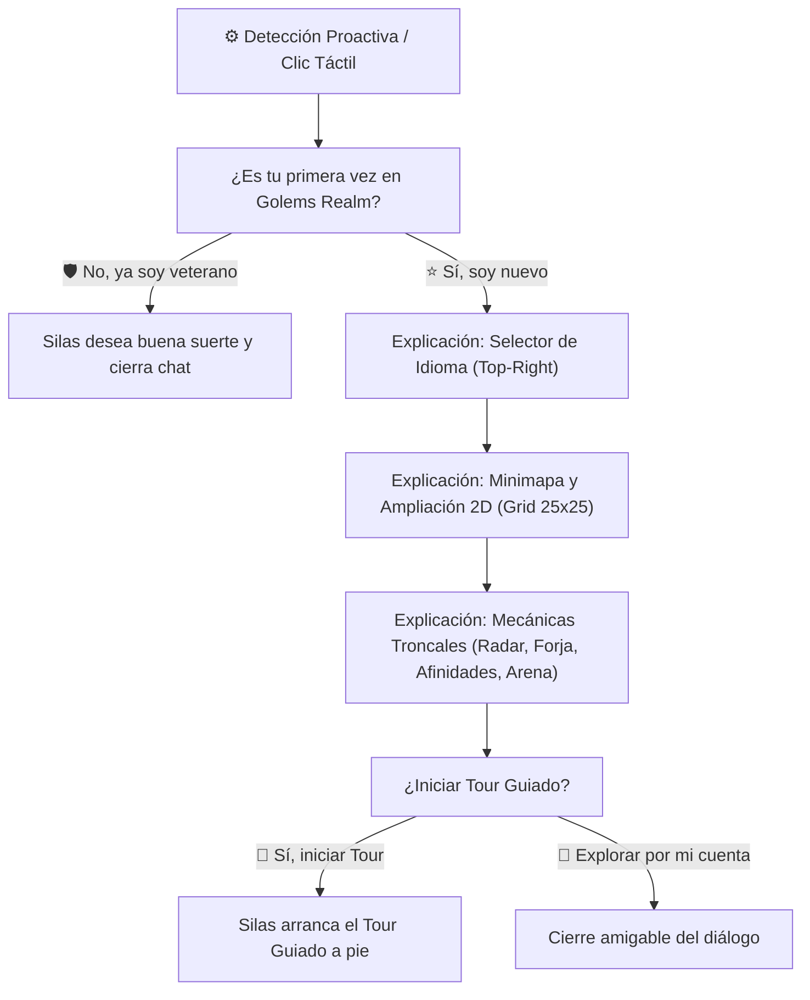
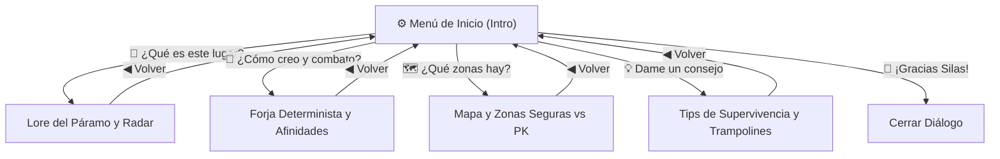

# 📖 Guía Maestra: NPC de Bienvenida «Silas el Sobreviviente» y Sistema de Tour Guiado

> [!IMPORTANT]
> **ESPECIFICACIÓN OFICIAL DE GOLEMS WORLD (SDK7 & MOBILE-FIRST)**:  
> Esta guía documenta la arquitectura, diseño visual, micro-ambientación, sistema de diálogo interactivo (React-ECS), árbol de tutoriales bilingües (`src/i18n`), cinemáticas orbitales de cámara (`src/cinematics/marketCinematic.ts`) y el sistema de navegación por waypoints del **Tour Guiado de Silas el Sobreviviente** en Decentraland SDK7.

---

## 📑 Tabla de Contenidos

1. [Resumen y Propósito del NPC](#1-resumen-y-propósito-del-npc)
2. [Ubicación Espacial y Coordenadas del Campamento](#2-ubicación-espacial-y-coordenadas-del-campamento)
3. [Detección Proactiva y Clic Táctil Mobile-First](#3-detección-proactiva-y-clic-táctil-mobile-first)
4. [Árbol de Diálogos y Tutorial de Bienvenida (i18n)](#4-árbol-de-diálogos-y-tutorial-de-bienvenida-i18n)
5. [Sistema de Tour Guiado y Circuito de 11 Waypoints](#5-sistema-de-tour-guiado-y-circuito-de-11-waypoints)
6. [Cámaras Cinemáticas y Barridos Orbitales del Mercado](#6-cámaras-cinemáticas-y-barridos-orbitales-del-mercado)
7. [Interfaz de Usuario React-ECS y Subtítulos en Movimiento](#7-interfaz-de-usuario-react-ecs-y-subtítulos-en-movimiento)
8. [Estructura Modular de Archivos](#8-estructura-modular-de-archivos)

---

## 1. Resumen y Propósito del NPC

**Silas el Sobreviviente** es el primer personaje no jugable con el que interactúa el jugador al ingresar a **Golems World**. Actúa como el mentor y guía de supervivencia del páramo industrial:

- **Fantasea y Rol**: Un veterano chatarrero y forjador que ha sobrevivido décadas a la Gran Sobrecarga. Viste indumentaria de cuero resistente y desgastada por el humo y las chispas.
- **Función Tutorial Orgánica**:
  1. Consulta amigablemente si es la primera vez del jugador en el reino.
  2. Enseña a utilizar el **Selector de Idioma** (`🌐 ES | EN`) en la esquina superior derecha.
  3. Explica el funcionamiento del **Minimapa en tiempo real** y su botón táctil para ampliar a pantalla completa (grid 25x25 / 625 parcelas).
  4. Detalla las mecánicas troncales: **Radar de Calor**, **Forja Determinista** (5 a 12 piezas), **Pentágono de Afinidades** y la **Gran Arena** de combate FFA a 200m, 200m.
  5. Ofrece un **Tour Guiado a pie** recorriendo los 4 puntos neurálgicos de la Forja (Escondite y 3 Cofres, Mercado Oeste, Fábrica de Golems, Mercado Sur y retorno al campamento).

---

## 2. Ubicación Espacial y Coordenadas del Campamento

Silas y su campamento base están situados en la plataforma adoquinada de bienvenida en la esquina suroeste del mapa:

| Parámetro | Valor Canónico | Notas de Diseño |
| :--- | :--- | :--- |
| **Parcela del Grid** | `[0, 0]` (Base del mapa 25x25) | Primera parcela del Distrito de la Forja |
| **Coordenadas Métricas** | `X: 15.8m | Y: 0.25m | Z: 5.9m` | Elevado a $Y=0.25\text{m}$ sobre el piso de madera |
| **Distrito** | Distrito de la Forja | Zona 🟢 Segura (Sin PK / Libre de Daño) |
| **Proximidad al Spawn** | A 5.4 metros del punto de aparición | Punto de Spawn en `(12.2m, 2.0m)` |
| **Orientación Base** | $180^\circ$ (Mirando hacia el Sur / Acceso) | Recibe de frente al avatar recién aparecido |

---

## 3. Detección Proactiva y Clic Táctil Mobile-First

1. **Detección por Proximidad ($\le 4.5\text{m}$)**:  
   Implementada dentro de `welcomeNpcAnimationSystem` en `src/objects/welcomeNpc.ts`. Al aproximarse el avatar por primera vez, Silas realiza un emote de saludo (`wave`) y abre automáticamente la ventana modal de diálogo.
2. **Interacción Táctil / Puntero (`InputAction.IA_POINTER`)**:  
   Hitbox táctil generosa ($\ge 8\text{m}$) sobre el avatar de Silas y su mini-golem acompañante Pistón, permitiendo reanudar o consultar información en cualquier instante.

---

## 4. Árbol de Diálogos y Tutorial de Bienvenida (i18n)



---

## 5. Sistema de Tour Guiado y Circuito de 11 Waypoints

El sistema (`src/systems/silasTourSystem.ts`) orquesta una máquina de estados que desplaza a Silas suavemente entre 11 waypoints con rotación continua en la dirección de marcha y subtítulos flotantes sincronizados:

| WP # | Parcela | Coordenadas $(X, Z)$ | Acción / Parada | Explicación Narrativa |
| :--- | :--- | :--- | :--- | :--- |
| **WP 0** | `[0, 0]` | `(15.8m, 5.9m)` | Inicio del Tour | Silas invita al jugador a seguirlo. |
| **WP 1** | `[0, 0]` | `(15.8m, 10.3m)` | Marcha Norte | Subtítulo: Te llevaré a conocer tu refugio personal. |
| **WP 2** | `[0, 0]` | `(9.7m, 15.5m)` | **Parada 1: Escondite** | **3 Cofres de Bóveda** + **Cámara Orbital Panorámica 1** (Refugio y Cofres Seguros). |
| **WP 3** | `[0, 1]` | `(15.7m, 21.9m)` | Marcha Calle Norte | Subtítulo: Nos dirigimos al concurrido Paseo Comercial. |
| **WP 4** | `[0, 1]` | `(15.4m, 25.8m)` | Marcha Aproximación | Subtítulo: Camino de abastecimiento de repuestos. |
| **WP 5** | `[0, 1]` | `(10.6m, 29.0m)` | **Parada 2: Mercado Oeste** | Quioscos 06 al 10 + **Cámara Orbital Panorámica 2**. |
| **WP 6** | `[0, 1]` | `(15.6m, 29.4m)` | Marcha Hacia el Este | Subtítulo: Te mostraré la Fábrica de Golems. |
| **WP 7** | `[1, 1]` | `(23.6m, 25.8m)` | Marcha Corredor Central | Subtítulo: Siente el calor de las calderas y turbinas. |
| **WP 8** | `[2, 1]` | `(42.4m, 25.8m)` | **Parada 3: Fábrica Golems** | Forja determinista + **Cámara Orbital Panorámica 3** (Crisol, turbinas y podio prototipo). |
| **WP 9** | `[1, 0]` | `(30.0m, 11.5m)` | **Parada 4: Mercado Sur** | Quioscos 01 al 05 + **Cámara Orbital Panorámica 4**. |
| **WP 10**| `[1, 0]` | `(16.0m, 9.8m)` | Marcha Regreso | Subtítulo: Ya estamos regresando a mi campamento. |
| **WP 11**| `[0, 0]` | `(15.8m, 5.9m)` | **Parada 5: Retorno Final** | Silas regresa a su puesto, gira $180^\circ$, saluda y gradúa al jugador. |

---

## 6. Cámaras Cinemáticas y Barridos Orbitales del Tour

Implementadas en `src/cinematics/marketCinematic.ts`:

1. **Cámara de Seguimiento Continuo (`activateTourFollowCamera`)**:  
   Mantiene una `VirtualCamera` en tercera persona centrada en Silas ($Y+2.5\text{m}, Z-3.8\text{m}$ con interpolación suave), asegurando que el jugador visualice a Silas y el camino a cada paso.
2. **Cámara Orbital Escondite del Jugador (`playHideoutCinematic`)**:  
   Barrido cinemático de 4.8s enfocado en el refugio y los 3 cofres de la bóveda en el eje Z ($12.8\text{m} \rightarrow 22.6\text{m}$).
3. **Cámara Orbital Paseo Oeste (`playMarketWestCinematic`)**:  
   Barrido cinemático de 4.8s sobre los quioscos 06 al 10 en el eje Z ($25\text{m} \rightarrow 58\text{m}$).
4. **Cámara Orbital Fábrica de Golems (`playFactoryCinematic`)**:  
   Barrido cinemático de 4.8s elevado de este a oeste ($X=44.5\text{m} \rightarrow 26.0\text{m}$) enfocado en el crisol de forja y podio prototipo.
5. **Cámara Orbital Bulevar Sur (`playMarketSouthCinematic`)**:  
   Barrido cinemático de 4.8s sobre los quioscos 01 al 05 en el eje X ($26\text{m} \rightarrow 65\text{m}$).

---

## 7. Interfaz de Usuario React-ECS y Subtítulos en Movimiento

1. **Modal de Diálogo RPG (`<NpcDialog />` en `src/ui.tsx`)**:  
   Panel táctil Mobile-First con botones de avance (`Siguiente ➔`, `Continuar ➔`, `Finalizar 🏆`).
2. **HUD de Subtítulos en Marcha (`<SilasTourSubtitleHUD />`)**:  
   Barra flotante inferior no invasiva con distintivo `[ ⚙️ Silas el Sobreviviente ]` y botón de salto rápido (`Finalizar Tour ✖`), garantizando que no obstaculice los joysticks táctiles nativos.

---

## 8. Estructura Modular de Archivos

```text
src/
├── cinematics/
│   ├── silasCinematic.ts        # Cinemática de presentación inicial de Silas
│   └── marketCinematic.ts       # Cámaras orbitales del mercado y cámara de seguimiento del tour
├── objects/
│   └── welcomeNpc.ts            # Fábrica del NPC Silas, campamento y detección proactiva
├── systems/
│   └── silasTourSystem.ts       # Sistema de navegación ECS por 11 waypoints y orquestación del tour
├── state.ts                     # Estado global del tour y ramas de diálogo
├── ui.tsx                       # Componentes <NpcDialog /> y <SilasTourSubtitleHUD />
├── i18n/
│   ├── types.ts                 # Esquema de traducciones tipado
│   └── locales/
│       ├── es.ts                # Textos en español
│       └── en.ts                # Textos en inglés
└── index.ts                     # Inicialización de cámaras y registro de silasTourSystem
```


---

## 1. Resumen y Propósito del NPC

**Silas el Sobreviviente** es el primer personaje no jugable con el que interactúa el jugador al ingresar a **Golems World**. Actúa como el mentor y guía de supervivencia del páramo industrial:

- **Fantasea y Rol**: Un veterano chatarrero y forjador que ha sobrevivido décadas a la Gran Sobrecarga. Viste ropa de cuero resistente y desgastada por el humo y las chispas.
- **Función Tutorial Orgánica**: En lugar de tutoriales invasivos, Silas explica en lenguaje inmersivo:
  1. El origen de los autómatas y el funcionamiento del **Radar de Calor**.
  2. La combinación de 5 a 12 piezas en la **Forja Determinista** y el **Pentágono de Afinidades**.
  3. La zonificación del mapa de 25x25 (áreas seguras vs zonas PK sin ley).
  4. Consejos tácticos (trampolines de vapor, balance de piezas y optimización).
- **Interacción Mobile-First**: Compatible al 100% con controles táctiles sin necesidad de ratón físico.

---

## 2. Ubicación Espacial y Coordenadas Métricas

Silas y su campamento están situados en la plataforma adoquinada de bienvenida en la esquina suroeste del mapa:

| Parámetro | Valor Canónico | Notas de Diseño |
| :--- | :--- | :--- |
| **Parcela del Grid** | `[0, 0]` (Base del mapa 25x25) | Primera parcela del Distrito de la Forja |
| **Coordenadas Métricas** | `X: 15.8m | Y: 0.25m | Z: 5.9m` | Elevado a $Y=0.25\text{m}$ sobre el piso de madera |
| **Distrito** | Distrito de la Forja | Zona 🟢 Segura (Sin PK / Libre de Daño) |
| **Proximidad al Spawn** | A 5.4 metros del punto de aparición | Punto de Spawn en `(12.2m, 2.0m)` |
| **Orientación (Rotación)** | $180^\circ$ (Mirando hacia el Sur / Acceso) | Recibe de frente al avatar recién aparecido |

```text
(0, 16m) ┌────────────────────────────────────────────────────────┐ (16m, 16m)
         │                                                        │
         │   [Trampolín de Vapor]                                 │
         │   (5.1m, 7.1m)                                         │
         │                                [CAMPAMENTO DE SILAS] ⚙️ │
         │                                (15.8m, 5.9m)           │
         │                                                        │
         │   [Punto de Spawn]                                     │
         │   (12.2m, 2.0m)                                        │
         │                                                        │
(0, 0m)  └────────────────────────────────────────────────────────┘ (16m, 0m)
```

---

## 3. Modelado y Representación Visual (`AvatarShape`)

El avatar de Silas se genera mediante el componente nativo `AvatarShape` de SDK7 con indumentaria de sobreviviente:

```typescript
AvatarShape.create(silasAvatar, {
  id: 'silas-wasteland-survivor',
  name: '', // Nombre customizado vía TextShape 3D
  bodyShape: 'urn:decentraland:off-chain:base-avatars:BaseMale',
  wearables: [
    'urn:decentraland:off-chain:base-avatars:eyebrows_00',
    'urn:decentraland:off-chain:base-avatars:mouth_00',
    'urn:decentraland:off-chain:base-avatars:eyes_00',
    'urn:decentraland:off-chain:base-avatars:beard',
    'urn:decentraland:off-chain:base-avatars:messy_hair',
    'urn:decentraland:off-chain:base-avatars:leather_jacket',
    'urn:decentraland:off-chain:base-avatars:brown_pants',
    'urn:decentraland:off-chain:base-avatars:boots'
  ],
  emotes: [],
  skinColor: { r: 0.82, g: 0.68, b: 0.55 }, // Tez curtida por el sol y el hollín
  hairColor: { r: 0.42, g: 0.32, b: 0.22 }, // Castaño ceniciento
  eyeColor: { r: 0.35, g: 0.65, b: 0.85 },  // Azul acerado
  expressionTriggerId: 'wave',
  expressionTriggerTimestamp: 0
})
```

### Rótulo Flotante 3D
Sobre la cabeza de Silas ($Y = +2.25\text{m}$) se ubica un `TextShape` vinculado a un `Billboard`:
- **Texto ES**: `⚙️ Silas • Sobreviviente del Páramo`
- **Texto EN**: `⚙️ Silas • Wasteland Survivor`
- **Color**: Dorado cálido `#FFD759` (`Color4.create(1.0, 0.85, 0.35, 1.0)`).

---

## 4. Micro-Campamento de Supervivencia y Props Ambientales

Para integrar al personaje de forma orgánica con la escena, su base incluye un puesto de supervivencia compuesto por modelos GLB oficiales:

```text
                   (Z+)
                    ▲
                    │     [Smoker Humeante]
                    │     (-1.3m, +0.4m)
                    │           ♨️
                    │
   [Mini-Golem] 🤖  │       [SILAS] ⚙️
   (-0.95m, -0.65m) │        (0, 0)
                    │
                    │                  [Cofre de Chatarra]
                    │                  (+1.2m, +0.3m)
                    │
                    │     [Barril con Farol] 🏮
                    │     (+1.0m, -0.9m)
                    └─────────────────────────────► (X+)
```

| Elemento | Modelo 3D (`GltfContainer`) | Offset Local ($X, Y, Z$) | Escala | Función / Propósito |
| :--- | :--- | :--- | :--- | :--- |
| **Silas (Avatar)** | `AvatarShape` nativo | `(0, 0, 0)` | $1.0\times$ | Personaje principal y punto de interacción |
| **Chimenea Humeante** | `assets/asset-packs/smoker/Smoker.glb` | `(-1.3, 0, +0.4)` | $0.7\times$ | Fuente de calor, humo y vapor |
| **Cofre de Repuestos**| `assets/asset-packs/chest_gear/Chest Gear.glb`| `(+1.2, 0, +0.3)` | $0.9\times$ | Alijo con engranajes rescatados |
| **Mesa de Barril** | `assets/asset-packs/barrel/Barrel.glb` | `(+1.0, 0, -0.9)` | $0.85\times$| Mesa auxiliar de trabajo |
| **Farol de Aceite** | `assets/asset-packs/table_lamp/Table Lamp.glb`| `(+1.0, 0.75, -0.9)`| $0.9\times$ | Iluminación de baliza nocturna |
| **Golem «Pistón»** | `assets/golems/steam/golem_003.glb` | `(-0.95, 0, -0.65)` | $0.65\times$| Mini-golem de vapor leal a Silas |

---

## 5. Árbol de Diálogos Ramificado e Internacionalización (i18n)

El diálogo está estructurado en 4 ramas principales accesibles desde el menú de inicio:



### Tabla Comparativa de Textos Bilingües

| Clave i18n | Español (`locales/es.ts`) | Inglés (`locales/en.ts`) |
| :--- | :--- | :--- |
| `npc.dialogTitle` | `⚙️ SILAS, EL SOBREVIVIENTE` | `⚙️ SILAS, THE SURVIVOR` |
| `npc.role` | `Sobreviviente del Páramo` | `Wasteland Survivor` |
| `npc.dialogIntro` | *«¡Vaya, otro forastero que llega entero a la Forja! Soy Silas. Llevo años sobreviviendo en este páramo de chatarra y vapor. Si quieres durar aquí más de dos días con vida, te conviene escuchar con atención.»* | *«Well, well, another newcomer who made it in one piece to the Forge! I am Silas. I have been surviving for years in this wasteland of scrap and steam. If you want to last more than two days alive out here, you better listen closely.»* |
| `npc.optLore` | `📖 ¿Qué es este lugar y cómo sobrevivo?` | `📖 What is this place and how do I survive?` |
| `npc.optGolems` | `🤖 ¿Cómo creo y combato con Golems?` | `🤖 How do I craft and fight with Golems?` |
| `npc.optZones` | `🗺️ ¿Qué peligros y zonas hay en el mapa?` | `🗺️ What dangers and zones are on the map?` |
| `npc.optTips` | `💡 Dame un consejo de supervivencia` | `💡 Give me a survival tip` |
| `npc.optClose` | `🚪 ¡Gracias Silas, volveré luego!` | `🚪 Thanks Silas, I will be on my way!` |
| `npc.loreText` | *«Antes de la Gran Sobrecarga, este mundo era una red colosal de fundiciones y talleres. Cuando los reactores colapsaron, la energía mágica residual se fusionó con la chatarra, dando vida a los primeros autómatas. Para sobrevivir, usa tu radar de calor: detectará piezas enterradas que emergen cuando te acercas.»* | *«Before the Great Overload, this land was a colossal network of foundries and workshops. When the reactors collapsed, residual magical energy fused with scrap metal, bringing the first automatons to life. To survive, use your heat radar: it tracks buried parts that rise from the earth as you approach.»* |
| `npc.golemsText` | *«No podrás explorar muy lejos sin un escuadrón. En la Forja puedes combinar entre 5 y 12 piezas de chatarra. Cada receta única engendra un golem con afinidad elemental: Vapor vence a Mecánico, Mecánico a Galvánico, Galvánico a Luminoso, Luminoso a Éter y Éter a Vapor. ¡En la Gran Arena central (200m, 200m) probarás su valía!»* | *«You will not get far out there without a squad. In the Forge you can combine 5 to 12 scrap components. Each unique recipe yields a golem with elemental affinity: Steam beats Mechanical, Mechanical beats Galvanic, Galvanic beats Luminous, Luminous beats Aether, and Aether beats Steam. In the Grand Arena at (200m, 200m) you will test their might!»* |
| `npc.zonesText` | *«El Distrito de la Forja (Suroeste) y la Reserva Minera (Noreste) son zonas seguras. Pero ten mucho cuidado si vas al Desierto de Chatarra (Noroeste) o a las Calderas (Sureste): son zonas PK sin ley donde los materiales legendarios y los combates a muerte están a la orden del día.»* | *«The Forge District (Southwest) and Mining Reserve (Northeast) are safe havens. But beware if you venture into the Scrap Desert (Northwest) or Foundry Boilers (Southeast): they are lawless free-PK zones where legendary loot and deadly battles reign.»* |
| `npc.tipsText` | *«Consejo de viejo chatarrero: aprovecha los trampolines de vapor para desplazarte a toda velocidad. Y jamás descartes piezas comunes como tubos o resortes: una buena combinación puede crear un golem más veloz y equilibrado que un coloso pesado.»* | *«A veteran scrapper tip: use steam trampolines to travel at high speeds across the terrain. And never discard common parts like copper pipes or clock springs: a smart combination can create a faster, better-balanced golem than an unwieldy colossus.»* |
| `npc.backButton` | `◀ Volver a preguntar` | `◀ Ask something else` |

---

## 6. Interfaz de Usuario y Modal RPG Mobile-First (`ui.tsx`)

El modal de diálogo está implementado en `src/ui.tsx` mediante **React-ECS**:

- **Ancho Virtual y Posición**: 860px centrado en la parte inferior (`position: { bottom: 40 }`).
- **Paleta Steampunk**:
  - Fondo del panel: `#0F141F` con 96% de opacidad (`Color4.create(0.06, 0.08, 0.12, 0.96)`).
  - Caja de texto narrativo: `#1F2633` (`Color4.create(0.12, 0.15, 0.2, 0.85)`).
  - Botones de selección: `#29384D` con tipografía dorada `#FFE666`.
  - Botón de cierre: `#3D1A1A` con cruz roja (`✖`).
- **Interacción Touch-Friendly**: `pointerFilter: 'block'` en el modal y los botones para evitar clics accidentales en el mundo 3D mientras se lee el diálogo.

---

## 7. Sistema de Animación Reactiva (`welcomeNpcAnimationSystem`)

Ubicado en `src/objects/welcomeNpc.ts` y registrado en `src/index.ts`:

```typescript
export function welcomeNpcAnimationSystem(dt: number) {
  if (!silasNpcEntity || !AvatarShape.has(silasNpcEntity)) return

  emoteTimer += dt

  // Cada 9 segundos, si el jugador está a corta distancia, reproduce un saludo
  if (emoteTimer >= 9) {
    emoteTimer = 0

    if (Transform.has(engine.PlayerEntity)) {
      const pPos = Transform.get(engine.PlayerEntity).position
      const npcPos = Transform.has(silasNpcEntity) ? Transform.get(silasNpcEntity).position : Vector3.Zero()
      const worldNpcX = 15.8 + npcPos.x
      const worldNpcZ = 5.9 + npcPos.z

      const dx = pPos.x - worldNpcX
      const dz = pPos.z - worldNpcZ
      const distSq = dx * dx + dz * dz

      // Si está a menos de 10 metros, realiza un emote de saludo
      if (distSq <= 100) {
        const avatar = AvatarShape.getMutable(silasNpcEntity)
        currentEmoteIndex = (currentEmoteIndex + 1) % 2
        avatar.expressionTriggerId = currentEmoteIndex === 0 ? 'wave' : 'raiseHand'
        avatar.expressionTriggerTimestamp = (avatar.expressionTriggerTimestamp ?? 0) + 1
      }
    }
  }
}
```

---

## 8. Estructura de Archivos e Integración en la Escena

```text
src/
├── objects/
│   └── welcomeNpc.ts       # Fábrica del NPC, campamento de supervivencia y animación reactiva
├── state.ts                # Estado global: isNpcDialogOpen, npcDialogStep y helpers
├── ui.tsx                  # Componente <NpcDialog /> React-ECS y hook con el selector de idioma
├── i18n/
│   ├── types.ts            # Esquema TranslationSchema con la clave 'npc'
│   └── locales/
│       ├── es.ts           # Textos en español
│       └── en.ts           # Textos en inglés
└── index.ts                # Instanciación en (15.8m, 0.25m, 5.9m) y registro del sistema en main()
```
