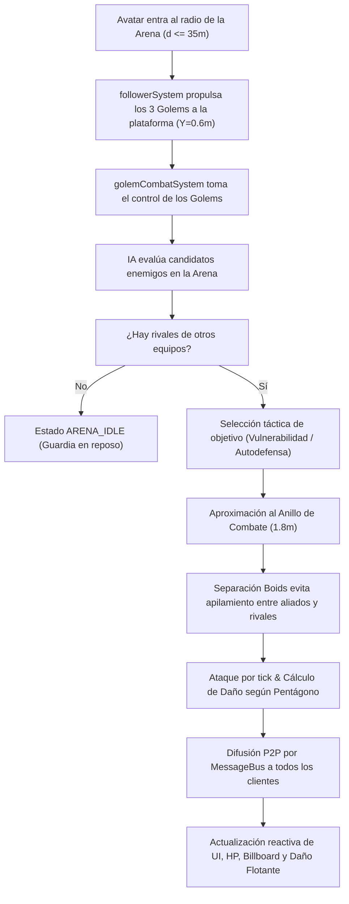
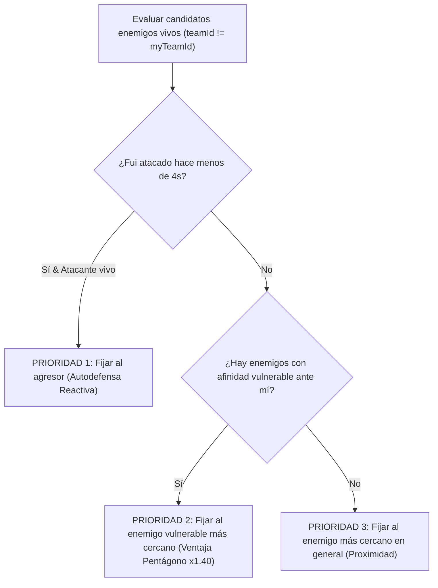

# ⚔️ Guía Técnica: Sistema de Combate en Tiempo Real y Batallas FFA en la Gran Arena Steampunk (Decentraland SDK7)

Esta guía documenta exhaustivamente la arquitectura técnica, las fórmulas matemáticas, los componentes ECS, la Inteligencia Artificial táctica de selección de objetivos, el sistema de separación física anti-apilamiento, la sincronización multijugador P2P y la interfaz de usuario en vivo del **Sistema de Combate de Golems** en Decentraland SDK7.

---

## 📑 Tabla de Contenidos

1. [Visión General y Modo "Free For All" (FFA)](#1-visión-general-y-modo-free-for-all-ffa)
2. [Pentágono de Afinidades Elementales y Fórmulas Matemáticas](#2-pentágono-de-afinidades-elementales-y-fórmulas-matemáticas)
   - [2.1 Relaciones del Pentágono Energético](#21-relaciones-del-pentágono-energético)
   - [2.2 Ecuación Oficial de Daño por Tick](#22-ecuación-oficial-de-daño-por-tick)
   - [2.3 Frecuencia de Ataque y Enfriamiento por Velocidad](#23-frecuencia-de-ataque-y-enfriamiento-por-velocidad)
3. [Arquitectura de Equipos Canónicos (`GOLEM_TEAMS`) e Inmunidad a Fuego Amigo](#3-arquitectura-de-equipos-canónicos-golem_teams-e-inmunidad-a-fuego-amigo)
   - [3.1 Identificadores Inmutables de Equipo](#31-identificadores-inmutables-de-equipo)
   - [3.2 Validación Determinista de Aliados (`areGolemsAllies`)](#32-validación-determinista-de-aliados-aregolemsallies)
4. [Inteligencia Artificial Táctica y Selección de Objetivos](#4-inteligencia-artificial-táctica-y-selección-de-objetivos)
   - [4.1 Jerarquía de Prioridades de la IA](#41-jerarquía-de-prioridades-de-la-ia)
   - [4.2 Búsqueda Reactiva de Vulnerabilidad](#42-búsqueda-reactiva-de-vulnerabilidad)
5. [Navegación Táctica, Anillo de Combate y Separación Física Anti-Apilamiento](#5-navegación-táctica-anillo-de-combate-y-separación-física-anti-apilamiento)
   - [5.1 Anillo Perimetral de Combate (`COMBAT_STOP_DISTANCE`)](#51-anillo-perimetral-de-combate-combat_stop_distance)
   - [5.2 Fuerzas de Repulsión Boids (`MIN_SEPARATION_DISTANCE`)](#52-fuerzas-de-repulsión-boids-min_separation_distance)
6. [Componentes ECS y Estados de Batalla](#6-componentes-ecs-y-estados-de-batalla)
   - [6.1 `GolemCombatComponent`](#61-golemcombatcomponent)
   - [6.2 `FloatingDamageComponent`](#62-floatingdamagecomponent)
7. [Ciclo de Vida de Daño, Barras de Salud y Eliminación a 0 HP](#7-ciclo-de-vida-de-daño-barras-de-salud-y-eliminación-a-0-hp)
   - [7.1 Etiquetas Flotantes en Billboard con ASCII Dinámico](#71-etiquetas-flotantes-en-billboard-con-ascii-dinámico)
   - [7.2 Destrucción Limpia y Asignación de EXP](#72-destrucción-limpia-y-asignación-de-exp)
8. [Sincronización Multijugador P2P en Tiempo Real (MessageBus)](#8-sincronización-multijugador-p2p-en-tiempo-real-messagebus)
   - [8.1 Eventos de Ataque (`golem_combat_attack`)](#81-eventos-de-ataque-golem_combat_attack)
   - [8.2 Eventos de Derrota (`golem_combat_defeat`)](#82-eventos-de-derrota-golem_combat_defeat)
9. [Progresión de Sesión, EXP y Subida de Nivel en Vivo](#9-progresión-de-sesión-exp-y-subida-de-nivel-en-vivo)
10. [Interfaz de Usuario React-ECS Mobile-First y Sincronización en Vivo](#10-interfaz-de-usuario-react-ecs-mobile-first-y-sincronización-en-vivo)
11. [Transición Espacial entre Modo Seguidor y Modo Combate](#11-transición-espacial-entre-modo-seguidor-y-modo-combate)
12. [Manual para Desarrolladores: Archivos y Flujo de Trabajo](#12-manual-para-desarrolladores-archivos-y-flujo-de-trabajo)

---

## 1. Visión General y Modo "Free For All" (FFA)

El sistema de combate de **Golems** está diseñado para ser dinámico, accesible y libre de fricciones técnicas en dispositivos móviles y de escritorio. Al entrar en la **Gran Arena Circular Steampunk** (`X: 200m, Z: 200m`, radio de combate de $35\text{m}$), el modo de juego cambia automáticamente de **Modo Exploración (Seguimiento)** a **Modo Combate "Free For All" (FFA)**:



---

## 2. Pentágono de Afinidades Elementales y Fórmulas Matemáticas

### 2.1 Relaciones del Pentágono Energético
Cada golem posee una afinidad elemental dominante derivada de los materiales empleados en su forja o generada aleatoriamente al inicio de la sesión. El equilibrio competitivo se rige por un pentágono cíclico:

```text
               ♨️ VAPOR
              ▲       \
             /         \ (x1.40)
     (x0.75)/           ▼
           🔮 ÉTER     ⚙️ MECÁNICO
            ▲           /
     (x0.75) \         / (x1.40)
              \       ▼
        ☀️ LUMINOSO ◄─── ⚡ GALVÁNICO
                 (x1.40)
```

| Atacante | Defensor | Multiplicador | Condición Táctica |
| :--- | :--- | :---: | :--- |
| **Vapor** (`STEAM`) | **Mecánico** (`MECHANICAL`) | $\times 1.40$ | ⚡ Ventaja Crítica (El vapor oxida la chatarra) |
| **Mecánico** (`MECHANICAL`) | **Galvánico** (`GALVANIC`) | $\times 1.40$ | ⚡ Ventaja Crítica (El aislamiento mecánico desvía la corriente) |
| **Galvánico** (`GALVANIC`) | **Luminoso** (`LUMINOUS`) | $\times 1.40$ | ⚡ Ventaja Crítica (La sobretensión sobrecarga los prismas) |
| **Luminoso** (`LUMINOUS`) | **Éter** (`AETHER`) | $\times 1.40$ | ⚡ Ventaja Crítica (La luz purifica la magia residual) |
| **Éter** (`AETHER`) | **Vapor** (`STEAM`) | $\times 1.40$ | ⚡ Ventaja Crítica (El éter disipa la condensación térmica) |
| *Cualquier ventaja inversa* | *Defensor fuerte* | $\times 0.75$ | 🛡️ Desventaja Elemental |
| *Misma afinidad u otras* | *Defensor neutro* | $\times 1.00$ | ⚖️ Daño Neutro |

### 2.2 Ecuación Oficial de Daño por Tick
El daño final infligido por un impacto cuerpo a cuerpo se calcula con mitigación lineal de defensa acotada:

$$\text{DañoBase} = \text{Ataque}_{\text{atacante}} - (\text{Defensa}_{\text{defensor}} \times 0.5)$$

$$\text{DañoFinal} = \max\Big(2, \; \text{round}\big(\text{DañoBase} \times \text{MultiplicadorAfinidad}\big)\Big)$$

### 2.3 Frecuencia de Ataque y Enfriamiento por Velocidad
El temporizador de recarga de ataque ($T_{\text{cooldown}}$ en segundos) disminuye conforme mayor sea la estadística de **Velocidad** del golem:

$$T_{\text{cooldown}} = \max\left(0.8\text{ s}, \; \frac{2.2\text{ s}}{1 + \text{Velocidad} \times 0.04}\right)$$

---

## 3. Arquitectura de Equipos Canónicos (`GOLEM_TEAMS`) e Inmunidad a Fuego Amigo

Para evitar definitivamente cualquier error de fuego amigo (jugadores cuyos golems se ataquen entre sí), el sistema utiliza una **Arquitectura Canónica de Equipos** basada en identificadores inmutables en el componente ECS:

### 3.1 Identificadores Inmutables de Equipo
En `src/components/combat.ts`:

```typescript
export const GOLEM_TEAMS = {
  PLAYER: 'TEAM_PLAYER',
  SPARRING: 'TEAM_SPARRING',
  REMOTE_PREFIX: 'TEAM_REMOTE_'
} as const
```

- **Tus 3 Golems**: Tienen asignado `teamId: 'TEAM_PLAYER'` de forma estricta e invariable.
- **Bots de Sparring**: Tienen asignado `teamId: 'TEAM_SPARRING'`.
- **Jugadores Remotos**: Tienen asignado `teamId: 'TEAM_REMOTE_<walletAddress>'`.

### 3.2 Validación Determinista de Aliados (`areGolemsAllies`)
En `src/systems/golemCombatSystem.ts`:

```typescript
export function areGolemsAllies(
  teamA?: string,
  teamB?: string,
  ownerA?: string,
  ownerB?: string,
  golemIdA?: string,
  golemIdB?: string
): boolean {
  // 1. Mismo teamId canónico no vacío
  if (teamA && teamB && teamA === teamB) return true

  // 2. Ambos pertenecen al escuadrón local activo en memoria
  if (golemIdA && isLocalSquadGolem(golemIdA) && golemIdB && isLocalSquadGolem(golemIdB)) {
    return true
  }

  const localId = getLocalPlayerId().toLowerCase()
  const normA = (ownerA || '').toLowerCase()
  const normB = (ownerB || '').toLowerCase()

  // 3. Ambos pertenecen al bando del jugador local
  const isLocalA =
    teamA === GOLEM_TEAMS.PLAYER ||
    normA === 'local' ||
    normA === 'local_player' ||
    normA === localId ||
    (golemIdA !== undefined && isLocalSquadGolem(golemIdA))

  const isLocalB =
    teamB === GOLEM_TEAMS.PLAYER ||
    normB === 'local' ||
    normB === 'local_player' ||
    normB === localId ||
    (golemIdB !== undefined && isLocalSquadGolem(golemIdB))

  if (isLocalA && isLocalB) return true

  // 4. Mismo dueño idéntico
  if (normA && normB && normA === normB) return true

  return false
}
```

---

## 4. Inteligencia Artificial Táctica y Selección de Objetivos

Cada golem ejecuta en cada tick un motor de decisión táctico autónomo para seleccionar su objetivo entre los candidatos enemigos presentes en la arena.

### 4.1 Jerarquía de Prioridades de la IA



### 4.2 Búsqueda Reactiva de Vulnerabilidad
La función `getVulnerableAffinity(myAffinity)` en `src/config/golems.ts` determina cuál es el tipo elemental óptimo al que cazar. Por ejemplo:
- Un golem de **Vapor** priorizará automáticamente a los golems **Mecánicos** enemigos.
- Un golem **Galvánico** priorizará a los golems **Luminosos** enemigos.

---

## 5. Navegación Táctica, Anillo de Combate y Separación Física Anti-Apilamiento

Para garantizar combates visualmente limpios y evitar que los modelos 3D se fusionen o se apilen en una masa indistinguible, el sistema aplica dos algoritmos espaciales simultáneos:

### 5.1 Anillo Perimetral de Combate (`COMBAT_STOP_DISTANCE`)
Al perseguir a un objetivo enemigo, el golem atacante **no se desplaza al centro exacto del objetivo**, sino que calcula un punto de parada a una distancia radial de seguridad:

$$\vec{P}_{\text{deseada}} = \vec{P}_{\text{objetivo}} - \widehat{u}_{\text{haciaObjetivo}} \times \text{COMBAT\_STOP\_DISTANCE}$$

Con $\text{COMBAT\_STOP\_DISTANCE} = 1.8\text{ m}$. Esto hace que los golems rodeen a su rival en formación de abanico natural.

### 5.2 Fuerzas de Repulsión Boids (`MIN_SEPARATION_DISTANCE`)
En cada tick, se evalúan todos los pares de golems activos en la arena. Si la distancia euclidiana horizontal entre el golem $A$ y el golem $B$ es inferior a $1.6\text{ m}$, se aplica una fuerza de repulsión proporcional a la superposición:

$$\vec{\Delta} = (X_A - X_B, \; 0, \; Z_A - Z_B)$$

$$\text{solapamiento} = \frac{\text{MIN\_SEPARATION} - \|\vec{\Delta}\|}{2}$$

$$\vec{P}_A \leftarrow \vec{P}_A + \widehat{\Delta} \times \text{solapamiento} \times \min(1.0, \; \Delta t \times 6.0)$$
$$\vec{P}_B \leftarrow \vec{P}_B - \widehat{\Delta} \times \text{solapamiento} \times \min(1.0, \; \Delta t \times 6.0)$$

Ambas entidades mantienen su altura bloqueada en la plataforma: $Y = 0.6\text{ m}$.

---

## 6. Componentes ECS y Estados de Batalla

### 6.1 `GolemCombatComponent`
Definido en `src/components/combat.ts`:

| Campo | Tipo Schemas | Propósito |
| :--- | :--- | :--- |
| `golemId` | `Schemas.String` | Identificador único del golem. |
| `teamId` | `Schemas.String` | Bando canónico (`TEAM_PLAYER`, `TEAM_REMOTE_*`). |
| `ownerAddress` | `Schemas.String` | Wallet o ID del dueño. |
| `affinity` | `Schemas.String` | Tipo energético (`Vapor`, `Galvánico`, etc.). |
| `maxHp` | `Schemas.Float` | Salud máxima del autómata. |
| `currentHp` | `Schemas.Float` | Salud actual en tiempo real. |
| `attack` | `Schemas.Float` | Poder de impacto físico/mágico. |
| `defense` | `Schemas.Float` | Reducción de daño entrante. |
| `speed` | `Schemas.Float` | Velocidad de recarga y movimiento. |
| `expReward` | `Schemas.Float` | Puntos de EXP otorgados al ser derrotado ($50-120$). |
| `level` | `Schemas.Int` | Nivel de progresión ($1-50$). |
| `state` | `Schemas.String` | Estado táctico (`following`, `arena_idle`, `arena_chasing`, `arena_attacking`, `defeated`). |
| `targetGolemId` | `Schemas.String` | ID del enemigo actualmente fijado. |
| `attackCooldownTimer` | `Schemas.Float` | Segundos restantes para el próximo ataque. |
| `lastAttackerId` | `Schemas.String` | ID del último agresor para autodefensa. |
| `lastAttackedTimestamp` | `Schemas.Float` | Timestamp del último daño recibido. |
| `isDefeated` | `Schemas.Boolean` | Marcador de muerte a 0 HP. |

### 6.2 `FloatingDamageComponent`
Maneja la animación de números de daño que ascienden verticalmente sobre el punto de impacto:
- `lifetime`: $1.2\text{ s}$ de duración.
- `riseSpeed`: $+1.1\text{ m/s}$ de ascenso en el eje Y.
- Color: **Amarillo dorado** (`#FFD700`) con prefijo `⚡ CRÍTICO -` si hubo ventaja elemental, o **Rojo** (`#FF4040`) en impacto estándar.

---

## 7. Ciclo de Vida de Daño, Barras de Salud y Eliminación a 0 HP

### 7.1 Etiquetas Flotantes en Billboard con ASCII Dinámico
Cada golem cuenta con una entidad hija con componentes `TextShape` y `Billboard` a $Y = +1.5\text{m}$:

```text
Calderón Blindado [Vapor]
Nv.1 [████████░░] 85/120 HP
```

La función `getHealthBarAscii(currentHp, maxHp)` en `src/objects/golemFactory.ts` recalcula la proporción de 10 bloques `█` / `░` en tiempo real tras cada impacto.

### 7.2 Destrucción Limpia y Asignación de EXP
Cuando los puntos de salud de un golem se reducen a $\le 0$:
1. Se marca `isDefeated = true` y `currentHp = 0`.
2. Se sincroniza el estado local mediante `updateLocalGolemHp(defeatedId, 0)`.
3. Se otorga la recompensa de experiencia `expReward` al golem atacante (`addLocalGolemExp`) y al jugador local (`awardPlayerExp`).
4. Se incrementa el contador de bajas: `incrementPlayerKills()`.
5. Se difunde el evento `golem_combat_defeat` por red.
6. Se destruye la entidad y todos sus hijos (modelos, cartel billboard) mediante `removeEntityWithChildren(engine, entity)`.

---

## 8. Sincronización Multijugador P2P en Tiempo Real (MessageBus)

La comunicación entre avatares se realiza de forma P2P mediante el bus de mensajería de Decentraland (`@dcl/sdk/message-bus`):

### 8.1 Eventos de Ataque (`golem_combat_attack`)
Difunde cada golpe asestado por el cliente dueño del atacante:

```typescript
export interface GolemAttackMessageDto {
  attackerId: string
  targetId: string
  attackerOwner: string
  targetOwner: string
  attackerTeam?: string
  targetTeam?: string
  damage: number
  isAdvantage: boolean
  remainingHp: number
  timestamp: number
}
```

Los clientes remotos que reciben el mensaje actualizan la vida del golem defensor en sus motores locales y generan los números de daño flotantes correspondientes.

### 8.2 Eventos de Derrota (`golem_combat_defeat`)
Difunde la caída de una unidad para que todos los jugadores eliminen la entidad de su escena y muestren la notificación en el registro de combate.

---

## 9. Progresión de Sesión, EXP y Subida de Nivel en Vivo

En `src/state.ts`, el progreso de los combates se acumula dinámicamente en memoria de sesión:
- **Experiencia Requerida para Subir de Nivel**: $\text{EXP}_{\text{necesaria}} = \text{Nivel} \times 100$.
- **Al Subir de Nivel**:
  - `level += 1`
  - `maxHp = Math.round(maxHp * 1.15)` (Aumento del $+15\%$)
  - `currentHp = maxHp` (Restauración completa de salud)
  - `attack = Math.round(attack * 1.12)` (Aumento del $+12\%$)
  - `defense = Math.round(defense * 1.10)` (Aumento del $+10\%$)
  - Se emite un aviso dorado en el log de combate: `⭐ ¡[Nombre] subió al Nivel X!`.

---

## 10. Interfaz de Usuario React-ECS Mobile-First y Sincronización en Vivo

En `src/ui.tsx`, el panel HUD superior se mantiene permanentemente sincronizado con los componentes ECS `GolemCombatComponent` sin intermediarios:

```text
┌────────────────────────────────────────────────────────────────────────────────────────┐
│ 🏟️ GOLEMS' WORLD · GRAN ARENA STEAMPUNK                                               │
│ ⚔️ MODO COMBATE "FREE FOR ALL" ACTIVO (¡TODOS CONTRA TODOS!)                           │
│ 👥 Jugadores: 1  |  ⚡ Golems: 3  |  🏆 Derrotas: 4  |  ⭐ EXP Total: 320             │
├────────────────────────────────────────────────────────────────────────────────────────┤
│ ┌───────────────────────┐  ┌───────────────────────┐  ┌──────────────────────────────┐ │
│ │ ♨️ Calderón Blindado │  │ ⚡ Centella Galvánica │  │ ⚙️ Engranaje Titán           │ │
│ │ Nv.2 [Vapor]          │  │ Nv.1 [Galvánico]      │  │ Nv.1 [Mecánico]              │ │
│ │ [██████████] 138/138  │  │ [██████░░░░] 72/120   │  │ [██████████] 140/140         │ │
│ │ ATK:31 DEF:16 SPD:18  │  │ ATK:27 DEF:12 SPD:22  │  │ ATK:24 DEF:20 SPD:12         │ │
│ └───────────────────────┘  └───────────────────────┘  └──────────────────────────────┘ │
├────────────────────────────────────────────────────────────────────────────────────────┤
│ ⚔️ Calderón atacó a Centella (-28 HP) ⚡ [VENTAJA ELEMENTAL]                            │
│ 🏆 ¡Calderón destruyó a Centella! (+60 EXP)                                           │
└────────────────────────────────────────────────────────────────────────────────────────┘
```

- **Ubicación**: Zona superior central (`top: 10px`, ancho: `780px`).
- **Zona Segura Táctil**: Deja el $75\%$ inferior de la pantalla $100\%$ despejado para el joystick virtual, los botones de salto y el chat de Decentraland en dispositivos móviles.
- **Botón de Reaparición**: Si los 3 golems caen en batalla, aparece un botón táctil grande `✨ REAPARECER ESCUADRÓN` para convocar 3 nuevos autómatas aleatorios.

---

## 11. Transición Espacial entre Modo Seguidor y Modo Combate

El cambio de comportamiento entre caminar por el mundo y batallar en la arena es automático y transparente:

1. **Fuera de la Arena ($d > 35\text{m}$)**:
   - `followerSystem.ts` maneja a los 3 golems mediante la cola FIFO de migajas (*Breadcrumbs*) a $1.8\text{m}$, $3.6\text{m}$ y $5.4\text{m}$ detrás del avatar.
   - `golemCombatSystem.ts` no interviene.
2. **Cruce del Perímetro ($d \le 35\text{m}$)**:
   - `followerSystem.ts` detecta que el avatar ingresó a la arena y propulsa/eleva suavemente a los golems rezagados hacia la plataforma ($Y = 0.6\text{m}$).
   - `followerSystem.ts` cede el control a `golemCombatSystem.ts`.
3. **Dentro de la Arena**:
   - Los golems entran en estado de combate activo, rotan hacia sus rivales, aplican repulsión Boids y atacan por ticks.
4. **Salida de la Arena ($d > 35\text{m}$)**:
   - Al salir el avatar, `golemCombatSystem.ts` finaliza las persecuciones y los golems regresan de inmediato a su formación de seguimiento en fila detrás del jugador.

---

## 12. Manual para Desarrolladores: Archivos y Flujo de Trabajo

| Archivo | Responsabilidad Principal |
| :--- | :--- |
| [`src/config/golems.ts`](file:///d:/DECENTRALAND/Scenes/Hackathon/src/config/golems.ts) | Definición de afinidades, pentágono elemental, multiplicadores y generador de estadísticas aleatorias RPG. |
| [`src/config/arenaConfig.ts`](file:///d:/DECENTRALAND/Scenes/Hackathon/src/config/arenaConfig.ts) | Coordenadas centrales `(200, 0, 200)`, radio ($36\text{m}$) y altura de la plataforma ($0.6\text{m}$). |
| [`src/components/combat.ts`](file:///d:/DECENTRALAND/Scenes/Hackathon/src/components/combat.ts) | Definición de `GolemCombatComponent`, `FloatingDamageComponent`, `GOLEM_TEAMS` y DTOs de mensajes. |
| [`src/systems/golemCombatSystem.ts`](file:///d:/DECENTRALAND/Scenes/Hackathon/src/systems/golemCombatSystem.ts) | Sistema ECS de combate FFA: IA táctica, anillo perimetral, separación Boids, daño delta-time y sincronización. |
| [`src/systems/followerSystem.ts`](file:///d:/DECENTRALAND/Scenes/Hackathon/src/systems/followerSystem.ts) | Sistema de seguimiento multi-trail y salto/elevación hacia la plataforma de la arena. |
| [`src/objects/golemFactory.ts`](file:///d:/DECENTRALAND/Scenes/Hackathon/src/objects/golemFactory.ts) | Creación de entidades de golems con modelos 3D, Billboards con salud ASCII y números de daño flotantes. |
| [`src/state.ts`](file:///d:/DECENTRALAND/Scenes/Hackathon/src/state.ts) | Estado de sesión en memoria: EXP acumulada, contador de bajas, subida de nivel y logs de combate. |
| [`src/multiplayer.ts`](file:///d:/DECENTRALAND/Scenes/Hackathon/src/multiplayer.ts) | Difusión y escucha de eventos de ataque y derrota por `MessageBus`. |
| [`src/ui.tsx`](file:///d:/DECENTRALAND/Scenes/Hackathon/src/ui.tsx) | Interfaz gráfica HUD superior 2D con renderizado React-ECS en tiempo real. |
| [`src/i18n/`](file:///d:/DECENTRALAND/Scenes/Hackathon/src/i18n/index.ts) | Motor de internacionalización y traducciones dinámicas de combate y afinidades ([guia-soporte-bilingue-i18n.md](file:///d:/DECENTRALAND/Scenes/Hackathon/guias/guia-soporte-bilingue-i18n.md)). |
