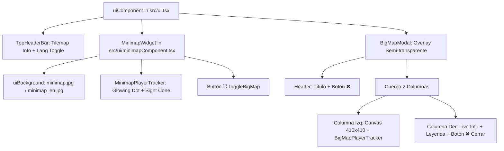

# 🗺️ Guía Maestra: Sistema de Minimapa, Cartografía 2D y Orientación (Decentraland SDK7)

Esta guía técnica y documental detalla exhaustivamente la arquitectura, algoritmos trigonométricos de orientación 360°, fórmulas de proyección espacial, soporte bilingüe reactivo y patrones de diseño **Mobile-First** del subsistema de **Minimapa HUD** y **Modal de Mapa Completo** en **Golems World**.

---

## 📑 Tabla de Contenidos

1. [Visión General y Objetivos del Subsistema](#1-visión-general-y-objetivos-del-subsistema)
2. [Estructura de Archivos y Responsabilidades](#2-estructura-de-archivos-y-responsabilidades)
3. [Matemáticas de Proyección Cartográfica (Grid 25x25 / 400m × 400m)](#3-matemáticas-de-proyección-cartográfica-grid-25x25--400m--400m)
4. [Algoritmo de Rotación de Cámara y Cono de Visión 360° (Sight Cone)](#4-algoritmo-de-rotación-de-cámara-y-cono-de-visión-360-sight-cone)
5. [Arquitectura Mobile-First: Modal Panorámico en 2 Columnas](#5-arquitectura-mobile-first-modal-panorámico-en-2-columnas)
6. [Soporte Bilingüe y Texturas Dinámicas (ES / EN)](#6-soporte-bilingüe-y-texturas-dinámicas-es--en)
7. [Componentes React-ECS y Jerarquía Visual](#7-componentes-react-ecs-y-jerarquía-visual)
8. [Buenas Prácticas, Restricciones Móviles y Rendimiento](#8-buenas-prácticas-restricciones-móviles-y-rendimiento)

---

## 1. Visión General y Objetivos del Subsistema

El mundo de **Golems** se despliega sobre una cuadrícula monumental de **25x25 parcelas** ($400\text{m} \times 400\text{m} = 160.000\text{ m}^2$). Para garantizar que el jugador explore con confianza, localice zonas de recolección, identifique áreas seguras vs. zonas de peligro libre PK y llegue a la Gran Arena Central, el juego cuenta con un sistema cartográfico dual:

1. **Minimapa HUD Perenne**:
   - Widget compacto de $200\text{px} \times 200\text{px}$ ubicado en la esquina superior derecha (`top: 80, right: 28`), inmediatamente debajo de la barra de estado y selector de idioma (`TopHeaderBar`).
   - Muestra la posición del jugador en vivo, el cono de visión y un botón táctil `⛶` para maximizar.
2. **Modal de Mapa Completo Panorámico (*BigMapModal*)**:
   - Modal interactivo con fondo semitransparente (`rgba(5, 8, 15, 0.86)`), diseñado en **2 columnas apaisadas** ($880\text{px} \times 480\text{px}$) para adaptarse con total holgura a las pantallas horizontales de dispositivos móviles (`1600x720`) y monitores de escritorio (`1920x1080`).
   - Proporciona coordenadas métricas en tiempo real, desglose de distritos, leyenda de peligros y controles de salida ergonómicos.

---

## 2. Estructura de Archivos y Responsabilidades

```
src/
├── assets/images/
│   ├── minimap.jpg              # Arte cartográfico oficial en Español (400x400m)
│   └── minimap_en.jpg           # Arte cartográfico oficial en Inglés (400x400m)
├── src/
│   ├── i18n/                    # Motor de internacionalización bilingüe tipado
│   │   ├── types.ts             # Esquema TranslationSchema.map
│   │   ├── locales/es.ts        # Traducciones en español (puntos cardinales, títulos, leyendas)
│   │   └── locales/en.ts        # Traducciones en inglés
│   ├── state.ts                 # Estado de sesión (isBigMapOpen, toggleBigMap)
│   ├── utils/
│   │   ├── location.ts          # Detección de distritos y coordenadas métricas
│   │   └── mapUtils.ts          # Cálculos de proyección 2D, ángulos yaw y cono de visión
│   ├── ui/
│   │   └── minimapComponent.tsx # Componentes React-ECS (MinimapWidget, BigMapModal, Trackers)
│   └── ui.tsx                   # Orquestador del árbol raíz de la interfaz
```

---

## 3. Matemáticas de Proyección Cartográfica (Grid 25x25 / 400m × 400m)

El espacio 3D de Decentraland utiliza un sistema de coordenadas donde:
- **Eje X (Ancho / Oeste $\rightarrow$ Este)**: $0.0\text{m} \le X \le 400.0\text{m}$ ($25 \text{ parcelas} \times 16\text{m}$).
- **Eje Z (Profundidad / Sur $\rightarrow$ Norte)**: $0.0\text{m} \le Z \le 400.0\text{m}$ ($25 \text{ parcelas} \times 16\text{m}$).
- **Eje Y (Elevación)**: Terreno base en $Y \approx 0.0\text{m}$.

En el canvas 2D de React-ECS:
- El origen `(0%, 0%)` se encuentra en la **esquina superior izquierda** (Noroeste: $X=0\text{m}, Z=400\text{m}$).
- El eje horizontal `left` crece hacia la derecha ($X \rightarrow 400\text{m}$).
- El eje vertical `top` crece hacia abajo ($Z \rightarrow 0\text{m}$).

### 📐 Fórmulas Canónicas de Transformación:

$$\text{percentX} = \left(\frac{\text{clamp}(X, 0, 400)}{400}\right) \times 100\%$$

$$\text{percentY} = \left(\frac{400 - \text{clamp}(Z, 0, 400)}{400}\right) \times 100\%$$

$$\text{parcelX} = \lfloor X / 16 \rfloor, \quad \text{parcelZ} = \lfloor Z / 16 \rfloor$$

```typescript
// Implementación en src/utils/mapUtils.ts
const clampedX = Math.max(0, Math.min(400, x))
const clampedZ = Math.max(0, Math.min(400, z))

const percentX = (clampedX / 400) * 100
const percentY = ((400 - clampedZ) / 400) * 100
```

---

## 4. Algoritmo de Rotación de Cámara y Cono de Visión 360° (Sight Cone)

Para orientar al jugador sin necesidad de raycasting complejo, se extrae el cuaternión de orientación horizontal $q = (x, y, z, w)$ desde `engine.CameraEntity` (o `engine.PlayerEntity`).

### 📐 Derivación del Vector Director y Ángulo 2D:

1. **Vector Forward 3D**:
   $$F_x = 2(xz + wy)$$
   $$F_z = 1 - 2(x^2 + y^2)$$

2. **Mapeo a Pantalla 2D**:
   Como el eje $+Z$ del mundo 3D apunta hacia el Norte (hacia arriba en el mapa, es decir, $-Y$ en el canvas de UI):
   $$D_x = F_x \quad (\text{Este } +X)$$
   $$D_y = -F_z \quad (\text{Norte } +Z \rightarrow \text{Top } -Y)$$

3. **Ángulo Yaw en Radianes y Grados**:
   $$\theta_{\text{rad}} = \text{atan2}(D_y, D_x)$$
   $$\theta_{\text{deg}} = \frac{\theta_{\text{rad}} \times 180^\circ}{\pi}$$

4. **Proyección del Cono de Visión Radiante**:
   Se proyecta un abanico angular de apertura $\pm 25^\circ$ ($\Delta\theta \approx 0.44\text{ rad}$) con puntos luminosos a diferentes distancias de radio $r$:
   - Vértice frontal principal: $(r \cos\theta, r \sin\theta)$
   - Haz izquierdo: $(0.85 r \cos(\theta - \Delta\theta), 0.85 r \sin(\theta - \Delta\theta))$
   - Haz derecho: $(0.85 r \cos(\theta + \Delta\theta), 0.85 r \sin(\theta + \Delta\theta))$
   - Haces intermedios para generar volumen visual.

```typescript
// Implementación en src/utils/mapUtils.ts
export function getConeOffsets(radius: number, angleRad: number, coneSpreadRad: number = 0.44) {
  const leftAngle = angleRad - coneSpreadRad
  const rightAngle = angleRad + coneSpreadRad
  return [
    { offsetX: Math.cos(angleRad) * radius, offsetY: Math.sin(angleRad) * radius, size: 6, opacity: 0.95 },
    { offsetX: Math.cos(leftAngle) * (radius * 0.85), offsetY: Math.sin(leftAngle) * (radius * 0.85), size: 5, opacity: 0.65 },
    { offsetX: Math.cos(rightAngle) * (radius * 0.85), offsetY: Math.sin(rightAngle) * (radius * 0.85), size: 5, opacity: 0.65 }
  ]
}
```

---

## 5. Arquitectura Mobile-First: Modal Panorámico en 2 Columnas

### 📱 Desafío en Dispositivos Móviles:
En el cliente móvil de Decentraland (Godot Explorer) bajo SDK 7.26.0+, la resolución virtual horizontal de referencia se reescala a **`1600x720`**. Además, los dispositivos aplican un margen seguro (*screen safe insets* por notch y barra de navegación) que reduce la altura efectiva usable a **~620px - 650px**.

Un diseño vertical monolítico con altura $\ge 800\text{px}$ provoca que la cabecera (título y botón de cerrar) quede cortada por encima del borde superior (`top < 0`).

### 💡 Solución de Diseño Panorámico en 2 Columnas ($880\text{px} \times 480\text{px}$):

```text
┌─────────────────────────────────────────────────────────────────────────────┐
│ 🗺️ MAPA DEL MUNDO • Cuadrícula 25x25 (400m × 400m)                      [✖] │
├────────────────────────────────┬────────────────────────────────────────────┤
│                                │ 📍 Parcela [0, 0] • X: 16.0m | Z: 5.9m     │
│                                │ 🔥 Distrito de la Forja                    │
│   LIENZO CUADRADO DEL MAPA     ├────────────────────────────────────────────┤
│   (410px × 410px)              │ 📋 Leyenda de Zonificación y Riesgo        │
│                                │  🟢 Zona Segura (Sin PK)                   │
│   • Textura HD limpia          │     🔥 Forja • 💎 Minería • ⚙️ Chatarrales │
│   • Glowing Dot del jugador    │  🏆 Gran Arena Steampunk                   │
│   • Cono de Visión 360°        │     Torneo Steampunk • Centro (200m, 200m) │
│                                │  🔴 Zona de Peligro (PK Libre)             │
│                                │     🏜️ Desierto • 🌋 Calderas              │
│                                ├────────────────────────────────────────────┤
│                                │ [ ✖ Cerrar Mapa                          ] │
└────────────────────────────────┴────────────────────────────────────────────┘
```

- **Altura Total**: **`480px`**, dejando un margen de seguridad de más de **`70px` arriba y abajo** en pantallas móviles de 720px.
- **Columna Izquierda ($410\text{px} \times 410\text{px}$)**: Lienzo cartográfico que luce el arte original en alta resolución sin sobreimpresión de emojis invasivos.
- **Columna Derecha ($424\text{px} \times 410\text{px}$)**: Panel de información con tarjetas de ubicación en vivo, leyenda clasificada y botón táctil amplio de cierre.

---

## 6. Soporte Bilingüe y Texturas Dinámicas (ES / EN)

El sistema de cartografía implementa reactividad bilingüe completa mediante [`src/i18n`](file:///d:/DECENTRALAND/Scenes/Hackathon/src/i18n):

```typescript
// En src/ui/minimapComponent.tsx
export function getMinimapTextureSrc(): string {
  return getLanguage() === 'en' ? 'assets/images/minimap_en.jpg' : 'assets/images/minimap.jpg'
}
```

- **Español (`es`)**: Renderiza `assets/images/minimap.jpg` con nombres en español (*«Distrito de la Forja»*, *«Desierto de Chatarra»*, etc.) y puntos cardinales **N**, **S**, **E**, **O**.
- **Inglés (`en`)**: Renderiza `assets/images/minimap_en.jpg` con nombres en inglés (*«Forge District»*, *«Junkyard Desert»*, etc.) y puntos cardinales **N**, **S**, **E**, **W**.
- Al pulsar el botón `🌐 ES | en` en el HUD, el cambio de textura y textos se produce instantáneamente en el siguiente frame sin parpadeos ni recargas.

---

## 7. Componentes React-ECS y Jerarquía Visual



---

## 8. Buenas Prácticas, Restricciones Móviles y Rendimiento

1. **Gestión de Filtro de Punteros (`pointerFilter`)**:
   - El contenedor raíz y las capas decorativas utilizan `pointerFilter: 'none'` para no bloquear los joysticks virtuales ni los clics en el mundo 3D.
   - Únicamente los botones interactivos (`⛶`, `✖`, selector de idioma) declaran `pointerFilter: 'block'`.
2. **Dimensiones Fijas y Texturas con Modo `'stretch'`**:
   - Para evitar el bug de mosaico (*tiling*) de texturas nine-slice en el cliente móvil Godot, todas las imágenes de mapa se renderizan con `textureMode: 'stretch'`.
3. **Cero Cálculos de Raycasting en Bucle UI**:
   - La geolocalización se evalúa por lectura directa de componentes `Transform.get(engine.PlayerEntity)` y `Transform.get(engine.CameraEntity)` con complejidad computacional $O(1)$.
4. **Hitboxes Táctiles Accesibles**:
   - Todos los botones interactivos en el minimapa y modal grande poseen áreas mínimas de contacto de $36\text{px} \times 30\text{px}$ hasta $424\text{px} \times 40\text{px}$, superando los estándares ergonómicos táctiles.
