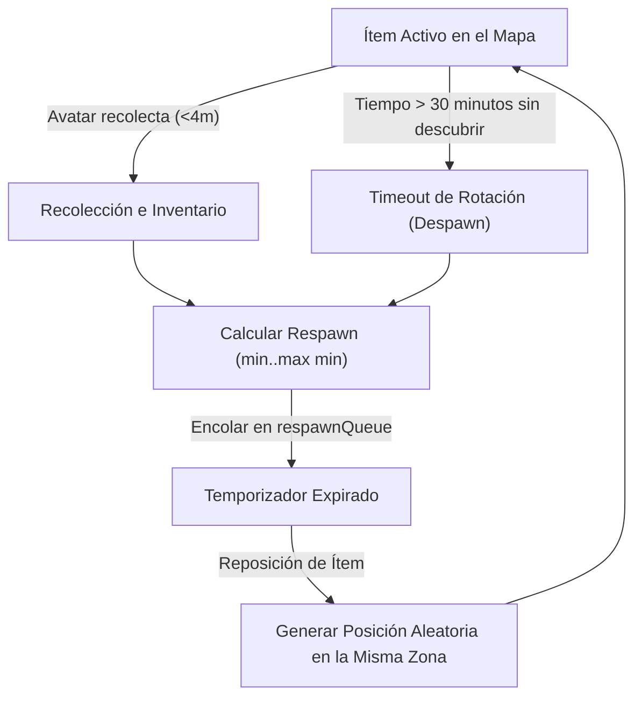

# 🗺️ Guía Maestra: Ubicación, Spawner y Recolección de Materiales (Item Placement & Heat Radar)

> **Ubicación del Código y Módulos**:
> - 📄 **Catálogo y Configuración de Materiales**: [`src/config/items.ts`](file:///d:/DECENTRALAND/Scenes/Hackathon/src/config/items.ts)
> - 🧱 **Componente ECS SDK7**: [`src/components/item.ts`](file:///d:/DECENTRALAND/Scenes/Hackathon/src/components/item.ts)
> - 🛠️ **Generador y Spawner de 130 Ítems**: [`src/objects/itemGenerator.ts`](file:///d:/DECENTRALAND/Scenes/Hackathon/src/objects/itemGenerator.ts)
> - ⚡ **Sistema de Respawns, Timeouts y Radar**: [`src/systems/itemSpawnSystem.ts`](file:///d:/DECENTRALAND/Scenes/Hackathon/src/systems/itemSpawnSystem.ts)
> - 🖥️ **Widget de Radar de Calor React-ECS**: [`src/ui/heatRadarComponent.tsx`](file:///d:/DECENTRALAND/Scenes/Hackathon/src/ui/heatRadarComponent.tsx)

---

## 📖 1. Resumen Ejecutivo y Arquitectura del Sistema

En el universo de **Golems World**, los materiales para la Forja no crecen en la superficie de forma estática; representan piezas de chatarra, mecatrónica y utensilios reutilizados camuflados o enterrados a lo largo y ancho del mundo de 25x25 parcelas (400m × 400m / 160.000 m²).

El sistema se basa en 4 pilares fundamentales:
1. **Poblado Constante de 130 Ítems Activos**: El mapa mantiene una densidad fija de **130 ítems concurrentes**, distribuidos proporcionalmente por zona según el peso total de sus materiales.
2. **Aislamiento Estricto por Zonas (Incluyendo Zonas de Peligro PK)**: Cada uno de los 46 materiales pertenece a una zona específica. Los ítems de zonas de peligro PK (**Desierto de Chatarra PK** y **Calderas de la Fundición PK**) **JAMÁS** aparecen fuera de las coordenadas métricas de sus zonas correspondientes.
3. **Ciclo de Vida Dinámico (Respawns y Timeout de 30 min)**: Al recolectar un ítem, se programa un respawn temporizado ($T \in [\text{respawnMinMinutes}, \text{respawnMaxMinutes}]$). Si un ítem no es descubierto tras **30 minutos**, expira automáticamente y rota a una nueva ubicación aleatoria en la misma zona.
4. **Radar de Calor y Emergencia del Suelo (< 4m)**: Los ítems permanecen camuflados a $Y = -0.5\text{m}$. Al acercarse el avatar a menos de 4 metros, la pieza asciende a $Y = 0.25\text{m}$ y activa su hitbox táctil Mobile-First.

---

## 🗺️ 2. Zonas Espaciales y Delimitación Estricta de Coordenadas

El mapa de 400m × 400m se divide en 7 sectores de aparición, excluyendo la zona segura de inicio (Distrito de la Forja `0..140 X, 0..140 Z`) y la Gran Arena Central (`164..236 X, 164..236 Z`):

```text
(0, 400m) ┌───────────────────────────┬───────────────────────────┐ (400m, 400m)
          │  DESIERTO DE CHATARRA (PK)│    RESERVA DE MINERÍA     │
          │  (0..140m X, 260..400m Z) │    (260..400m X, 260..400m Z)│
          │  🔴 Legendarios (Peso 1.5%)│   🟢 Raros/Épicos (Peso 5.4%)│
          ├───────────────────────────┼───────────────────────────┤
          │  SUBESTACIÓN ELÉCTRICA    │    TORRE DE RADIO         │
          │  (140..260m X, 280..400m Z)│   (280..400m X, 140..260m Z) │
          │  🟠 Galvánicos (Peso 6.9%)│   🟠 Luminosos (Peso 5.4%)│
          ├───────────────────────────┴───────────────────────────┤
          │               GRAN ARENA DE TORNEO STEAMPUNK          │
          │               (Excluida: 164..236 X, 164..236 Z)      │
          ├───────────────────────────────────────────────────────┤
          │   LOS CHATARRALES         │   FÁBRICA ABANDONADA      │
          │   (0..140m X, 140..260m Z)│   (140..260m X, 140..260m Z) │
          │   🟢 Comunes (Peso 50%)   │   🟡 Poco Comunes (27.7%) │
          ├───────────────────────────┼───────────────────────────┤
          │  DISTRITO DE LA FORJA     │   CALDERAS FUNDICIÓN (PK) │
          │  (Excluido: Hub Seguro)   │   (260..400m X, 0..140m Z)│
          │  (0..140m X, 0..140m Z)   │   🔴 Épicos Vapor (Peso 3.1%)│
(0, 0m)   └───────────────────────────┴───────────────────────────┘ (400m, 0m)
```

### Tabla de Delimitación y Pesos Proporcionales (130 Ítems)

| Zona de Aparición | Rango X (m) | Rango Z (m) | Tipo de Zona | Peso Proporcional | Ítems Activos Objetivo | Categoría de Materiales |
| :--- | :--- | :--- | :--- | :--- | :--- | :--- |
| **Los Chatarrales** | `5` a `135` | `145` a `255` | 🟢 Segura | 50.0% (0.50) | 65 ítems | 14 Comunes (Alambre, Tornillos, Ollas) |
| **Fábrica Abandonada** | `145` a `255` | `145` a `255` | 🟡 Media | 27.7% (0.277) | 36 ítems | 11 Poco Comunes (Transistores, Manómetros) |
| **Subestación Eléctrica** | `145` a `255` | `285` a `395` | 🟠 Alta | 6.9% (0.069) | 9 ítems | Raros Galvánicos/Vapor y Épico Plasma |
| **Torre de Radio** | `285` a `395` | `145` a `255` | 🟠 Alta | 5.4% (0.054) | 7 ítems | Raros Luminosos y Épico Solar |
| **Reserva de Minería** | `265` a `395` | `265` a `395` | 🟢 Segura | 5.4% (0.054) | 7 ítems | Raros Mecánicos y Épico Maná/Autómata |
| **Calderas Fundición (PK)**| `265` a `395` | `5` a `135` | 🔴 **PK Libre** | 3.1% (0.031) | 4 ítems | Épicos de Fundición (`reactor_eter`, etc.) |
| **Desierto Chatarra (PK)** | `5` a `135` | `265` a `395` | 🔴 **PK Libre** | 1.5% (0.015) | 2 ítems | 4 Legendarios (`ojo_dragon`, `corazon_primigenio`) |

---

## 🎲 3. Algoritmo de Selección y Garantía Estricta de Instancias Únicas

En `src/objects/itemGenerator.ts`, el generador realiza la selección probabilística respetando el `spawnWeight` de cada `ItemConfig` y el límite de instancias únicas:

```typescript
export function pickRandomItemConfigForZone(zoneName: string): ItemConfig {
  const allItems = Object.values(COLLECTABLE_ITEMS)
  // 1. Filtrar estrictamente ítems que pertenezcan a la zona solicitada
  const zoneItems = allItems.filter((item) => normalizeZoneName(item.zone) === zoneName)

  const candidatePool = zoneItems.length > 0 
    ? zoneItems 
    : allItems.filter((i) => normalizeZoneName(i.zone) === 'Los Chatarrales')

  // 2. Filtrar ítems Épicos y Legendarios con isUniqueInstance: true que ya existan activos
  const availablePool = candidatePool.filter((item) => {
    if (item.isUniqueInstance) {
      return !isUniqueItemActive(item.id)
    }
    return true
  })

  // 3. Ruleta de selección ponderada por spawnWeight
  const finalPool = availablePool.length > 0 ? availablePool : candidatePool
  const totalWeight = finalPool.reduce((sum, item) => sum + item.spawnWeight, 0)
  let randomRoll = Math.random() * totalWeight

  for (const item of finalPool) {
    if (randomRoll <= item.spawnWeight) {
      return item
    }
    randomRoll -= item.spawnWeight
  }

  return finalPool[0]
}
```

> [!IMPORTANT]
> **Regla de Instancias Únicas (`isUniqueInstance: true`)**:
> Ítems legendarios como el `ojo_dragon` o `corazon_primigenio` poseen `isUniqueInstance: true`. Si una instancia de `ojo_dragon` ya se encuentra activa en el **Desierto de Chatarra (PK)**, el sistema impedirá la aparición de una segunda copia hasta que la primera sea recolectada o expire.

---

## ⏱️ 4. Ciclo de Vida: Respawns Temporizados y Timeout de Rotación (30 min)

El sistema `itemSpawnSystem` gestiona el reemplazo de piezas mediante una cola de temporizadores asíncronos y rotación preventiva:



- **Tiempos de Respawn por Rareza**:
  - Comunes: 1 a 3 minutos.
  - Poco Comunes: 4 a 7 minutos.
  - Raros: 10 a 15 minutos.
  - Épicos: 20 a 30 minutos.
  - Legendarios: 45 a 60 minutos.
- **Rotación por Desuso (30 min)**: Evita que piezas valiosas queden estancadas indefinidamente en rincones inaccesibles.

---

## 📡 5. Radar de Calor React-ECS y Emergencia Visual

### Posicionamiento en UI (`src/ui/heatRadarComponent.tsx`)
El widget de Radar de Calor está integrado en la interfaz 2D de React-ECS en la esquina superior derecha (`top: 80, right: 240`), ubicado exactamente a la izquierda del widget de Minimapa.

### Niveles del Gradiente Térmico:
1. **Sensor Inactivo ($d > 30\text{m}$)**: Tono azul frío (`#0D1F38`), texto `"RADAR TÉRMICO: INACTIVO (>30m)"`.
2. **Señal Templada ($15\text{m} < d \le 30\text{m}$)**: Tono amarillo cálido (`#332E05`), texto `"📡 RADAR TEMPLADO: Señal a ~Xm"`.
3. **Pulso Rápido / Cálido ($4\text{m} < d \le 15\text{m}$)**: Tono naranja brillante (`#401700`), texto `"⚡ RADAR CÁLIDO: Objeto a ~Xm"`.
4. **Proximidad Inmediata ($d \le 4\text{m}$)**: Tono rojo incandescente (`#380D00`), texto `"🔥 ¡OBJETO DETECTADO! NOMBRE (RAREZA)"`.

### Mecánica de Emergencia del Suelo:
Cuando el avatar se encuentra a $d \le 4.0\text{m}$, el sistema `itemSpawnSystem` modifica dinámicamente la posición $Y$ de la entidad:
- **Camuflado ($d > 15\text{m}$)**: $Y = -0.50\text{m}$ (oculto bajo el terreno).
- **Emergido ($d \le 4\text{m}$)**: $Y = 0.25\text{m}$ (pieza visible lista para tocar en pantalla táctil).

---

## 🧪 6. Manual de Verificación y Pruebas

1. **Compilación de Producción**:
   ```bash
   npm run build
   # Garantiza 0 errores de sintaxis o tipos TypeScript
   ```
2. **Prueba de Aislamiento por Zonas**:
   - Teletransportar al avatar al Desierto de Chatarra `(X: 70, Z: 330)`.
   - Verificar que todos los materiales detectados pertenezcan exclusivamente al catálogo de Legendarios (`ojo_dragon`, `corazon_primigenio`, etc.).
3. **Prueba de Proximidad e Interacción Táctil**:
   - Acercarse a un punto térmico hasta que la UI cambie a estado incandescente y el modelo GLB emerja del suelo.
   - Hacer clic/toque en la pieza para confirmar que se añade al inventario local (`playerInventory`) y dispara el log de recolección.
